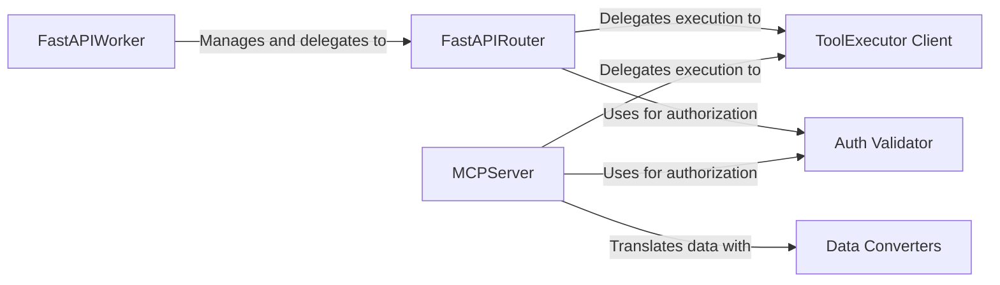

## Details

One paragraph explaining the functionality which is represented by this graph. What the main flow is and what is its purpose.

### FastAPIWorker
The main entry point and process manager for the HTTP server. It initializes the FastAPI application and delegates routing responsibilities to the FastAPIRouter.

**Related Classes/Methods**:

- <a href="https://github.com/ArcadeAI/arcade-ai/blob/main/libs/arcade-serve/arcade_serve/fastapi/worker.py#L16-L45" target="_blank" rel="noopener noreferrer">`arcade_serve/fastapi/worker.py:FastAPIWorker` (16:45)</a>

### FastAPIRouter
Defines and manages the HTTP API endpoints (e.g., `/execute`, `/list_tools`). It adapts core logic handlers to the FastAPI framework, handling the request-response lifecycle.

**Related Classes/Methods**:

- <a href="https://github.com/ArcadeAI/arcade-ai/blob/main/libs/arcade-serve/arcade_serve/fastapi/worker.py#L51-L110" target="_blank" rel="noopener noreferrer">`arcade_serve/fastapi/worker.py:FastAPIRouter` (51:110)</a>

### MCPServer
The central orchestrator for the Mission Control Protocol (MCP). It manages persistent client connections, handles the message-passing lifecycle, and maintains server state for stateful interactions.

**Related Classes/Methods**:

- `arcade_serve/mcp/server.py`

### ToolExecutor Client
Acts as a crucial bridge to the `arcade-core` subsystem. It abstracts the details of how tools are executed, providing a simple, unified interface for both the `FastAPIRouter` and `MCPServer` to use.

**Related Classes/Methods**:

- `arcade_core/executor.py`

### Auth Validator
A critical security component responsible for enforcing access control. It validates credentials (like engine IDs or auth tokens) to ensure a request is authorized to access the requested tools.

**Related Classes/Methods**:

- `arcade_serve/fastapi/auth.py`
- `arcade_serve/mcp/server.py`

### Data Converters
A set of utility functions that perform bidirectional translation between the public-facing MCP data models and the internal data structures used by `arcade-core`. This acts as an anti-corruption layer, decoupling the API from the core logic.

**Related Classes/Methods**:

- `arcade_serve/mcp/convert.py`

### [FAQ](https://github.com/CodeBoarding/GeneratedOnBoardings/tree/main?tab=readme-ov-file#faq)