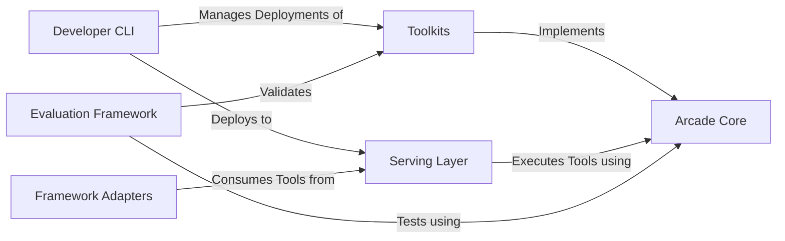

## Details

An analysis of the Arcade AI platform's architecture, based on the provided context and Control Flow Graph (CFG) data, reveals a modular and scalable system designed for developing and serving AI agent tools. The platform's components are clearly delineated, with `arcade-core` serving as the central hub providing foundational abstractions and execution logic. The primary workflow involves developers creating `Toolkits` using these core abstractions, which are then deployed to the `Serving Layer` via the `Developer CLI`. Once live, these tools are consumed by AI agents, a process simplified by `Framework Adapters`. The `Evaluation Framework` supports this lifecycle by enabling robust testing and validation of the toolkits.

### Arcade Core [[Expand]](./Arcade_Core.md)
The foundational engine providing core abstractions, data schemas (`Toolkit`), and the `ToolExecutor` for running tools. It is the central dependency for all other platform components.

**Related Classes/Methods**:

- `arcade_core.catalog`
- `arcade_core.executor`
- `arcade_core.toolkit`

### Serving Layer [[Expand]](./Serving_Layer.md)
Exposes toolkits over a network via a worker-based system (`FastAPIWorker`). It handles incoming requests from AI agents and orchestrates tool execution using Arcade Core.

**Related Classes/Methods**:

- `arcade_serve.fastapi.worker`
- `arcade_serve.mcp.server`

### Developer CLI
The primary interface for developers. It provides commands to package, deploy, and manage toolkits on the Serving Layer, and handles developer authentication.

**Related Classes/Methods**:

- `arcade_cli.main`
- `arcade_cli.deployment.packages`

### Toolkits
User-created packages containing the business logic for a set of tools. They are built using the abstractions provided by Arcade Core.

**Related Classes/Methods**:

- `toolkits.postgres.arcade_postgres.database_engine`

### Framework Adapters
A set of modules that act as clients to the Serving Layer, enabling seamless integration and consumption of Arcade tools within popular AI agent frameworks like LangChain.

**Related Classes/Methods**:

- `contrib.langchain.langchain_arcade.manager`
- `contrib.crewai.crewai_arcade.manager`

### Evaluation Framework [[Expand]](./Evaluation_Framework.md)
Provides the necessary tools (`EvalSuite`, `Critic`) to test and validate the functionality and performance of toolkits, interacting directly with the core execution logic.

**Related Classes/Methods**:

- `arcade_evals.eval`
- `arcade_evals.critic`

### [FAQ](https://github.com/CodeBoarding/GeneratedOnBoardings/tree/main?tab=readme-ov-file#faq)