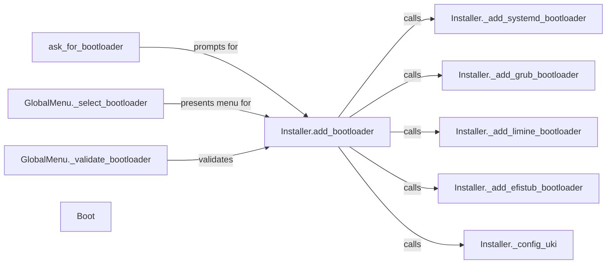

## Component Details

The bootloader configuration process in archinstall involves prompting the user for their bootloader preference, then installing and configuring the selected bootloader. The `Installer` class serves as the central point for managing the bootloader installation, delegating to specific methods for different bootloaders like systemd-boot, GRUB, Limine, and EFISTUB. The `Boot` class provides a context for executing commands within the boot environment. The `GlobalMenu` class handles user interaction for bootloader selection and validation.

### ask_for_bootloader
This component is responsible for prompting the user to select a bootloader during the installation process. It presents a list of available bootloaders and captures the user's choice.
- **Related Classes/Methods**: `archinstall.lib.interactions.system_conf:ask_for_bootloader`

### Installer.add_bootloader
This component acts as a central point for adding a bootloader to the system. It receives the user's bootloader selection and determines which specific bootloader installation method to call based on that selection. It orchestrates the bootloader installation process.
- **Related Classes/Methods**: `archinstall.lib.installer.Installer:add_bootloader`

### Installer._add_systemd_bootloader
This component installs and configures the systemd-boot bootloader. It performs the necessary steps to set up systemd-boot as the system's bootloader.
- **Related Classes/Methods**: `archinstall.lib.installer.Installer:_add_systemd_bootloader`

### Installer._add_grub_bootloader
This component installs and configures the GRUB bootloader. It handles the specific configuration steps required for GRUB.
- **Related Classes/Methods**: `archinstall.lib.installer.Installer:_add_grub_bootloader`

### Installer._add_limine_bootloader
This component installs and configures the Limine bootloader. It manages the installation and setup of Limine.
- **Related Classes/Methods**: `archinstall.lib.installer.Installer:_add_limine_bootloader`

### Installer._add_efistub_bootloader
This component configures the EFI stub bootloader. It sets up the system to boot directly from the EFI stub.
- **Related Classes/Methods**: `archinstall.lib.installer.Installer:_add_efistub_bootloader`

### Installer._config_uki
This component configures the Unified Kernel Image (UKI) boot setup. It prepares the system to boot using a UKI.
- **Related Classes/Methods**: `archinstall.lib.installer.Installer:_config_uki`

### GlobalMenu._select_bootloader
This component presents the user with a menu to select their desired bootloader. It provides a user-friendly interface for choosing a bootloader.
- **Related Classes/Methods**: `archinstall.lib.global_menu.GlobalMenu:_select_bootloader`

### GlobalMenu._validate_bootloader
This component validates the user's bootloader selection. It ensures that the selected bootloader is valid and supported.
- **Related Classes/Methods**: `archinstall.lib.global_menu.GlobalMenu:_validate_bootloader`

### Boot
This component manages boot-related operations, including entering and exiting a boot environment and executing system commands. It provides a context for performing boot-related tasks.
- **Related Classes/Methods**: `archinstall.lib.boot.Boot:__enter__`, `archinstall.lib.boot.Boot:__exit__`, `archinstall.lib.boot.Boot:SysCommand`
