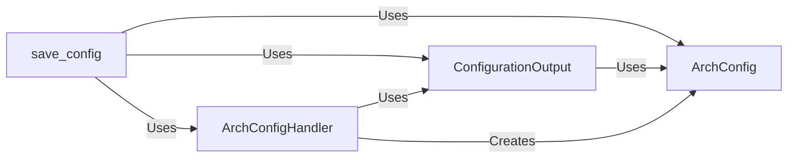

## Component Details

The Configuration Management component is responsible for handling the application's configuration settings. It involves parsing configuration data from various sources like command-line arguments, configuration files, and URLs. The parsed configuration is then stored in a structured format, validated, and made available to other components of the application. The component also provides functionality for persisting the configuration to user-specific files, enabling the application to retain settings across sessions.

### ArchConfig
Represents the configuration data structure. It provides methods for safe JSON serialization and deserialization from a configuration dictionary. It acts as a data container for the configuration settings.
- **Related Classes/Methods**: `archinstall.lib.args.ArchConfig`

### ArchConfigHandler
Handles the parsing of command-line arguments, configuration files, and URLs. It defines the arguments, parses them, processes credentials, and cleans up the configuration. It orchestrates the configuration loading process.
- **Related Classes/Methods**: `archinstall.lib.args.ArchConfigHandler`

### ConfigurationOutput
Handles the output and saving of the configuration. It provides methods for writing debug information, confirming the configuration with the user, and saving the configuration to user-specific files. It manages the persistence of the configuration.
- **Related Classes/Methods**: `archinstall.lib.configuration.ConfigurationOutput`

### save_config
A function that saves the configuration using ConfigurationOutput. It takes ArchConfigHandler and ArchConfig as input and uses ConfigurationOutput to save the configuration.
- **Related Classes/Methods**: `archinstall.lib.configuration:save_config`
