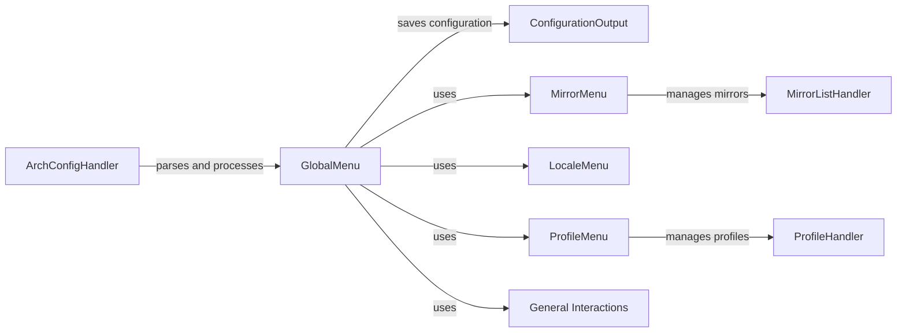

## Component Details

The Configuration Management subsystem in archinstall is responsible for handling the entire configuration process, from parsing command-line arguments and configuration files to providing interactive menus for user input and saving the final configuration. It orchestrates the flow of configuration data, ensuring consistency and flexibility throughout the installation process. The core components work together to gather, validate, and persist the installation settings.

### ArchConfigHandler
The ArchConfigHandler is the entry point for configuration. It parses command-line arguments and configuration files, loading settings and making them available to other components. It uses models to represent the configuration and interacts with the GlobalMenu to allow user interaction.
- **Related Classes/Methods**: `archinstall.lib.args.ArchConfigHandler`

### GlobalMenu
The GlobalMenu provides a central menu-driven interface for configuring various aspects of the installation. It presents options to the user, gathers input, and uses other menu components (like MirrorMenu, LocaleMenu, ProfileMenu, and DiskLayoutConfigurationMenu) to handle specific configuration tasks. It also interacts with General Interactions for simple questions.
- **Related Classes/Methods**: `archinstall.lib.global_menu.GlobalMenu`

### ConfigurationOutput
The ConfigurationOutput component handles saving and managing the final installation configuration. It provides methods for writing debug information, confirming the configuration, validating paths, and saving user configurations and credentials. It is used at the end of the configuration process to persist the settings.
- **Related Classes/Methods**: `archinstall.lib.configuration.ConfigurationOutput`

### MirrorMenu
The MirrorMenu allows the user to configure mirror settings. It presents a menu of mirror regions and allows the user to select mirrors. It uses the MirrorListHandler to manage the list of available mirrors.
- **Related Classes/Methods**: `archinstall.lib.mirrors.MirrorMenu`

### MirrorListHandler
The MirrorListHandler manages the list of available mirrors. It loads mirrors from local and remote sources, retrieves mirror regions, and gets the status of mirrors by region. It is used by the MirrorMenu to provide the list of mirrors to the user.
- **Related Classes/Methods**: `archinstall.lib.mirrors.MirrorListHandler`

### LocaleMenu
The LocaleMenu allows the user to configure locale settings. It presents a menu of locale languages and encodings and allows the user to select the keyboard layout.
- **Related Classes/Methods**: `archinstall.lib.locale.locale_menu.LocaleMenu`

### ProfileMenu
The ProfileMenu allows the user to select and configure installation profiles. It presents a menu of profiles and allows the user to select a graphics driver and preview the profile configuration. It uses the ProfileHandler to manage the installation profiles.
- **Related Classes/Methods**: `archinstall.lib.profile.profile_menu.ProfileMenu`

### ProfileHandler
The ProfileHandler manages the installation profiles. It parses profile configurations, retrieves available profiles, installs graphics drivers, and installs profile configurations. It is used by the ProfileMenu to manage the installation profiles.
- **Related Classes/Methods**: `archinstall.lib.profile.profiles_handler.ProfileHandler`

### General Interactions
This module contains functions for general user interactions, such as asking for a timezone, hostname, audio selection, additional packages, and the number of parallel downloads. It is used by the GlobalMenu to gather user input.
- **Related Classes/Methods**: `archinstall.lib.interactions.general_conf`
