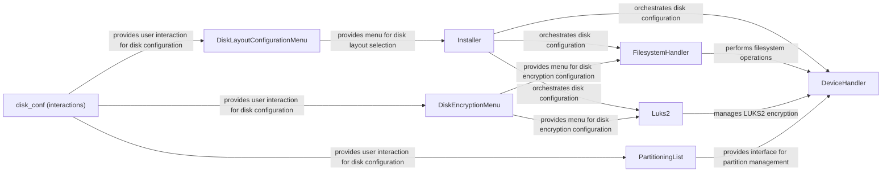

## Component Details

The Disk Management component is responsible for configuring the storage devices for the Arch Linux installation. It encompasses functionalities for partitioning, formatting, and encrypting disks, including support for LVM and LUKS. The process involves user interaction through menu-driven interfaces to define the desired disk layout and encryption settings. The Installer orchestrates the entire disk configuration process, utilizing DeviceHandler and FilesystemHandler for low-level operations and Luks2 for encryption management. The component ensures that the storage is properly prepared before the installation process begins.

### Installer
The Installer class orchestrates the disk configuration process. It handles mounting partitions, preparing LUKS encryption, managing LVM, generating key files, and creating the fstab file. It acts as a central point for coordinating various disk-related operations.
- **Related Classes/Methods**: `archinstall.lib.installer.Installer`

### FilesystemHandler
The FilesystemHandler class is responsible for performing filesystem operations such as formatting partitions and setting up LVM. It handles both standard and encrypted LVM configurations. It interacts with DeviceHandler to execute low-level operations.
- **Related Classes/Methods**: `archinstall.lib.disk.filesystem.FilesystemHandler`

### DeviceHandler
The DeviceHandler class provides low-level device management functionalities. It handles partitioning, formatting, encryption, mounting, and LVM operations. It interacts directly with the system's disk devices.
- **Related Classes/Methods**: `archinstall.lib.disk.device_handler.DeviceHandler`

### Luks2
The Luks2 class manages LUKS2 encryption operations. It provides methods for encrypting, unlocking, locking, and managing keyfiles for LUKS2 encrypted partitions.
- **Related Classes/Methods**: `archinstall.lib.luks.Luks2`

### DiskLayoutConfigurationMenu
The DiskLayoutConfigurationMenu class provides a menu-driven interface for selecting disk layout configurations. It allows users to choose predefined layouts or customize their own.
- **Related Classes/Methods**: `archinstall.lib.disk.disk_menu.DiskLayoutConfigurationMenu`

### PartitioningList
The PartitioningList class provides an interface for managing partitions. It allows users to create, delete, and modify partitions, as well as set Btrfs subvolumes.
- **Related Classes/Methods**: `archinstall.lib.disk.partitioning_menu.PartitioningList`

### DiskEncryptionMenu
The DiskEncryptionMenu class provides a menu-driven interface for configuring disk encryption. It allows users to select encryption types, passwords, and devices for encryption.
- **Related Classes/Methods**: `archinstall.lib.disk.encryption_menu.DiskEncryptionMenu`

### disk_conf (interactions)
The `disk_conf` module within `archinstall.lib.interactions` provides functions for user interaction related to disk configuration. It includes functions for selecting devices, disk configurations, LVM configurations, and other disk-related settings.
- **Related Classes/Methods**: `archinstall.lib.interactions.disk_conf`
