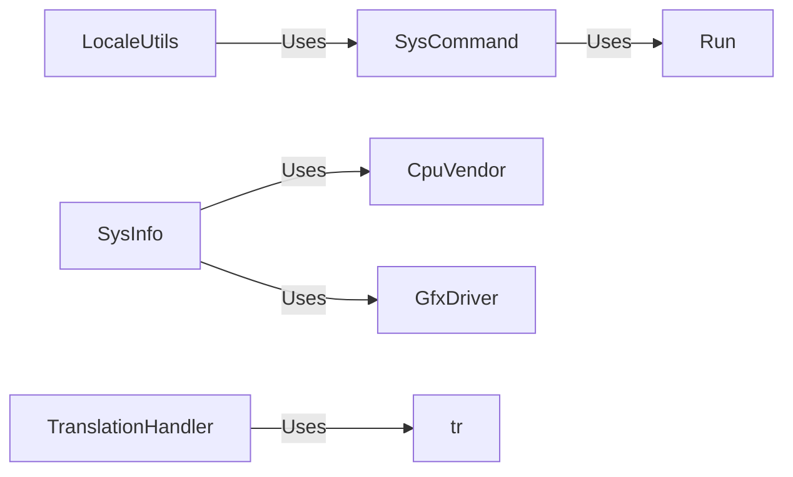

## Component Details

The Environment Interaction subsystem provides a set of tools and utilities for interacting with the underlying operating system and hardware. It encompasses functionalities such as executing system commands, gathering system information, handling translations, and managing locale settings. This subsystem ensures a consistent and reliable way to perform these tasks throughout the installation process.

### SysInfo
The SysInfo component is responsible for gathering system hardware and virtualization information. It detects CPU vendor, graphics devices, memory details, virtualization status, and whether the system is a virtual machine. This information is crucial for making informed decisions during the installation process, such as selecting appropriate drivers and configuring the system for optimal performance.
- **Related Classes/Methods**: `archinstall.lib.hardware.SysInfo`

### SysCommand
The SysCommand component provides a way to execute system commands. It creates sessions, executes commands, and manages the command execution process. It's a central point for interacting with the operating system, allowing other components to perform tasks such as partitioning disks, installing packages, and configuring system settings.
- **Related Classes/Methods**: `archinstall.lib.general.SysCommand`

### TranslationHandler
The TranslationHandler component manages translations for different languages. It loads language mappings, retrieves translations, and manages the available translations. This component ensures that the installation process can be presented in the user's preferred language, improving the user experience.
- **Related Classes/Methods**: `archinstall.lib.translationhandler.TranslationHandler`

### LocaleUtils
The LocaleUtils component provides utilities for managing locale settings. It includes functions for listing keyboard languages, verifying keyboard layouts, getting and setting the keyboard layout, and listing timezones. This component allows the user to configure the system's locale settings to match their preferences.
- **Related Classes/Methods**: `archinstall.lib.locale.utils`

### Run
The `run` function is a general utility for executing commands. It provides a simple interface for running shell commands and capturing their output. It is used by other components, such as `SysCommand` and `LocaleUtils`, to interact with the operating system.
- **Related Classes/Methods**: `archinstall.lib.general:run`
