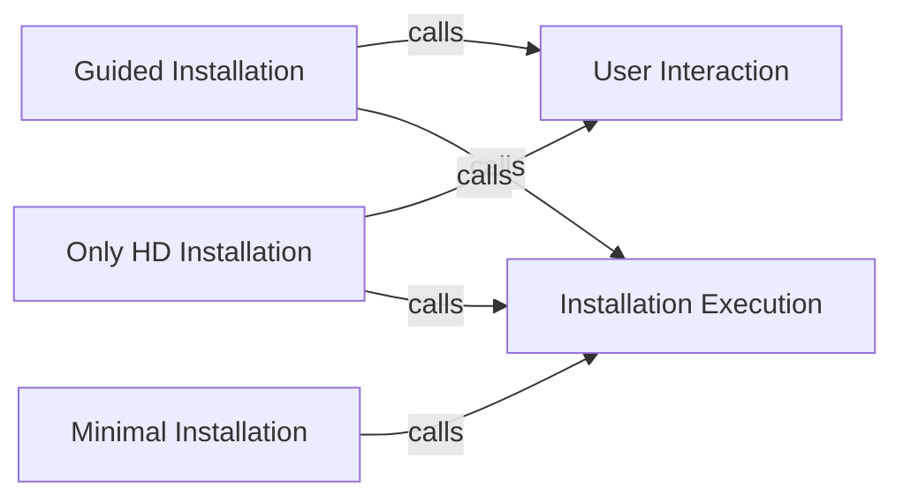

## Component Details

The installation orchestration component manages the overall installation workflow for Arch Linux. It provides different installation flows, including guided, minimal, and only-hd installations, each catering to different user needs and preferences. The component acts as a central control point, coordinating the execution of various modules based on user choices and configurations, guiding the installation process from start to finish. It offers both interactive and automated installation options, allowing users to customize the installation or perform a basic installation with minimal intervention.

### Guided Installation
The guided installation flow interactively prompts the user for input to customize the installation process. It gathers information about disk configuration, locale, keyboard layout, hostname, root password, user accounts, and network configuration. Based on the user's responses, it performs the installation by partitioning the disk, installing packages, configuring the system, and setting up the bootloader.
- **Related Classes/Methods**: `archinstall.archinstall.scripts.guided:guided`, `archinstall.archinstall.scripts.guided:ask_user_questions`, `archinstall.archinstall.scripts.guided:perform_installation`, `archinstall.examples.interactive_installation:guided`, `archinstall.examples.interactive_installation:ask_user_questions`, `archinstall.examples.interactive_installation:perform_installation`

### Minimal Installation
The minimal installation flow performs a basic installation of Arch Linux with essential packages and configurations. It does not ask the user any questions and proceeds with a predefined configuration. This flow is suitable for users who want a quick and simple installation without customization.
- **Related Classes/Methods**: `archinstall.archinstall.scripts.minimal:_minimal`, `archinstall.archinstall.scripts.minimal:perform_installation`, `archinstall.examples.minimal_installation:_minimal`, `archinstall.examples.minimal_installation:perform_installation`

### Only HD Installation
The only_hd installation flow focuses on hard drive configurations. It prompts the user for input related to hard drives and performs the installation based on the responses. This flow is useful for users who want to customize the disk partitioning and file system setup.
- **Related Classes/Methods**: `archinstall.archinstall.scripts.only_hd:_only_hd`, `archinstall.archinstall.scripts.only_hd:ask_user_questions`, `archinstall.archinstall.scripts.only_hd:perform_installation`, `archinstall.examples.only_hd_installation:_only_hd`, `archinstall.examples.only_hd_installation:ask_user_questions`, `archinstall.examples.only_hd_installation:perform_installation`

### User Interaction
This component is responsible for gathering installation preferences from the user through interactive prompts. It collects necessary information to customize the installation process, such as disk configuration, locale, keyboard layout, hostname, root password, and user accounts.
- **Related Classes/Methods**: `archinstall.archinstall.scripts.guided:ask_user_questions`, `archinstall.archinstall.scripts.only_hd:ask_user_questions`, `archinstall.examples.interactive_installation:ask_user_questions`, `archinstall.examples.only_hd_installation:ask_user_questions`

### Installation Execution
This component executes the actual installation process based on the configuration derived from user input or predefined settings. It handles tasks such as partitioning the disk, installing packages, configuring the system, and setting up the bootloader.
- **Related Classes/Methods**: `archinstall.archinstall.scripts.guided:perform_installation`, `archinstall.archinstall.scripts.minimal:perform_installation`, `archinstall.archinstall.scripts.only_hd:perform_installation`, `archinstall.examples.interactive_installation:perform_installation`, `archinstall.examples.minimal_installation:perform_installation`, `archinstall.examples.only_hd_installation:perform_installation`
