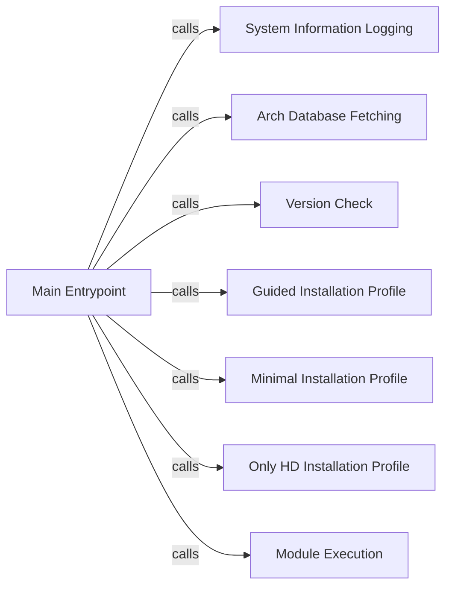

## Component Details

The archinstall script orchestrates the installation of Arch Linux. The main function serves as the entry point, initializing the process by logging system information, fetching the Arch Linux package database, and checking for new versions. It then calls one of the installation profiles (guided, minimal, or only_hd) based on user input or configuration. The selected profile guides the user through the installation process or performs an automated installation with minimal user interaction.

### Main Entrypoint
The main function is the starting point of the archinstall script. It sets up the environment, logs system information, fetches the Arch Linux database, checks for updates, and then delegates the installation process to a specific installation profile.
- **Related Classes/Methods**: `archinstall.archinstall:main`

### System Information Logging
This component is responsible for gathering and logging system information to a file. This information can be useful for debugging and auditing purposes, providing a snapshot of the system's state at the time of installation.
- **Related Classes/Methods**: `archinstall.archinstall:_log_sys_info`

### Arch Database Fetching
This component fetches the Arch Linux package database from the Arch Linux mirrors. This database is essential for resolving package dependencies and installing software during the installation process.
- **Related Classes/Methods**: `archinstall.archinstall:_fetch_arch_db`

### Version Check
This component checks for a newer version of the archinstall script. This ensures that the user is using the latest version with the newest features and bug fixes, improving the overall installation experience.
- **Related Classes/Methods**: `archinstall.archinstall:_check_new_version`

### Guided Installation Profile
This installation profile provides an interactive, user-friendly interface for installing Arch Linux. It guides the user through the various configuration options, making the installation process more accessible to beginners.
- **Related Classes/Methods**: `archinstall.examples.interactive_installation:guided`, `archinstall.archinstall.scripts.guided:guided`

### Minimal Installation Profile
This installation profile installs a bare-bones Arch Linux system with minimal packages. It is designed for experienced users who want a minimal system and full control over the installed software.
- **Related Classes/Methods**: `archinstall.examples.minimal_installation:_minimal`, `archinstall.archinstall.scripts.minimal:_minimal`

### Only HD Installation Profile
This installation profile installs Arch Linux on a single hard drive. It simplifies the installation process for users who only have one hard drive in their system.
- **Related Classes/Methods**: `archinstall.examples.only_hd_installation:_only_hd`, `archinstall.archinstall.scripts.only_hd:_only_hd`

### Module Execution
This component allows the archinstall script to be run as a module within another Python script. This enables more advanced users to integrate archinstall into their own custom installation workflows.
- **Related Classes/Methods**: `archinstall.archinstall:run_as_a_module`
