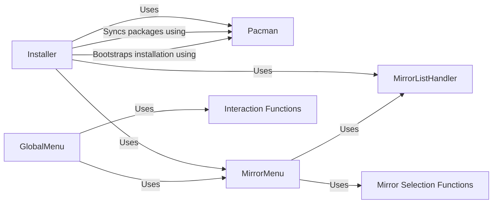

## Component Details

The package management subsystem is responsible for installing software packages on the system using Pacman. It involves configuring mirror lists, resolving dependencies, and installing the selected packages. The Installer orchestrates the process, utilizing Pacman for package management and MirrorMenu/MirrorListHandler for mirror configuration. User interaction is facilitated through GlobalMenu and Interaction Functions.

### Installer
The Installer class manages the overall installation process. It sets up mirrors, installs base packages, and allows for the installation of additional packages based on user selections. It acts as the central orchestrator for the installation process.
- **Related Classes/Methods**: `archinstall.lib.installer.Installer`

### Pacman
The Pacman class provides an interface for interacting with the Pacman package manager. It handles tasks such as syncing package databases, bootstrapping the installation environment, and running Pacman commands to install, remove, or update packages.
- **Related Classes/Methods**: `archinstall.lib.pacman.Pacman`

### MirrorMenu
The MirrorMenu class provides a menu-driven interface for configuring mirror settings. It allows users to select mirror regions and add custom mirror servers, influencing the source from which packages are downloaded.
- **Related Classes/Methods**: `archinstall.lib.mirrors.MirrorMenu`

### MirrorListHandler
The MirrorListHandler class manages the list of available mirrors. It loads mirrors from local and remote sources, retrieves mirror regions, and determines mirror statuses, providing the data source for mirror selection.
- **Related Classes/Methods**: `archinstall.lib.mirrors.MirrorListHandler`

### GlobalMenu
The GlobalMenu class provides a global menu for user interactions, including selecting additional packages and configuring mirrors. It serves as a central point for user input and configuration during the installation process.
- **Related Classes/Methods**: `archinstall.lib.global_menu.GlobalMenu`

### Mirror Selection Functions
A set of functions for selecting mirror regions, adding custom mirror servers and selecting custom mirrors. These functions are used by the MirrorMenu to allow the user to configure the mirrors.
- **Related Classes/Methods**: `archinstall.lib.mirrors`

### Interaction Functions
A set of functions for user interactions, such as asking for additional packages to install. These functions are used by the GlobalMenu to interact with the user.
- **Related Classes/Methods**: `archinstall.lib.interactions`
