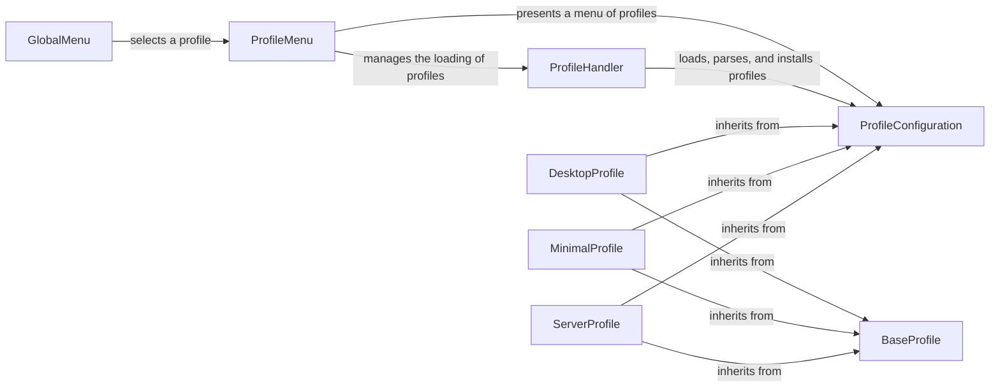

## Component Details

The Profile Management component in archinstall allows users to select and apply predefined installation profiles, streamlining the system configuration process. It encompasses the presentation of available profiles, handling user input for profile selection, loading and parsing profile configurations, and installing the packages and settings specified within the chosen profile. The process starts with presenting available profiles to the user, then loading the selected profile, parsing its configuration, and finally installing the packages and settings defined in the profile.

### ProfileMenu
The ProfileMenu component is responsible for presenting a menu of available profiles to the user. It handles user input to select a profile and allows the user to configure certain aspects of the selected profile before installation. It interacts with the ProfileHandler to load the list of available profiles.
- **Related Classes/Methods**: `archinstall.lib.profile.profile_menu.ProfileMenu`

### ProfileHandler
The ProfileHandler component manages the loading, parsing, and installation of profiles. It is responsible for finding available profiles, parsing their configurations, and installing the packages and settings specified in the profile. It interacts with the ProfileConfiguration to represent the profile's settings and packages.
- **Related Classes/Methods**: `archinstall.lib.profile.profiles_handler.ProfileHandler`

### ProfileConfiguration
The ProfileConfiguration component represents the configuration of a profile. It stores the settings and packages specified in the profile's configuration file. It is used by the ProfileHandler to install the packages and settings defined in the profile.
- **Related Classes/Methods**: `archinstall.lib.models.profile_model.ProfileConfiguration`

### BaseProfile
The BaseProfile component serves as an abstract base class for all profiles. It defines the common interface and functionality for all profile types, such as installing packages and configuring system settings. Specific profile implementations, like DesktopProfile or ServerProfile, inherit from this base class.
- **Related Classes/Methods**: `archinstall.lib.profile.profile.Profile`

### DesktopProfile
The DesktopProfile component is a specialized profile designed for desktop environments. It extends the BaseProfile and includes configurations and packages specific to desktop setups, such as display managers, desktop environments, and graphical applications.
- **Related Classes/Methods**: `archinstall.default_profiles.desktop.DesktopProfile`

### MinimalProfile
The MinimalProfile component represents a profile with only the essential packages installed. It provides a basic system setup without any additional software or configurations, suitable for users who want a clean and minimal installation.
- **Related Classes/Methods**: `archinstall.default_profiles.minimal.MinimalProfile`

### ServerProfile
The ServerProfile component represents a server profile with packages and configurations suitable for a server environment. It includes software and settings optimized for server tasks, such as web servers, databases, and system administration tools.
- **Related Classes/Methods**: `archinstall.default_profiles.server.ServerProfile`

### GlobalMenu
The GlobalMenu component presents a global menu to the user and handles user input to select a profile. It acts as a higher-level menu that might incorporate profile selection. It interacts with ProfileMenu to present the list of available profiles.
- **Related Classes/Methods**: `archinstall.lib.global_menu.GlobalMenu`
