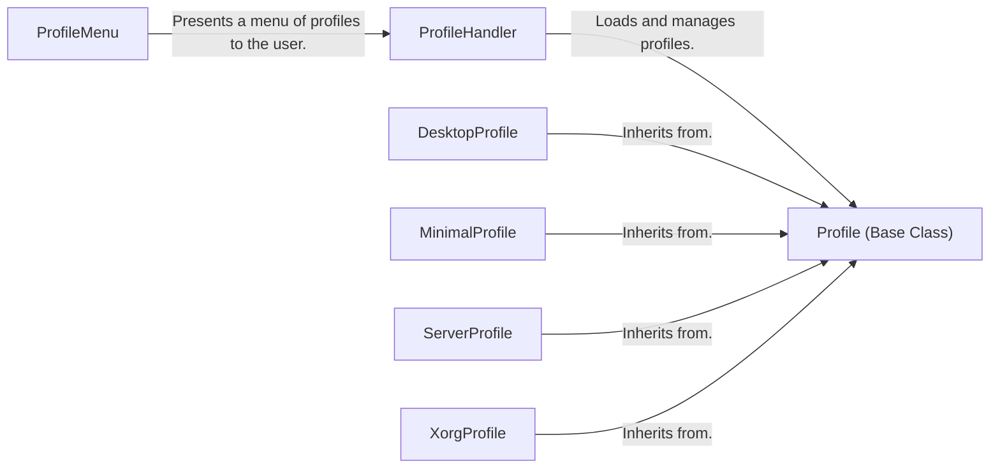

## Component Details

The Profile Management component is responsible for providing a user-friendly way to select and apply pre-configured system profiles during the Arch Linux installation process. It encompasses the presentation of available profiles, the loading and parsing of profile configurations, and the subsequent installation of packages and settings defined within the chosen profile. The component streamlines the installation process by offering ready-made configurations for different system types, such as desktop, server, or specialized environments like those using specific window managers or compositors.

### ProfileMenu
The ProfileMenu class is responsible for presenting a menu of available installation profiles to the user. It handles user interaction, allowing the user to select a profile and configure related options such as the greeter or graphics driver. It acts as the entry point for profile selection during the installation process.
- **Related Classes/Methods**: `archinstall.lib.profile.profile_menu.ProfileMenu`

### ProfileHandler
The ProfileHandler class manages the loading, parsing, and application of installation profiles. It discovers available profiles, reads their configuration files, and orchestrates the installation of packages and settings defined within the selected profile. It serves as the central orchestrator for profile-based installations.
- **Related Classes/Methods**: `archinstall.lib.profile.profiles_handler.ProfileHandler`

### Profile (Base Class)
The Profile base class defines the common interface for all profile types. It provides methods for checking profile types (e.g., desktop, Xorg), generating preview text, and retrieving package lists. It establishes a contract for all concrete profile implementations.
- **Related Classes/Methods**: `archinstall.default_profiles.profile.Profile`

### DesktopProfile
The DesktopProfile class is a specific profile tailored for desktop environments. It inherits from the Profile base class and includes configurations and packages commonly used in desktop setups, such as a graphical desktop environment, display manager, and common desktop applications.
- **Related Classes/Methods**: `archinstall.default_profiles.desktop.DesktopProfile`

### MinimalProfile
The MinimalProfile class represents a profile with a minimal set of packages and configurations, providing a basic Arch Linux installation. It's useful for users who want a bare-bones system and prefer to customize it from the ground up.
- **Related Classes/Methods**: `archinstall.default_profiles.minimal.MinimalProfile`

### ServerProfile
The ServerProfile class is a profile tailored for server environments. It includes server-specific packages and configurations, such as a web server, database server, and other tools commonly used on servers.
- **Related Classes/Methods**: `archinstall.default_profiles.server.ServerProfile`

### XorgProfile
The XorgProfile class is a profile specifically designed for systems using the Xorg display server. It includes the necessary packages and configurations for setting up an Xorg-based graphical environment.
- **Related Classes/Methods**: `archinstall.default_profiles.xorg.XorgProfile`
