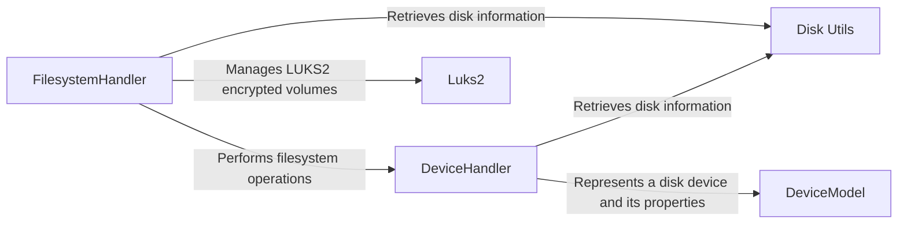

## Component Details

The Storage Management component orchestrates disk-related operations, preparing storage devices for installation. It gathers disk information, performs low-level device operations, manages file systems and LVM, and handles encryption. The central flow involves using `lsblk` to discover disks, `DeviceHandler` to partition and format them, `FilesystemHandler` to create file systems and LVM volumes, and `Luks2` to manage encryption. The `DeviceModel` represents the state of each disk device.

### FilesystemHandler
The FilesystemHandler class is responsible for orchestrating filesystem operations, including formatting partitions, setting up LVM (Logical Volume Management), and handling encryption. It acts as a central point for managing the filesystem aspects of disk configuration.
- **Related Classes/Methods**: `archinstall.lib.disk.filesystem.FilesystemHandler`

### DeviceHandler
The DeviceHandler class provides an interface for interacting with disk devices. It offers functionalities such as partitioning, formatting, encryption, and LVM management at the device level. It also provides methods for retrieving device information and managing mount points.
- **Related Classes/Methods**: `archinstall.lib.disk.device_handler.DeviceHandler`

### Disk Utils
The Disk Utils module provides utility functions for retrieving disk information using lsblk, managing mount points, and determining disk layouts. It offers helper functions to fetch and parse disk-related data.
- **Related Classes/Methods**: `archinstall.lib.disk.utils`

### Luks2
The Luks2 class provides an interface for managing LUKS2 encrypted volumes. It handles encryption and decryption operations, key management, and other LUKS2-related tasks.
- **Related Classes/Methods**: `archinstall.lib.luks.Luks2`

### DeviceModel
The DeviceModel class represents a disk device and its properties. It stores information about the device, such as its name, size, partitions, and mount points.
- **Related Classes/Methods**: `archinstall.lib.models.device_model`
