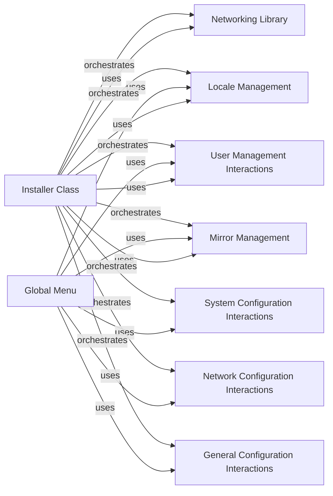

## Component Details

The System Configuration subsystem is responsible for configuring various system-level settings during the Arch Linux installation process. It encompasses networking, locale settings, mirror selection, user account management, and other general configurations. The subsystem interacts with the user to gather preferences and then applies these settings to the installed system, ensuring it is properly configured for the user's specific needs and environment. The configuration is orchestrated by the `Installer` class, which uses various helper classes and functions to set up the system.

### Installer Class
The Installer class is the central component for performing the actual installation steps. It encapsulates the core installation logic and handles tasks such as setting mirrors, locale, timezone, creating users, and setting passwords. It orchestrates the configuration process by calling other components.
- **Related Classes/Methods**: `archinstall.lib.installer.Installer`

### Networking Library
The Networking Library provides functions for managing network interfaces and performing network connectivity tests. It's used to configure the network during the installation process, allowing the system to connect to the internet and download packages.
- **Related Classes/Methods**: `archinstall.lib.networking`

### Locale Management
The Locale Management component provides functionalities for managing locale settings, including keyboard languages, X11 keyboard languages, and timezones. It allows users to configure the system's language and regional settings, ensuring the system is properly localized.
- **Related Classes/Methods**: `archinstall.lib.locale`

### Mirror Management
The Mirror Management component provides functionalities for managing mirror lists, including custom mirror repositories and servers. It allows users to select and configure mirror servers for package downloads, optimizing download speeds and ensuring package availability.
- **Related Classes/Methods**: `archinstall.lib.mirrors`

### User Management Interactions
The User Management Interactions component provides functionalities for managing user accounts, including adding and configuring users. It allows the user to create user accounts with specific privileges and passwords.
- **Related Classes/Methods**: `archinstall.lib.interactions.manage_users_conf`

### System Configuration Interactions
The System Configuration Interactions component provides functions for interacting with the user to configure system settings such as kernel, bootloader, swap, and drivers. It gathers user preferences for these settings.
- **Related Classes/Methods**: `archinstall.lib.interactions.system_conf`

### Network Configuration Interactions
The Network Configuration Interactions component provides functionalities for configuring network interfaces, including manual configuration options. It allows the user to configure network settings such as IP address, gateway, and DNS servers.
- **Related Classes/Methods**: `archinstall.lib.interactions.network_menu`

### General Configuration Interactions
The General Configuration Interactions component provides functions for interacting with the user to configure general system settings such as hostname, timezone, audio, and additional packages. It gathers user preferences for these general settings.
- **Related Classes/Methods**: `archinstall.lib.interactions.general_conf`

### Global Menu
The Global Menu component provides a menu-driven interface for configuring various aspects of the installation, such as language, disk encryption, locale, and network settings. It interacts with other components to gather user preferences.
- **Related Classes/Methods**: `archinstall.lib.global_menu.GlobalMenu`
