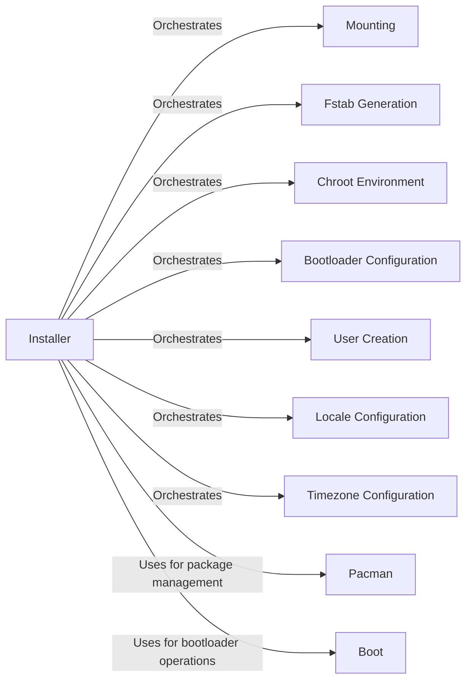

## Component Details

The System Installation component automates the process of installing Arch Linux. It orchestrates disk partitioning, mounting, package installation, bootloader setup, and system configuration. The central class, `Installer`, manages the installation process, utilizing `Pacman` for package management and `Boot` for bootloader configuration. The component ensures a functional Arch Linux system is set up on the target environment.

### Installer
The central class that orchestrates the entire installation process. It manages disk partitioning, mounting, package installation, bootloader setup, user creation, locale and timezone settings, and fstab generation.
- **Related Classes/Methods**: `archinstall.lib.installer.Installer`

### Pacman
Handles package management tasks, including syncing with repositories, installing packages, and removing packages within the installation environment.
- **Related Classes/Methods**: `archinstall.lib.pacman.Pacman`

### Boot
Manages bootloader-related operations, including installing and configuring bootloaders like systemd-boot, GRUB, and others.
- **Related Classes/Methods**: `archinstall.lib.boot.Boot`

### Mounting
Mounts the partition layout in a specific order to ensure proper system setup.
- **Related Classes/Methods**: `archinstall.lib.installer.Installer:mount_ordered_layout`

### Fstab Generation
Generates the fstab file, which defines how file systems are mounted at boot time.
- **Related Classes/Methods**: `archinstall.lib.installer.Installer:genfstab`

### Chroot Environment
Enters a chroot environment, allowing commands to be executed within the newly installed system.
- **Related Classes/Methods**: `archinstall.lib.installer.Installer:arch_chroot`

### Bootloader Configuration
Adds and configures the selected bootloader to enable booting into the installed system.
- **Related Classes/Methods**: `archinstall.lib.installer.Installer:add_bootloader`

### User Creation
Creates user accounts on the system.
- **Related Classes/Methods**: `archinstall.lib.installer.Installer:create_users`

### Locale Configuration
Sets the system locale.
- **Related Classes/Methods**: `archinstall.lib.installer.Installer:set_locale`

### Timezone Configuration
Sets the system timezone.
- **Related Classes/Methods**: `archinstall.lib.installer.Installer:set_timezone`
