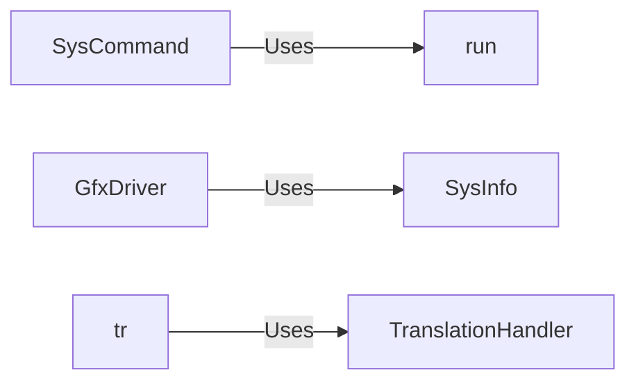

## Component Details

The System Interaction component provides the core functionalities for the archinstall installer to interact with the underlying system. It encompasses executing commands, gathering hardware information, and managing translations. The component abstracts system calls and external processes, offering a unified interface for other parts of the installer to perform system-level operations. It ensures that the installer can adapt to different hardware configurations and language settings.

### SysCommand
The `SysCommand` class provides a way to execute system commands and interact with them. It handles the creation of sessions and manages the execution of commands, capturing both standard output and standard error streams. It allows for interactive commands where input can be sent during execution.
- **Related Classes/Methods**: `archinstall.lib.general.SysCommand`

### run
The `run` function executes a system command using `subprocess.run` and returns the result. It's a higher-level function that simplifies command execution for non-interactive commands where only the final result is needed.
- **Related Classes/Methods**: `archinstall.lib.general:run`

### SysInfo
The `SysInfo` class gathers system information such as CPU vendor, memory details, virtualization status, and graphics devices. It provides methods to query these details, offering a centralized point for accessing hardware-related information.
- **Related Classes/Methods**: `archinstall.lib.hardware.SysInfo`

### GfxDriver
The `GfxDriver` class provides methods to determine the required graphics drivers based on the detected hardware. It uses `SysInfo` to detect the graphics hardware and then determines the appropriate driver to install.
- **Related Classes/Methods**: `archinstall.lib.hardware.GfxDriver`

### TranslationHandler
The `TranslationHandler` class manages translations for the installer. It loads language mappings and provides methods to retrieve translated messages, allowing the installer to be localized.
- **Related Classes/Methods**: `archinstall.lib.translationhandler.TranslationHandler`

### tr
The `tr` function is a translation function that uses the `TranslationHandler` to translate messages. It acts as a convenient wrapper around the `TranslationHandler` to simplify the translation process.
- **Related Classes/Methods**: `archinstall.lib.translationhandler:tr`
