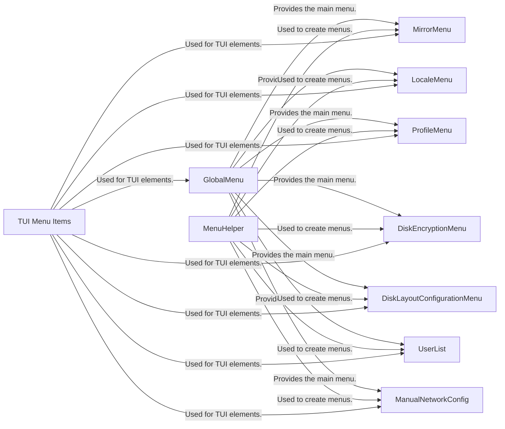

## Component Details

The TUI Framework provides the interactive text-based interface for the archinstall script. It encompasses menu structures, item definitions, and helper functions to create a user-friendly installation experience. The framework allows users to navigate through various configuration options, such as language selection, disk partitioning, user management, and network settings, guiding them through the installation process.

### GlobalMenu
The GlobalMenu class serves as the main entry point for the archinstall script's TUI. It presents a top-level menu with options to configure various aspects of the installation. It orchestrates the navigation to other sub-menus and interaction components.
- **Related Classes/Methods**: `archinstall.lib.global_menu.GlobalMenu`

### MenuHelper
The MenuHelper class provides helper functions for creating and managing menus, simplifying the development of interactive menus within the archinstall script. It encapsulates common menu-related tasks, reducing code duplication and improving maintainability.
- **Related Classes/Methods**: `archinstall.lib.menu.menu_helper.MenuHelper`

### TUI Menu Items
This component includes classes for creating menu items and groups for the text-based user interface (TUI). It provides the building blocks for constructing the interactive menus used throughout the archinstall script.
- **Related Classes/Methods**: `archinstall.tui.menu_item.MenuItem`, `archinstall.tui.menu_item.MenuItemGroup`, `archinstall.tui.menu_item.MenuItemsState`

### MirrorMenu
The MirrorMenu class allows the user to configure the mirror list used by pacman. It provides options to select mirror regions or add custom mirror servers for package downloads, optimizing the download speed and reliability during the installation process.
- **Related Classes/Methods**: `archinstall.lib.mirrors.MirrorMenu`

### LocaleMenu
The LocaleMenu class enables the user to select the system language, locale, and keyboard layout. It configures the system's localization settings, ensuring that the installed system is properly configured for the user's preferred language and region.
- **Related Classes/Methods**: `archinstall.lib.locale.locale_menu.LocaleMenu`

### ProfileMenu
The ProfileMenu class allows the user to select a pre-defined installation profile, such as desktop environments or server configurations. It simplifies the installation process by providing ready-made configurations, reducing the need for manual configuration.
- **Related Classes/Methods**: `archinstall.lib.profile.profile_menu.ProfileMenu`

### DiskEncryptionMenu
The DiskEncryptionMenu class provides options for configuring disk encryption, including selecting the encryption type, password, and partitions to encrypt. It enhances the system's security by encrypting the disk, protecting sensitive data from unauthorized access.
- **Related Classes/Methods**: `archinstall.lib.disk.encryption_menu.DiskEncryptionMenu`

### DiskLayoutConfigurationMenu
The DiskLayoutConfigurationMenu class allows the user to configure the disk layout, including selecting a pre-defined layout or manually configuring partitions and LVM volumes. It provides flexibility in setting up the storage configuration, catering to both novice and advanced users.
- **Related Classes/Methods**: `archinstall.lib.disk.disk_menu.DiskLayoutConfigurationMenu`

### UserList
The UserList class manages user accounts, allowing the user to add, modify, and delete user accounts. It configures the system's user management settings, ensuring that the installed system has the necessary user accounts for operation.
- **Related Classes/Methods**: `archinstall.lib.interactions.manage_users_conf.UserList`

### ManualNetworkConfig
The ManualNetworkConfig class allows the user to manually configure network interfaces, including setting IP addresses, gateway, and DNS servers. It provides an alternative to automatic network configuration, allowing users with specific network requirements to customize their network settings.
- **Related Classes/Methods**: `archinstall.lib.interactions.network_menu.ManualNetworkConfig`
