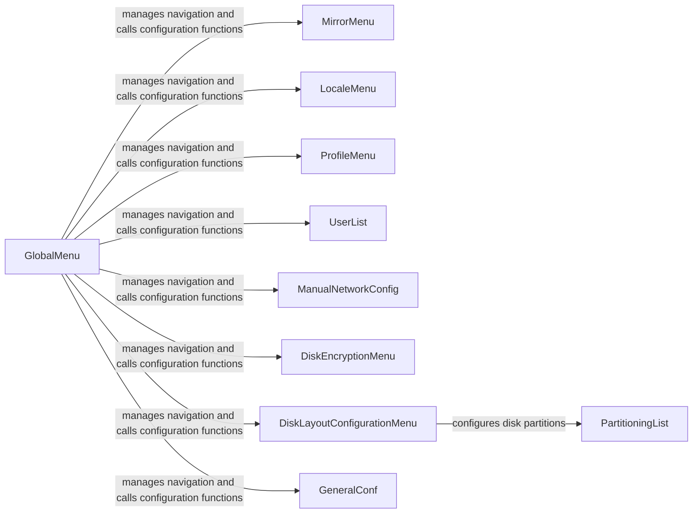

## Component Details

The User Interface component provides an interactive text-based interface (TUI) for users to configure the installation. It orchestrates the navigation between different configuration options, presents menus, prompts, and dialogs for various settings, such as language, disk encryption, network configuration, and user accounts. It relies on the `tui` package for rendering the interface and the `lib.menu` package for menu management. The main flow involves the GlobalMenu managing the main menu and calling the appropriate functions to configure various aspects of the system based on user input.

### GlobalMenu
The GlobalMenu class manages the main menu and orchestrates the navigation between different configuration options. It handles user input and calls the appropriate functions to configure various aspects of the system, such as disk encryption, locale, network, and user accounts.
- **Related Classes/Methods**: `archinstall.lib.global_menu.GlobalMenu`

### MirrorMenu
The MirrorMenu class provides options for selecting mirror regions and adding custom mirror servers. It allows the user to configure the mirror list used for downloading packages during the installation process.
- **Related Classes/Methods**: `archinstall.lib.mirrors.MirrorMenu`, `archinstall.lib.mirrors:select_mirror_regions`, `archinstall.lib.mirrors:add_custom_mirror_servers`, `archinstall.lib.mirrors:select_custom_mirror`, `archinstall.lib.mirrors:select_optional_`

### LocaleMenu
The LocaleMenu class allows the user to select the system language, locale, and keyboard layout. It provides a menu-driven interface for configuring these settings.
- **Related Classes/Methods**: `archinstall.lib.locale.locale_menu.LocaleMenu`, `archinstall.lib.locale.locale_menu:select_locale_lang`, `archinstall.lib.locale.locale_menu:select_locale_enc`, `archinstall.lib.locale.locale_menu:select_kb_layout`

### ProfileMenu
The ProfileMenu class enables the user to select a pre-defined profile or customize the system configuration. It allows the user to choose a desktop environment, graphics driver, and other profile-related settings.
- **Related Classes/Methods**: `archinstall.lib.profile.profile_menu.ProfileMenu`, `archinstall.lib.profile.profile_menu:select_greeter`, `archinstall.lib.profile.profile_menu:select_profile`

### UserList
The UserList class manages the creation and configuration of user accounts. It allows the user to add new users, set passwords, and configure user privileges.
- **Related Classes/Methods**: `archinstall.lib.interactions.manage_users_conf.UserList`, `archinstall.lib.interactions.manage_users_conf:ask_for_additional_users`

### ManualNetworkConfig
The ManualNetworkConfig class provides options for manually configuring the network interface. It allows the user to set the IP address, gateway, and DNS servers.
- **Related Classes/Methods**: `archinstall.lib.interactions.network_menu.ManualNetworkConfig`, `archinstall.lib.interactions.network_menu:ask_to_configure_network`

### DiskEncryptionMenu
The DiskEncryptionMenu class handles the configuration of disk encryption. It allows the user to select the encryption type, password, and partitions to encrypt.
- **Related Classes/Methods**: `archinstall.lib.disk.encryption_menu.DiskEncryptionMenu`, `archinstall.lib.disk.encryption_menu:select_encryption_type`, `archinstall.lib.disk.encryption_menu:select_encrypted_password`, `archinstall.lib.disk.encryption_menu:select_hsm`, `archinstall.lib.disk.encryption_menu:select_partitions_to_encrypt`, `archinstall.lib.disk.encryption_menu:select_lvm_vols_to_encrypt`

### DiskLayoutConfigurationMenu
The DiskLayoutConfigurationMenu class provides options for configuring the disk layout. It allows the user to select a pre-defined disk layout or customize the partitioning scheme.
- **Related Classes/Methods**: `archinstall.lib.disk.disk_menu.DiskLayoutConfigurationMenu`

### PartitioningList
The PartitioningList class manages the partitioning of the disk. It allows the user to create, delete, and modify partitions, as well as set mount points and file system types.
- **Related Classes/Methods**: `archinstall.lib.disk.partitioning_menu.PartitioningList`, `archinstall.lib.disk.partitioning_menu:manual_partitioning`

### GeneralConf
This module contains functions for asking general configuration questions, such as hostname, timezone, audio selection, additional packages, and parallel downloads.
- **Related Classes/Methods**: `archinstall.lib.interactions.general_conf:ask_ntp`, `archinstall.lib.interactions.general_conf:ask_hostname`, `archinstall.lib.interactions.general_conf:ask_for_a_timezone`, `archinstall.lib.interactions.general_conf:ask_for_audio_selection`, `archinstall.lib.interactions.general_conf:select_language`, `archinstall.lib.interactions.general_conf:select_archinstall_language`, `archinstall.lib.interactions.general_conf:ask_additional_packages_to_install`, `archinstall.lib.interactions.general_conf:add_number_of_parallel_downloads`, `archinstall.lib.interactions.general_conf:ask_post_installation`, `archinstall.lib.interactions.general_conf:ask_abort`
