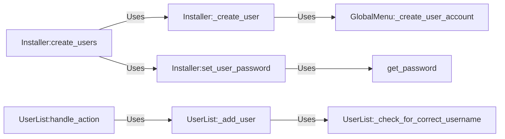

## Component Details

The User Management component handles the creation, configuration, and management of user accounts within the archinstall system. It encompasses the process of prompting the user for necessary information, validating inputs, creating user accounts on the system, and setting passwords. The flow begins with the installer prompting for user details, which are then validated and used to create user objects. These objects are then used to create the actual user accounts on the system, with passwords securely set. The component ensures that users can access the installed system with appropriate credentials and configurations.

### Installer:create_users
This component orchestrates the creation of multiple user accounts during the installation process. It calls other functions to create individual users and set their passwords, managing the overall user creation workflow.
- **Related Classes/Methods**: `archinstall.lib.installer.Installer`

### Installer:_create_user
This component is responsible for creating a single user account on the system. It encapsulates the system-level operations required to add a user to the operating system.
- **Related Classes/Methods**: `archinstall.lib.installer.Installer`

### Installer:set_user_password
This component sets the password for a user account. It handles the process of setting or changing a user's password, potentially involving password hashing or encryption for security.
- **Related Classes/Methods**: `archinstall.lib.installer.Installer`

### UserList:handle_action
This component handles user actions related to the user list, such as adding, removing, or modifying users. It acts as a central point for managing user-related operations within the UserList.
- **Related Classes/Methods**: `archinstall.lib.interactions.manage_users_conf.UserList`

### UserList:_add_user
This component adds a user to the UserList, storing their information. It persists user data within the UserList, making it available for later use.
- **Related Classes/Methods**: `archinstall.lib.interactions.manage_users_conf.UserList`

### UserList:_check_for_correct_username
This component validates the username to ensure it meets the system's requirements. It enforces username policies, preventing invalid or potentially harmful usernames from being used.
- **Related Classes/Methods**: `archinstall.lib.interactions.manage_users_conf.UserList`

### get_password
This component retrieves a password from the user, potentially using secure input methods to prevent it from being displayed on the screen.
- **Related Classes/Methods**: `archinstall.lib.utils.util`

### GlobalMenu:_create_user_account
Handles the creation of a user account, potentially interacting with system calls or libraries to add the user to the operating system. This component likely encapsulates the low-level operations required to create a user account, such as creating the user's home directory and setting up their initial environment.
- **Related Classes/Methods**: `archinstall.lib.global_menu.GlobalMenu`
