```mermaid
graph LR
    Installation_Orchestration["Installation Orchestration"]
    Configuration_Management["Configuration Management"]
    Disk_Management["Disk Management"]
    Package_Management["Package Management"]
    Bootloader_Configuration["Bootloader Configuration"]
    User_Management["User Management"]
    Profile_Management["Profile Management"]
    TUI_Framework["TUI Framework"]
    System_Interaction["System Interaction"]
    Installation_Orchestration -- "orchestrates" --> Configuration_Management
    Installation_Orchestration -- "orchestrates" --> Disk_Management
    Installation_Orchestration -- "orchestrates" --> Package_Management
    Installation_Orchestration -- "orchestrates" --> Bootloader_Configuration
    Installation_Orchestration -- "orchestrates" --> User_Management
    Installation_Orchestration -- "orchestrates" --> Profile_Management
    Configuration_Management -- "configures" --> Disk_Management
    Configuration_Management -- "configures" --> Package_Management
    Configuration_Management -- "configures" --> Bootloader_Configuration
    Configuration_Management -- "configures" --> User_Management
    Configuration_Management -- "configures" --> Profile_Management
    Disk_Management -- "manages disks for" --> Package_Management
    Package_Management -- "installs packages for" --> Bootloader_Configuration
    Bootloader_Configuration -- "configures bootloader for" --> User_Management
    User_Management -- "creates users for" --> Profile_Management
    Profile_Management -- "applies profiles using" --> TUI_Framework
    TUI_Framework -- "provides TUI for" --> Configuration_Management
    System_Interaction -- "interacts with system for" --> Disk_Management
    System_Interaction -- "interacts with system for" --> Package_Management
    System_Interaction -- "interacts with system for" --> Bootloader_Configuration
    System_Interaction -- "interacts with system for" --> User_Management
    System_Interaction -- "interacts with system for" --> Profile_Management
    click Installation_Orchestration href "https://github.com/CodeBoarding/GeneratedOnBoardings/blob/main/archinstall/Installation Orchestration.md" "Details"
    click Configuration_Management href "https://github.com/CodeBoarding/GeneratedOnBoardings/blob/main/archinstall/Configuration Management.md" "Details"
    click Disk_Management href "https://github.com/CodeBoarding/GeneratedOnBoardings/blob/main/archinstall/Disk Management.md" "Details"
    click Package_Management href "https://github.com/CodeBoarding/GeneratedOnBoardings/blob/main/archinstall/Package Management.md" "Details"
    click Bootloader_Configuration href "https://github.com/CodeBoarding/GeneratedOnBoardings/blob/main/archinstall/Bootloader Configuration.md" "Details"
    click User_Management href "https://github.com/CodeBoarding/GeneratedOnBoardings/blob/main/archinstall/User Management.md" "Details"
    click Profile_Management href "https://github.com/CodeBoarding/GeneratedOnBoardings/blob/main/archinstall/Profile Management.md" "Details"
    click TUI_Framework href "https://github.com/CodeBoarding/GeneratedOnBoardings/blob/main/archinstall/TUI Framework.md" "Details"
    click System_Interaction href "https://github.com/CodeBoarding/GeneratedOnBoardings/blob/main/archinstall/System Interaction.md" "Details"
```

## Component Details

The archinstall script automates the installation of Arch Linux. It provides a guided or automated approach to partitioning disks, installing packages, configuring the system, and setting up a bootloader. The script aims to simplify the installation process for both new and experienced users, offering various configuration options through a text-based user interface or command-line arguments.

### Installation Orchestration
This component manages the overall installation workflow, coordinating the execution of different modules based on user choices and configuration. It acts as the central control point, guiding the installation process from start to finish.
- **Related Classes/Methods**: `archinstall.archinstall.scripts.guided`, `archinstall.archinstall.scripts.minimal`, `archinstall.archinstall.scripts.only_hd`, `archinstall.examples.interactive_installation`, `archinstall.examples.minimal_installation`, `archinstall.examples.only_hd_installation`

### Configuration Management
This component handles the parsing, storage, and management of installation configuration settings. It gathers information from command-line arguments, configuration files, and user input to determine the installation parameters and stores them for use by other components.
- **Related Classes/Methods**: `archinstall.lib.args.ArchConfig`, `archinstall.lib.args.ArchConfigHandler`

### Disk Management
This component is responsible for disk partitioning, formatting, and encryption. It provides functionalities to interact with disks and partitions, create file systems, and manage LVM and LUKS encryption, ensuring the storage is properly prepared for the installation.
- **Related Classes/Methods**: `archinstall.lib.disk.device_handler.DeviceHandler`, `archinstall.lib.disk.filesystem.FilesystemHandler`, `archinstall.lib.disk.utils`, `archinstall.lib.luks.Luks2`, `archinstall.lib.models.device_model`

### Package Management
This component handles the installation of software packages using Pacman. It manages the mirror list, resolves dependencies, and installs the selected packages onto the system, ensuring all necessary software is present.
- **Related Classes/Methods**: `archinstall.lib.pacman.Pacman`

### Bootloader Configuration
This component configures the bootloader to enable the system to boot after installation. It supports different bootloaders and handles the necessary configuration steps, ensuring the system can start properly.
- **Related Classes/Methods**: `archinstall.lib.boot.Boot`

### User Management
This component manages the creation and configuration of user accounts. It allows setting usernames, passwords, and other user-related settings, ensuring users can access the installed system.
- **Related Classes/Methods**: `archinstall.lib.models.users`, `archinstall.lib.interactions.manage_users_conf`

### Profile Management
This component manages the selection and application of predefined installation profiles, such as desktop or server profiles. It allows users to quickly configure the system with a set of pre-selected packages and settings, simplifying the configuration process.
- **Related Classes/Methods**: `archinstall.lib.profile`, `archinstall.default_profiles`, `archinstall.lib.models.profile_model`

### TUI Framework
This component provides the text-based user interface (TUI) framework used for interactive configuration. It includes classes for creating menus, menu items, and help texts, enabling a user-friendly installation experience.
- **Related Classes/Methods**: `archinstall.tui`, `archinstall.lib.menu.menu_helper`

### System Interaction
This component provides functionalities for interacting with the underlying system, such as executing commands, detecting hardware information, and handling translations. It provides the necessary tools for the installer to communicate with the system.
- **Related Classes/Methods**: `archinstall.lib.general`, `archinstall.lib.hardware`, `archinstall.lib.translationhandler`