```mermaid
graph LR
    Installation_Orchestrator["Installation Orchestrator"]
    Configuration_Management["Configuration Management"]
    User_Interface["User Interface"]
    Storage_Management["Storage Management"]
    System_Installation["System Installation"]
    Profile_Management["Profile Management"]
    System_Configuration["System Configuration"]
    Environment_Interaction["Environment Interaction"]
    Installation_Orchestrator -- "orchestrates" --> Configuration_Management
    Installation_Orchestrator -- "orchestrates" --> User_Interface
    Installation_Orchestrator -- "orchestrates" --> Storage_Management
    Installation_Orchestrator -- "orchestrates" --> System_Installation
    Installation_Orchestrator -- "orchestrates" --> Profile_Management
    Installation_Orchestrator -- "orchestrates" --> System_Configuration
    Installation_Orchestrator -- "orchestrates" --> Environment_Interaction
    Configuration_Management -- "provides configuration data to" --> User_Interface
    Configuration_Management -- "provides configuration data to" --> Storage_Management
    Configuration_Management -- "provides configuration data to" --> System_Installation
    Configuration_Management -- "provides configuration data to" --> Profile_Management
    Configuration_Management -- "provides configuration data to" --> System_Configuration
    User_Interface -- "uses" --> Environment_Interaction
    Storage_Management -- "uses" --> Environment_Interaction
    System_Installation -- "uses" --> Storage_Management
    System_Installation -- "uses" --> System_Configuration
    System_Installation -- "uses" --> Environment_Interaction
    Profile_Management -- "uses" --> System_Installation
    System_Configuration -- "uses" --> Environment_Interaction
    click Installation_Orchestrator href "https://github.com/CodeBoarding/GeneratedOnBoardings/blob/main/archinstall/Installation Orchestrator.md" "Details"
    click Configuration_Management href "https://github.com/CodeBoarding/GeneratedOnBoardings/blob/main/archinstall/Configuration Management.md" "Details"
    click User_Interface href "https://github.com/CodeBoarding/GeneratedOnBoardings/blob/main/archinstall/User Interface.md" "Details"
    click Storage_Management href "https://github.com/CodeBoarding/GeneratedOnBoardings/blob/main/archinstall/Storage Management.md" "Details"
    click System_Installation href "https://github.com/CodeBoarding/GeneratedOnBoardings/blob/main/archinstall/System Installation.md" "Details"
    click Profile_Management href "https://github.com/CodeBoarding/GeneratedOnBoardings/blob/main/archinstall/Profile Management.md" "Details"
    click System_Configuration href "https://github.com/CodeBoarding/GeneratedOnBoardings/blob/main/archinstall/System Configuration.md" "Details"
    click Environment_Interaction href "https://github.com/CodeBoarding/GeneratedOnBoardings/blob/main/archinstall/Environment Interaction.md" "Details"
```

## Component Details

The archinstall project automates the installation of Arch Linux. It provides both interactive and non-interactive installation methods, allowing users to quickly and easily set up a customized Arch Linux system. The installation process involves configuring storage, installing packages, setting up the bootloader, and configuring the system environment. The project is structured around a set of modular components that handle different aspects of the installation process, such as user interaction, disk management, package installation, and system configuration.

### Installation Orchestrator
The Installation Orchestrator is the central control point, managing the overall installation workflow. It determines the installation path based on user input or configuration and coordinates the execution of other components. It dictates the flow of the installation, ensuring each step is performed in the correct order.
- **Related Classes/Methods**: `archinstall.archinstall:main`, `archinstall.archinstall:run_as_a_module`, `archinstall.examples.interactive_installation:guided`, `archinstall.examples.minimal_installation:_minimal`, `archinstall.examples.only_hd_installation:_only_hd`, `archinstall.archinstall.scripts.guided:guided`, `archinstall.archinstall.scripts.minimal:_minimal`, `archinstall.archinstall.scripts.only_hd:_only_hd`

### Configuration Management
The Configuration Management component handles the parsing and management of configuration data from various sources, including command-line arguments, configuration files, and user input. It provides a unified interface for accessing configuration parameters throughout the installation process, ensuring consistency and flexibility.
- **Related Classes/Methods**: `archinstall.lib.args.ArchConfigHandler`, `archinstall.lib.args.ArchConfig`, `archinstall.lib.configuration.ConfigurationOutput`

### User Interface
The User Interface component provides an interactive text-based interface (TUI) for users to configure the installation. It presents menus, prompts, and dialogs for various settings, such as language, disk encryption, network configuration, and user accounts. It relies on the `tui` package for rendering the interface and the `lib.menu` package for menu management.
- **Related Classes/Methods**: `archinstall.lib.global_menu.GlobalMenu`, `archinstall.tui`, `archinstall.lib.menu`

### Storage Management
The Storage Management component is responsible for all disk-related operations, including partitioning, formatting, encryption, and mounting. It interacts with the underlying storage devices to prepare them for the installation. It uses `lsblk` to gather disk information, `DeviceHandler` to perform low-level operations, and `FilesystemHandler` to manage file systems and LVM.
- **Related Classes/Methods**: `archinstall.lib.disk.device_handler.DeviceHandler`, `archinstall.lib.disk.filesystem.FilesystemHandler`, `archinstall.lib.disk.utils`, `archinstall.lib.luks.Luks2`, `archinstall.lib.models.device_model`

### System Installation
The System Installation component performs the core installation tasks within the target environment. It mounts partitions, installs packages using `Pacman`, configures the system, and sets up the bootloader using `Boot`. It is the engine that transforms the prepared storage into a functional Arch Linux system.
- **Related Classes/Methods**: `archinstall.lib.installer.Installer`, `archinstall.lib.pacman.Pacman`, `archinstall.lib.boot.Boot`

### Profile Management
The Profile Management component handles the loading and application of installation profiles. These profiles define pre-configured sets of packages and settings for different system types (e.g., desktop, server). It allows users to quickly install a system with a specific set of applications and configurations.
- **Related Classes/Methods**: `archinstall.lib.profile.profiles_handler.ProfileHandler`, `archinstall.default_profiles`, `archinstall.lib.models.profile_model`

### System Configuration
The System Configuration component encompasses various system-level configurations, including networking, locale settings, mirror selection, and user account management. It ensures that the installed system is properly configured for the user's specific needs and environment.
- **Related Classes/Methods**: `archinstall.lib.networking`, `archinstall.lib.models.network_configuration`, `archinstall.lib.locale`, `archinstall.lib.models.locale`, `archinstall.lib.mirrors`, `archinstall.lib.models.mirrors`, `archinstall.lib.models.users`, `archinstall.lib.interactions.manage_users_conf`

### Environment Interaction
The Environment Interaction component provides utilities for interacting with the system environment, including executing commands, detecting hardware information, and handling translations. It provides a consistent and reliable way to perform these tasks throughout the installation process.
- **Related Classes/Methods**: `archinstall.lib.hardware`, `archinstall.lib.general.SysCommand`, `archinstall.lib.general.SysCommandWorker`, `archinstall.lib.translationhandler`