```mermaid
graph LR
    argcomplete_finders__patch_argument_parser["argcomplete.finders._patch_argument_parser"]
    argcomplete_packages__argparse__parse_known_args["argcomplete.packages._argparse._parse_known_args"]
    argcomplete_packages__argparse_consume_positionals["argcomplete.packages._argparse.consume_positionals"]
    argcomplete_packages__argparse_consume_optional["argcomplete.packages._argparse.consume_optional"]
    argcomplete_packages__argparse_take_action["argcomplete.packages._argparse.take_action"]
    argcomplete_packages__argparse_action_is_open["argcomplete.packages._argparse.action_is_open"]
    argcomplete_packages__argparse_action_is_greedy["argcomplete.packages._argparse.action_is_greedy"]
    argcomplete_packages__argparse_action_is_satisfied["argcomplete.packages._argparse.action_is_satisfied"]
    argcomplete_finders__patch_argument_parser -- "enables" --> argcomplete_packages__argparse__parse_known_args
    argcomplete_packages__argparse__parse_known_args -- "delegates to" --> argcomplete_packages__argparse_consume_positionals
    argcomplete_packages__argparse__parse_known_args -- "delegates to" --> argcomplete_packages__argparse_consume_optional
    argcomplete_packages__argparse_consume_positionals -- "calls" --> argcomplete_packages__argparse_take_action
    argcomplete_packages__argparse_consume_optional -- "calls" --> argcomplete_packages__argparse_take_action
    argcomplete_packages__argparse_consume_optional -- "uses" --> argcomplete_packages__argparse_action_is_open
    argcomplete_packages__argparse_action_is_greedy -- "calls" --> argcomplete_packages__argparse_action_is_satisfied
```

## Details

The `ArgumentParser Adaptation` subsystem is responsible for intercepting and modifying the standard `argparse` module's behavior to enable `argcomplete` to introspect argument parsers and simulate parsing without executing the full application logic. This allows for safe and efficient completion generation.

### argcomplete.finders._patch_argument_parser
This is the orchestrator of the adaptation, responsible for dynamically modifying the `argparse.ArgumentParser` class and its related action classes. It embodies the "Interception Pattern" by replacing or wrapping original `argparse` methods.

**Related Classes/Methods**:

- <a href="https://github.com/kislyuk/argcomplete/blob/main/argcomplete/finders.py#L229-L285" target="_blank" rel="noopener noreferrer">`argcomplete.finders._patch_argument_parser`:229-285</a>

### argcomplete.packages._argparse._parse_known_args
The simulated core parsing method. It acts as the entry point for `argcomplete`'s "dry run" parsing, allowing introspection of the parser's state without side effects.

**Related Classes/Methods**:

- <a href="https://github.com/kislyuk/argcomplete/blob/main/argcomplete/packages/_argparse.py#L78-L342" target="_blank" rel="noopener noreferrer">`argcomplete.packages._argparse._parse_known_args`:78-342</a>

### argcomplete.packages._argparse.consume_positionals
Handles the simulated consumption of positional arguments during the dry run.

**Related Classes/Methods**:

- <a href="https://github.com/kislyuk/argcomplete/blob/main/argcomplete/packages/_argparse.py#L253-L272" target="_blank" rel="noopener noreferrer">`argcomplete.packages._argparse.consume_positionals`:253-272</a>

### argcomplete.packages._argparse.consume_optional
Handles the simulated consumption of optional arguments during the dry run.

**Related Classes/Methods**:

- <a href="https://github.com/kislyuk/argcomplete/blob/main/argcomplete/packages/_argparse.py#L162-L246" target="_blank" rel="noopener noreferrer">`argcomplete.packages._argparse.consume_optional`:162-246</a>

### argcomplete.packages._argparse.take_action
Simulates the effect of an `argparse` action being "taken" by updating internal state, crucially *without* executing the user-defined action code.

**Related Classes/Methods**:

- <a href="https://github.com/kislyuk/argcomplete/blob/main/argcomplete/packages/_argparse.py#L129-L159" target="_blank" rel="noopener noreferrer">`argcomplete.packages._argparse.take_action`:129-159</a>

### argcomplete.packages._argparse.action_is_open
An introspection method to determine if an `argparse` action is still expecting arguments.

**Related Classes/Methods**:

- <a href="https://github.com/kislyuk/argcomplete/blob/main/argcomplete/packages/_argparse.py#L46-L56" target="_blank" rel="noopener noreferrer">`argcomplete.packages._argparse.action_is_open`:46-56</a>

### argcomplete.packages._argparse.action_is_greedy
An introspection method to check if an `argparse` action consumes multiple arguments.

**Related Classes/Methods**:

- <a href="https://github.com/kislyuk/argcomplete/blob/main/argcomplete/packages/_argparse.py#L59-L70" target="_blank" rel="noopener noreferrer">`argcomplete.packages._argparse.action_is_greedy`:59-70</a>

### argcomplete.packages._argparse.action_is_satisfied
An introspection method to determine if an `argparse` action has received all its required arguments.

**Related Classes/Methods**:

- <a href="https://github.com/kislyuk/argcomplete/blob/main/argcomplete/packages/_argparse.py#L27-L43" target="_blank" rel="noopener noreferrer">`argcomplete.packages._argparse.action_is_satisfied`:27-43</a>

### [FAQ](https://github.com/CodeBoarding/GeneratedOnBoardings/tree/main?tab=readme-ov-file#faq)