```mermaid
graph LR
    argcomplete_finders___call__["argcomplete.finders.__call__"]
    argcomplete_finders__get_completions["argcomplete.finders._get_completions"]
    argcomplete_finders__patch_argument_parser["argcomplete.finders._patch_argument_parser"]
    argcomplete_finders_collect_completions["argcomplete.finders.collect_completions"]
    argcomplete_finders__get_option_completions["argcomplete.finders._get_option_completions"]
    argcomplete_finders__get_subparser_completions["argcomplete.finders._get_subparser_completions"]
    argcomplete_finders__complete_active_option["argcomplete.finders._complete_active_option"]
    argcomplete_packages__argparse_action_is_open["argcomplete.packages._argparse.action_is_open"]
    argcomplete_finders___call__ -- "invokes" --> argcomplete_finders__get_completions
    argcomplete_finders__get_completions -- "calls" --> argcomplete_finders__patch_argument_parser
    argcomplete_finders__get_completions -- "calls" --> argcomplete_finders_collect_completions
    argcomplete_finders_collect_completions -- "calls" --> argcomplete_finders__get_option_completions
    argcomplete_finders_collect_completions -- "calls" --> argcomplete_finders__get_subparser_completions
    argcomplete_finders_collect_completions -- "calls" --> argcomplete_finders__complete_active_option
    argcomplete_finders__complete_active_option -- "calls" --> argcomplete_packages__argparse_action_is_open
```

## Details

The `Completion Core Engine` subsystem is primarily encapsulated within `argcomplete/finders.py`, with crucial support from `argcomplete/packages/_argparse.py` for `argparse` introspection. The `Completion Core Engine` subsystem is defined by the `argcomplete.finders` module, which orchestrates the entire completion process, and its direct dependencies within `argcomplete.packages._argparse` that provide necessary `argparse` adaptation and state introspection. This flow ensures that the `Completion Core Engine` efficiently processes shell input, adapts the `argparse` context, and aggregates a comprehensive set of completion candidates before returning them to the shell.

### argcomplete.finders.__call__
Serves as the initial public entry point for the `argcomplete` completion process, initiating the core orchestration. It is the primary interface for `argcomplete` to begin the completion flow.

**Related Classes/Methods**:

- <a href="https://github.com/kislyuk/argcomplete/blob/main/argcomplete/finders.py#L258-L274" target="_blank" rel="noopener noreferrer">`argcomplete.finders.__call__`:258-274</a>
- <a href="https://github.com/kislyuk/argcomplete/blob/main/argcomplete/finders.py#L205-L227" target="_blank" rel="noopener noreferrer">`argcomplete.finders._get_completions`:205-227</a>

### argcomplete.finders._get_completions
The central orchestrator of the completion lifecycle. It manages the overall sequence: adapting the parser, collecting completion candidates, and applying filtering or custom completer logic. This component embodies the "Core Completion Engine" pattern.

**Related Classes/Methods**:

- <a href="https://github.com/kislyuk/argcomplete/blob/main/argcomplete/finders.py#L205-L227" target="_blank" rel="noopener noreferrer">`argcomplete.finders._get_completions`:205-227</a>
- <a href="https://github.com/kislyuk/argcomplete/blob/main/argcomplete/finders.py#L229-L285" target="_blank" rel="noopener noreferrer">`argcomplete.finders._patch_argument_parser`:229-285</a>
- <a href="https://github.com/kislyuk/argcomplete/blob/main/argcomplete/finders.py#L435-L465" target="_blank" rel="noopener noreferrer">`argcomplete.finders.collect_completions`:435-465</a>

### argcomplete.finders._patch_argument_parser
Directly implements the "ArgumentParser Adaptation" pattern by modifying the standard `argparse.ArgumentParser` instance. This allows `argcomplete` to integrate its custom completion logic and query the parser for completion candidates.

**Related Classes/Methods**:

- <a href="https://github.com/kislyuk/argcomplete/blob/main/argcomplete/finders.py#L229-L285" target="_blank" rel="noopener noreferrer">`argcomplete.finders._patch_argument_parser`:229-285</a>

### argcomplete.finders.collect_completions
A key component responsible for aggregating all potential completion candidates from various sources, including options, subparsers, and positional arguments. It iterates through and evaluates different argument types based on the current shell input.

**Related Classes/Methods**:

- <a href="https://github.com/kislyuk/argcomplete/blob/main/argcomplete/finders.py#L435-L465" target="_blank" rel="noopener noreferrer">`argcomplete.finders.collect_completions`:435-465</a>
- <a href="https://github.com/kislyuk/argcomplete/blob/main/argcomplete/finders.py#L321-L340" target="_blank" rel="noopener noreferrer">`argcomplete.finders._get_option_completions`:321-340</a>
- <a href="https://github.com/kislyuk/argcomplete/blob/main/argcomplete/finders.py#L296-L308" target="_blank" rel="noopener noreferrer">`argcomplete.finders._get_subparser_completions`:296-308</a>

### argcomplete.finders._get_option_completions
Specializes in generating completion candidates specifically for command-line options (e.g., `--help`, `-v`). It works in conjunction with the `ArgumentParser Adaptation` layer to identify relevant options.

**Related Classes/Methods**:

- <a href="https://github.com/kislyuk/argcomplete/blob/main/argcomplete/finders.py#L321-L340" target="_blank" rel="noopener noreferrer">`argcomplete.finders._get_option_completions`:321-340</a>

### argcomplete.finders._get_subparser_completions
Handles the generation of completion candidates for `argparse` subparsers. It identifies and suggests valid subparsers based on the current command line context.

**Related Classes/Methods**:

- <a href="https://github.com/kislyuk/argcomplete/blob/main/argcomplete/finders.py#L296-L308" target="_blank" rel="noopener noreferrer">`argcomplete.finders._get_subparser_completions`:296-308</a>

### argcomplete.finders._complete_active_option
Focuses on providing completions for the currently active option or argument, leveraging the `ArgumentParser Adaptation` layer for contextual understanding. It determines valid completions for the specific input the user is typing.

**Related Classes/Methods**:

- <a href="https://github.com/kislyuk/argcomplete/blob/main/argcomplete/finders.py#L351-L433" target="_blank" rel="noopener noreferrer">`argcomplete.finders._complete_active_option`:351-433</a>
- <a href="https://github.com/kislyuk/argcomplete/blob/main/argcomplete/packages/_argparse.py#L46-L56" target="_blank" rel="noopener noreferrer">`argcomplete.packages._argparse.action_is_open`:46-56</a>

### argcomplete.packages._argparse.action_is_open
A utility within the `ArgumentParser Adaptation` layer, crucial for determining if an `argparse` action is still expecting input. It provides a state check that guides the completion logic.

**Related Classes/Methods**:

- <a href="https://github.com/kislyuk/argcomplete/blob/main/argcomplete/packages/_argparse.py#L46-L56" target="_blank" rel="noopener noreferrer">`argcomplete.packages._argparse.action_is_open`:46-56</a>

### [FAQ](https://github.com/CodeBoarding/GeneratedOnBoardings/tree/main?tab=readme-ov-file#faq)