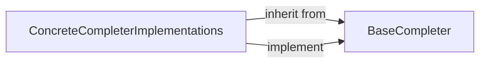

## Details

Analysis of the 'Custom Completer Interface' subsystem within `argcomplete/completers.py`, focusing on the `BaseCompleter` and its `ConcreteCompleterImplementations` and their interactions.

### BaseCompleter
This is the abstract base class that serves as the core extensible API for `argcomplete`. It defines the contract (`__call__` method) that all custom completers must adhere to, enabling developers to inject their specific, context-aware completion logic for `argparse` arguments. It embodies the Hook/Extension Pattern, providing the primary point for user-defined completion strategies.

**Related Classes/Methods**:

- <a href="https://github.com/kislyuk/argcomplete/blob/main/argcomplete/completers.py#L18-L26" target="_blank" rel="noopener noreferrer">`argcomplete.completers.BaseCompleter`:18-26</a>
- <a href="https://github.com/kislyuk/argcomplete/blob/main/argcomplete/completers.py" target="_blank" rel="noopener noreferrer">`argcomplete.completers.BaseCompleter:__call__`</a>

### ConcreteCompleterImplementations
These components represent the concrete strategies that implement the `BaseCompleter` interface. They provide specific, reusable completion behaviors, such as completing from a predefined list (`ChoicesCompleter`), file system paths (`FilesCompleter`, `DirectoriesCompleter`), or suppressing completions entirely (`SuppressCompleter`). They encapsulate the actual algorithms for generating completion candidates, adhering to the Plugin/Strategy Pattern.

**Related Classes/Methods**:

- <a href="https://github.com/kislyuk/argcomplete/blob/main/argcomplete/completers.py#L29-L39" target="_blank" rel="noopener noreferrer">`argcomplete.completers.ChoicesCompleter`:29-39</a>
- <a href="https://github.com/kislyuk/argcomplete/blob/main/argcomplete/completers.py#L45-L86" target="_blank" rel="noopener noreferrer">`argcomplete.completers.FilesCompleter`:45-86</a>
- <a href="https://github.com/kislyuk/argcomplete/blob/main/argcomplete/completers.py#L120-L122" target="_blank" rel="noopener noreferrer">`argcomplete.completers.DirectoriesCompleter`:120-122</a>
- <a href="https://github.com/kislyuk/argcomplete/blob/main/argcomplete/completers.py#L125-L137" target="_blank" rel="noopener noreferrer">`argcomplete.completers.SuppressCompleter`:125-137</a>
- <a href="https://github.com/kislyuk/argcomplete/blob/main/argcomplete/completers.py#L9-L15" target="_blank" rel="noopener noreferrer">`argcomplete.completers._call`:9-15</a>
- <a href="https://github.com/kislyuk/argcomplete/blob/main/argcomplete/completers.py#L33-L36" target="_blank" rel="noopener noreferrer">`argcomplete.completers._convert`:33-36</a>

### [FAQ](https://github.com/CodeBoarding/GeneratedOnBoardings/tree/main?tab=readme-ov-file#faq)