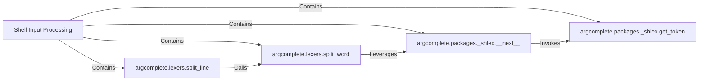

## Details

The `Shell Input Processing` subsystem is responsible for accurately parsing the raw command-line string provided by the shell. Its boundary encompasses the logic for handling complex shell quoting rules, escaping, and tokenization to transform the raw input into a structured list of arguments. This subsystem acts as a crucial "bridge" between the shell environment and the core `argcomplete` engine, ensuring the Python application correctly interprets the shell's context.

### Shell Input Processing [[Expand]](./Shell_Input_Processing.md)
The overarching component responsible for the entire process of converting raw shell input into structured arguments. It orchestrates the lower-level parsing functions to achieve this.

**Related Classes/Methods**:

- <a href="https://github.com/kislyuk/argcomplete/blob/main/argcomplete/lexers.py#L8-L57" target="_blank" rel="noopener noreferrer">`argcomplete.lexers.split_line`:8-57</a>
- <a href="https://github.com/kislyuk/argcomplete/blob/main/argcomplete/lexers.py#L17-L35" target="_blank" rel="noopener noreferrer">`argcomplete.lexers.split_word`:17-35</a>
- <a href="https://github.com/kislyuk/argcomplete/blob/main/argcomplete/packages/_shlex.py#L306-L310" target="_blank" rel="noopener noreferrer">`argcomplete.packages._shlex.__next__`:306-310</a>
- <a href="https://github.com/kislyuk/argcomplete/blob/main/argcomplete/packages/_shlex.py#L103-L133" target="_blank" rel="noopener noreferrer">`argcomplete.packages._shlex.get_token`:103-133</a>

### argcomplete.lexers.split_line
This is the high-level entry point for parsing a complete command line. It takes the full raw string and orchestrates its breakdown into individual words, respecting shell-specific quoting and escaping rules.

**Related Classes/Methods**:

- <a href="https://github.com/kislyuk/argcomplete/blob/main/argcomplete/lexers.py#L8-L57" target="_blank" rel="noopener noreferrer">`argcomplete.lexers.split_line`:8-57</a>

### argcomplete.lexers.split_word
Focuses on parsing a single "word" from the command line. It handles the intricacies of quotes and escapes within that word to correctly identify its boundaries and content, preparing it for further processing.

**Related Classes/Methods**:

- <a href="https://github.com/kislyuk/argcomplete/blob/main/argcomplete/lexers.py#L17-L35" target="_blank" rel="noopener noreferrer">`argcomplete.lexers.split_word`:17-35</a>

### argcomplete.packages._shlex.__next__
Provides an iterator interface for the underlying `_shlex` parser. It allows sequential retrieval of tokens (e.g., words, quoted strings) from the input stream, abstracting the direct calls to the low-level tokenization engine.

**Related Classes/Methods**:

- <a href="https://github.com/kislyuk/argcomplete/blob/main/argcomplete/packages/_shlex.py#L306-L310" target="_blank" rel="noopener noreferrer">`argcomplete.packages._shlex.__next__`:306-310</a>

### argcomplete.packages._shlex.get_token
This is the fundamental, low-level tokenization engine. It extracts the next raw token (e.g., a word, a quoted string, an operator) from the input stream, applying the most basic shell parsing rules. It represents the atomic unit of parsing within the `_shlex` module.

**Related Classes/Methods**:

- <a href="https://github.com/kislyuk/argcomplete/blob/main/argcomplete/packages/_shlex.py#L103-L133" target="_blank" rel="noopener noreferrer">`argcomplete.packages._shlex.get_token`:103-133</a>

### [FAQ](https://github.com/CodeBoarding/GeneratedOnBoardings/tree/main?tab=readme-ov-file#faq)