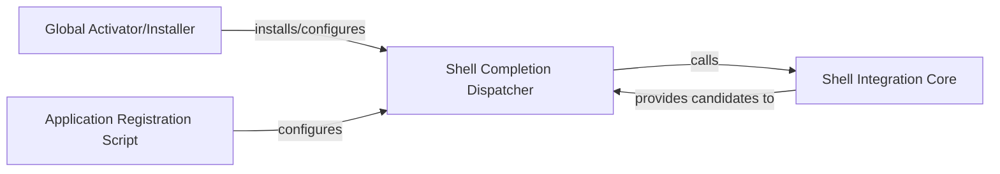

## Details

The `argcomplete` system facilitates command-line argument completion for Python applications. The `Global Activator/Installer` and `Application Registration Script` components are responsible for setting up and configuring the shell environment and specific applications, respectively, primarily by interacting with the `Shell Completion Dispatcher`. The `Shell Completion Dispatcher`, a shell script, acts as the initial entry point for completion requests, which then invokes the `Shell Integration Core`. The `Shell Integration Core`, written in Python, processes the completion request, interacts with the application's `argparse` definition, and generates the completion candidates, which it then provides back to the `Shell Completion Dispatcher` for display to the user. This architecture ensures a seamless flow from shell input to Python-driven completion logic.

### Global Activator/Installer
This component orchestrates the installation and configuration of `argcomplete`'s shell integration components for global argument completion across the user's shell environment (e.g., by placing scripts in appropriate system directories and updating shell RC files).

**Related Classes/Methods**:

- <a href="https://github.com/kislyuk/argcomplete/blob/main/argcomplete/scripts/activate_global_python_argcomplete.py" target="_blank" rel="noopener noreferrer">`argcomplete/scripts/activate_global_python_argcomplete.py`</a>

### Application Registration Script
A utility script designed to register individual Python applications for `argcomplete` completion. This typically involves generating or linking application-specific completion scripts or providing instructions for manual registration, ensuring that specific commands can leverage `argcomplete`.

**Related Classes/Methods**:

- <a href="https://github.com/kislyuk/argcomplete/blob/main/argcomplete/scripts/register_python_argcomplete.py" target="_blank" rel="noopener noreferrer">`argcomplete/scripts/register_python_argcomplete.py`</a>

### Shell Completion Dispatcher
This component represents the actual shell script (e.g., Bash, Zsh) that is sourced by the user's shell. It serves as the initial entry point for a completion request, setting up shell-specific environment variables and invoking the Python `argcomplete` logic.

**Related Classes/Methods**:

- <a href="https://github.com/kislyuk/argcomplete/blob/main/argcomplete/bash_completion.d/_python-argcomplete" target="_blank" rel="noopener noreferrer">`argcomplete/bash_completion.d/_python-argcomplete`</a>

### Shell Integration Core
This is the primary Python module that provides the runtime logic for `argcomplete` to interact with the shell. It acts as the crucial bridge between the shell's completion request and the Python application's `argparse` definition, processing the request and generating completion candidates.

**Related Classes/Methods**:

- <a href="https://github.com/kislyuk/argcomplete/blob/main/argcomplete/shell_integration.py" target="_blank" rel="noopener noreferrer">`argcomplete/shell_integration.py`</a>

### [FAQ](https://github.com/CodeBoarding/GeneratedOnBoardings/tree/main?tab=readme-ov-file#faq)