```mermaid
graph LR
    Shell_Environment["Shell Environment"]
    Shell_Integration_Activation["Shell Integration & Activation"]
    Shell_Input_Processing["Shell Input Processing"]
    Application_Readiness_Check["Application Readiness Check"]
    ArgumentParser_Adaptation["ArgumentParser Adaptation"]
    Custom_Completer_Interface["Custom Completer Interface"]
    Completion_Core_Engine["Completion Core Engine"]
    Shell_Environment -- "initiates completion request to" --> Shell_Integration_Activation
    Shell_Integration_Activation -- "passes raw command line to" --> Shell_Input_Processing
    Shell_Integration_Activation -- "triggers" --> Application_Readiness_Check
    Application_Readiness_Check -- "informs about application compatibility" --> Completion_Core_Engine
    Shell_Input_Processing -- "provides structured tokens/context to" --> Completion_Core_Engine
    Completion_Core_Engine -- "queries for argument structure" --> ArgumentParser_Adaptation
    ArgumentParser_Adaptation -- "returns parsing state/definitions to" --> Completion_Core_Engine
    Completion_Core_Engine -- "invokes for dynamic completions" --> Custom_Completer_Interface
    Custom_Completer_Interface -- "returns completion candidates to" --> Completion_Core_Engine
    Completion_Core_Engine -- "returns final list of completions to" --> Shell_Integration_Activation
    Shell_Integration_Activation -- "outputs completions to" --> Shell_Environment
    click Shell_Integration_Activation href "https://github.com/CodeBoarding/GeneratedOnBoardings/blob/main/argcomplete/Shell_Integration_Activation.md" "Details"
    click Shell_Input_Processing href "https://github.com/CodeBoarding/GeneratedOnBoardings/blob/main/argcomplete/Shell_Input_Processing.md" "Details"
    click ArgumentParser_Adaptation href "https://github.com/CodeBoarding/GeneratedOnBoardings/blob/main/argcomplete/ArgumentParser_Adaptation.md" "Details"
    click Custom_Completer_Interface href "https://github.com/CodeBoarding/GeneratedOnBoardings/blob/main/argcomplete/Custom_Completer_Interface.md" "Details"
    click Completion_Core_Engine href "https://github.com/CodeBoarding/GeneratedOnBoardings/blob/main/argcomplete/Completion_Core_Engine.md" "Details"
```

## Details

The `argcomplete` system facilitates dynamic command-line completions by integrating directly with the user's `Shell Environment`. The process begins when the `Shell Environment` initiates a completion request, which is captured by the `Shell Integration & Activation` component. This component then passes the raw command-line input to `Shell Input Processing` for tokenization and triggers an `Application Readiness Check` to ensure the target application is `argcomplete`-enabled. The core logic resides within the `Completion Core Engine`, which leverages `ArgumentParser Adaptation` to understand the application's argument structure and integrates with the `Custom Completer Interface` for dynamic, user-defined completions. Finally, the `Completion Core Engine` returns the compiled list of suggestions to `Shell Integration & Activation`, which then outputs these completions back to the `Shell Environment` for display to the user.

### Shell Environment
Represents the external command-line shell (e.g., Bash, Zsh) where users interact and initiate completion requests. It provides the raw input to `argcomplete` and receives the completion suggestions.

**Related Classes/Methods**: _None_

### Shell Integration & Activation [[Expand]](./Shell_Integration_Activation.md)
Manages the setup, activation, and initial handling of completion requests from the shell environment (Bash, Zsh). It acts as the primary interface between `argcomplete` and the user's shell.

**Related Classes/Methods**:

- <a href="https://github.com/kislyuk/argcomplete/blob/main/argcomplete/scripts/activate_global_python_argcomplete.py" target="_blank" rel="noopener noreferrer">`argcomplete/scripts/activate_global_python_argcomplete.py`</a>
- <a href="https://github.com/kislyuk/argcomplete/blob/main/argcomplete/scripts/register_python_argcomplete.py" target="_blank" rel="noopener noreferrer">`argcomplete/scripts/register_python_argcomplete.py`</a>
- <a href="https://github.com/kislyuk/argcomplete/blob/main/argcomplete/shell_integration.py" target="_blank" rel="noopener noreferrer">`argcomplete/shell_integration.py`</a>
- <a href="https://github.com/kislyuk/argcomplete/blob/main/argcomplete/bash_completion.d/_python-argcomplete" target="_blank" rel="noopener noreferrer">`argcomplete/bash_completion.d/_python-argcomplete`</a>

### Shell Input Processing [[Expand]](./Shell_Input_Processing.md)
Responsible for accurately parsing the raw command-line string provided by the shell, handling complex quoting rules and tokenization to produce structured input for the core engine.

**Related Classes/Methods**:

- <a href="https://github.com/kislyuk/argcomplete/blob/main/argcomplete/lexers.py" target="_blank" rel="noopener noreferrer">`argcomplete/lexers.py`</a>
- <a href="https://github.com/kislyuk/argcomplete/blob/main/argcomplete/packages/_shlex.py" target="_blank" rel="noopener noreferrer">`argcomplete/packages/_shlex.py`</a>

### Application Readiness Check
A utility component that verifies if a given Python script or console entry point is configured to use `argcomplete`, ensuring that completion logic is only invoked for compatible applications.

**Related Classes/Methods**:

- <a href="https://github.com/kislyuk/argcomplete/blob/main/argcomplete/_check_module.py" target="_blank" rel="noopener noreferrer">`argcomplete/_check_module.py`</a>
- <a href="https://github.com/kislyuk/argcomplete/blob/main/argcomplete/_check_console_script.py" target="_blank" rel="noopener noreferrer">`argcomplete/_check_console_script.py`</a>

### ArgumentParser Adaptation [[Expand]](./ArgumentParser_Adaptation.md)
Intercepts and adapts the standard `argparse` module's behavior, allowing `argcomplete` to introspect the parser's definition and simulate argument parsing without executing the full application logic.

**Related Classes/Methods**:

- <a href="https://github.com/kislyuk/argcomplete/blob/main/argcomplete/packages/_argparse.py" target="_blank" rel="noopener noreferrer">`argcomplete/packages/_argparse.py`</a>
- <a href="https://github.com/kislyuk/argcomplete/blob/main/argcomplete/finders.py" target="_blank" rel="noopener noreferrer">`argcomplete/finders.py`</a>

### Custom Completer Interface [[Expand]](./Custom_Completer_Interface.md)
Provides an extensible API for developers to define and register custom, dynamic completion logic for their specific `argparse` arguments, enabling context-aware completions.

**Related Classes/Methods**:

- <a href="https://github.com/kislyuk/argcomplete/blob/main/argcomplete/completers.py" target="_blank" rel="noopener noreferrer">`argcomplete/completers.py`</a>

### Completion Core Engine [[Expand]](./Completion_Core_Engine.md)
The central orchestrator of the completion process. It takes parsed shell input, interacts with the `ArgumentParser Adaptation` to understand command structure, integrates results from the `Custom Completer Interface`, and collects the final set of completion candidates.

**Related Classes/Methods**:

- <a href="https://github.com/kislyuk/argcomplete/blob/main/argcomplete/finders.py" target="_blank" rel="noopener noreferrer">`argcomplete/finders.py`</a>

### [FAQ](https://github.com/CodeBoarding/GeneratedOnBoardings/tree/main?tab=readme-ov-file#faq)