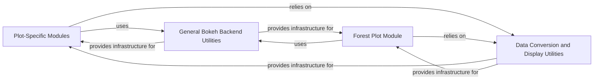

## Details

The `Bokeh Plotting Backend` subsystem is dedicated to rendering ArviZ plots using the Bokeh library, providing interactive web-based visualizations.

### Plot-Specific Modules
These modules (e.g., `densityplot`, `distplot`, `traceplot`, `posteriorplot`, `ppcplot`, `violinplot`, `elpdplot`, `kdeplot`, `pairplot`) provide the public API functions (e.g., `plot_density`, `plot_dist`) for generating specific types of Bokeh plots. They act as orchestrators, preparing data, calling internal Bokeh rendering helpers, and configuring plot aesthetics.

**Related Classes/Methods**:

- <a href="https://github.com/arviz-devs/arviz/blob/main/arviz/plots/backends/bokeh/densityplot.py#L1-L100" target="_blank" rel="noopener noreferrer">`arviz.plots.backends.bokeh.densityplot`:1-100</a>
- <a href="https://github.com/arviz-devs/arviz/blob/main/arviz/plots/backends/bokeh/distplot.py#L1-L100" target="_blank" rel="noopener noreferrer">`arviz.plots.backends.bokeh.distplot`:1-100</a>
- <a href="https://github.com/arviz-devs/arviz/blob/main/arviz/plots/backends/bokeh/elpdplot.py#L1-L100" target="_blank" rel="noopener noreferrer">`arviz.plots.backends.bokeh.elpdplot`:1-100</a>
- <a href="https://github.com/arviz-devs/arviz/blob/main/arviz/plots/backends/bokeh/kdeplot.py#L1-L100" target="_blank" rel="noopener noreferrer">`arviz.plots.backends.bokeh.kdeplot`:1-100</a>
- <a href="https://github.com/arviz-devs/arviz/blob/main/arviz/plots/backends/bokeh/pairplot.py#L1-L100" target="_blank" rel="noopener noreferrer">`arviz.plots.backends.bokeh.pairplot`:1-100</a>
- <a href="https://github.com/arviz-devs/arviz/blob/main/arviz/plots/backends/bokeh/posteriorplot.py#L1-L100" target="_blank" rel="noopener noreferrer">`arviz.plots.backends.bokeh.posteriorplot`:1-100</a>
- <a href="https://github.com/arviz-devs/arviz/blob/main/arviz/plots/backends/bokeh/ppcplot.py#L1-L100" target="_blank" rel="noopener noreferrer">`arviz.plots.backends.bokeh.ppcplot`:1-100</a>
- <a href="https://github.com/arviz-devs/arviz/blob/main/arviz/plots/backends/bokeh/violinplot.py#L1-L100" target="_blank" rel="noopener noreferrer">`arviz.plots.backends.bokeh.violinplot`:1-100</a>
- <a href="https://github.com/arviz-devs/arviz/blob/main/arviz/plots/backends/bokeh/traceplot.py#L1-L100" target="_blank" rel="noopener noreferrer">`arviz.plots.backends.bokeh.traceplot`:1-100</a>

### Forest Plot Module
A specialized plot module (`forestplot`) dedicated to handling the complex layout and rendering of forest plots. Due to its intricate nature, it utilizes internal helper classes (e.g., `PlotHandler`, `VarHandler`) for managing data and layout specifics, distinguishing it from the more general plot modules.

**Related Classes/Methods**:

- <a href="https://github.com/arviz-devs/arviz/blob/main/arviz/plots/backends/bokeh/forestplot.py#L1-L100" target="_blank" rel="noopener noreferrer">`arviz.plots.backends.bokeh.forestplot`:1-100</a>

### General Bokeh Backend Utilities
This component provides foundational, reusable utilities that support the creation of various Bokeh plots within the ArviZ context. These include functions for consistent plot grid layouts, managing default Bokeh styling parameters, and other common Bokeh-specific helper functions.

**Related Classes/Methods**:

- <a href="https://github.com/arviz-devs/arviz/blob/main/arviz/plots/backends/bokeh/__init__.py#L1-L100" target="_blank" rel="noopener noreferrer">`arviz.plots.backends.bokeh`:1-100</a>

### Data Conversion and Display Utilities
This component acts as a crucial bridge between ArviZ's internal data structures (primarily `xarray.InferenceData`) and Bokeh's rendering engine. It handles the conversion of data into Bokeh's `ColumnDataSource` format and the final display of the generated Bokeh plot objects. This component is likely part of the broader `arviz.plots.backends` package, providing a generic interface for all backends.

**Related Classes/Methods**:

- <a href="https://github.com/arviz-devs/arviz/blob/main/arviz/plots/backends/__init__.py#L1-L100" target="_blank" rel="noopener noreferrer">`arviz.plots.backends`:1-100</a>

### [FAQ](https://github.com/CodeBoarding/GeneratedOnBoardings/tree/main?tab=readme-ov-file#faq)