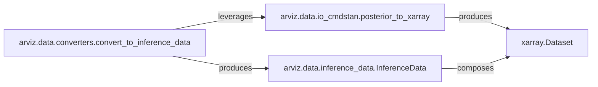

## Details

The `arviz.data` subsystem is primarily concerned with the standardized representation and conversion of Bayesian inference results. At its core, the `InferenceData` object serves as an immutable container, leveraging `xarray.Dataset` as its internal building block for efficient multi-dimensional data handling. The `convert_to_inference_data` function acts as the main entry point for users, abstracting the complexities of transforming diverse input formats into the `InferenceData` structure. Specialized adapters like `posterior_to_xarray` handle the conversion of specific external data formats (e.g., CmdStan output) into the `xarray.Dataset` format, which then populates the `InferenceData` object. This architecture ensures a flexible and extensible data ingestion pipeline while maintaining a consistent internal data model.

### arviz.data.inference_data.InferenceData
The foundational and central data structure in ArviZ. It acts as an immutable container for Bayesian inference results, designed to hold various groups of data (e.g., posterior, prior, observed data, sample stats) in a standardized format. It is built upon and composes `xarray.Dataset` objects internally, as confirmed by its `__init__` method which accepts `xr.Dataset` instances and its various methods (e.g., `from_netcdf`, `to_netcdf`) that interact directly with `xarray.Dataset`.

**Related Classes/Methods**:

- <a href="https://github.com/arviz-devs/arviz/blob/main/arviz/data/inference_data.py" target="_blank" rel="noopener noreferrer">`arviz.data.inference_data.InferenceData:__init__`</a>
- <a href="https://github.com/arviz-devs/arviz/blob/main/arviz/data/inference_data.py" target="_blank" rel="noopener noreferrer">`arviz.data.inference_data.InferenceData:from_netcdf`</a>
- <a href="https://github.com/arviz-devs/arviz/blob/main/arviz/data/inference_data.py" target="_blank" rel="noopener noreferrer">`arviz.data.inference_data.InferenceData:to_netcdf`</a>

### arviz.data.converters.convert_to_inference_data
A high-level facade function and the primary public API for converting diverse data types (e.g., PyMC traces, Stan objects, dictionaries) into the standardized `InferenceData` format. It orchestrates the conversion process by dispatching to appropriate internal conversion functions, such as `posterior_to_xarray`, to prepare data for `InferenceData`.

**Related Classes/Methods**: _None_

### arviz.data.io_cmdstan.posterior_to_xarray
A specialized adapter function responsible for translating raw output from CmdStan (a specific Bayesian modeling framework) into `xarray.Dataset` objects. This component exemplifies the integration adapters, preparing external data for consumption by `InferenceData`. Its source code explicitly shows it returns `xarray.Dataset` objects.

**Related Classes/Methods**:

- <a href="https://github.com/arviz-devs/arviz/blob/main/arviz/data/io_cmdstan.py#L179-L250" target="_blank" rel="noopener noreferrer">`arviz.data.io_cmdstan.posterior_to_xarray`:179-250</a>

### xarray.Dataset
An N-dimensional labeled array data structure from the `xarray` library. It serves as the fundamental building block for `InferenceData`, providing robust capabilities for handling multi-dimensional, labeled data, which is essential for representing complex Bayesian inference results. This is an external dependency.

**Related Classes/Methods**: _None_

### [FAQ](https://github.com/CodeBoarding/GeneratedOnBoardings/tree/main?tab=readme-ov-file#faq)