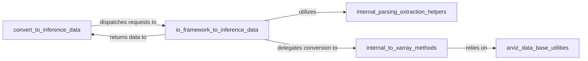

## Details

The Data Ingestion & Conversion subsystem in ArviZ is responsible for standardizing raw output from various probabilistic programming frameworks into the InferenceData format. This subsystem acts as a crucial entry point, ensuring that diverse data sources can be uniformly processed by ArviZ's analysis and visualization components.

### convert_to_inference_data
This component serves as the primary public interface (arviz.data.converters.convert_to_inference_data) for users to initiate the conversion of diverse data types into the standardized InferenceData format. It acts as a Facade, simplifying the complex underlying conversion logic by dispatching the request to the appropriate framework-specific io_ components.

**Related Classes/Methods**:

- <a href="https://github.com/arviz-devs/arviz/blob/main/arviz/data/converters.py#L23-L144" target="_blank" rel="noopener noreferrer">`arviz.data.converters.convert_to_inference_data`:23-144</a>

### io_framework_to_inference_data
This component represents a collection of framework-specific adapters (e.g., arviz.data.io_beanmachine.to_inference_data, arviz.data.io_cmdstan.to_inference_data). Each adapter is responsible for the unique logic of ingesting raw output from its respective probabilistic programming framework and orchestrating its transformation into the InferenceData structure. They encapsulate the specific knowledge required for each external data format.

**Related Classes/Methods**:

- <a href="https://github.com/arviz-devs/arviz/blob/main/arviz/data/io_beanmachine.py#L70-L79" target="_blank" rel="noopener noreferrer">`arviz.data.io_beanmachine.to_inference_data`:70-79</a>
- <a href="https://github.com/arviz-devs/arviz/blob/main/arviz/data/io_cmdstan.py#L674-L696" target="_blank" rel="noopener noreferrer">`arviz.data.io_cmdstan.to_inference_data`:674-696</a>
- <a href="https://github.com/arviz-devs/arviz/blob/main/arviz/data/io_cmdstanpy.py#L564-L586" target="_blank" rel="noopener noreferrer">`arviz.data.io_cmdstanpy.to_inference_data`:564-586</a>
- <a href="https://github.com/arviz-devs/arviz/blob/main/arviz/data/io_emcee.py#L246-L252" target="_blank" rel="noopener noreferrer">`arviz.data.io_emcee.to_inference_data`:246-252</a>
- <a href="https://github.com/arviz-devs/arviz/blob/main/arviz/data/io_dict.py#L326-L348" target="_blank" rel="noopener noreferrer">`arviz.data.io_dict.to_inference_data`:326-348</a>
- <a href="https://github.com/arviz-devs/arviz/blob/main/arviz/data/io_pyjags.py#L100-L114" target="_blank" rel="noopener noreferrer">`arviz.data.io_pyjags.to_inference_data`:100-114</a>
- <a href="https://github.com/arviz-devs/arviz/blob/main/arviz/data/io_pyro.py#L258-L272" target="_blank" rel="noopener noreferrer">`arviz.data.io_pyro.to_inference_data`:258-272</a>
- <a href="https://github.com/arviz-devs/arviz/blob/main/arviz/data/io_numpyro.py#L381-L400" target="_blank" rel="noopener noreferrer">`arviz.data.io_numpyro.to_inference_data`:381-400</a>
- <a href="https://github.com/arviz-devs/arviz/blob/main/arviz/data/io_pystan.py#L602-L629" target="_blank" rel="noopener noreferrer">`arviz.data.io_pystan.to_inference_data`:602-629</a>

### internal_parsing_extraction_helpers
This component comprises internal, framework-specific functions (e.g., _unpack_fit, get_draws) that directly interact with the native output formats of probabilistic programming frameworks. Their responsibility is to parse and extract raw, unstandardized data (e.g., samples, log probabilities, diagnostics) from these native formats. They provide the initial, framework-dependent data to the io_framework_to_inference_data components.

**Related Classes/Methods**:

- <a href="https://github.com/arviz-devs/arviz/blob/main/arviz/data/io_beanmachine.py" target="_blank" rel="noopener noreferrer">`arviz.data.io_beanmachine._unpack_fit`</a>
- <a href="https://github.com/arviz-devs/arviz/blob/main/arviz/data/io_cmdstan.py" target="_blank" rel="noopener noreferrer">`arviz.data.io_cmdstan.get_draws`</a>

### internal_to_xarray_methods
This component consists of internal helper methods (e.g., posterior_to_xarray, sample_stats_to_xarray) that take the parsed raw data and convert specific components (e.g., posterior samples, sample statistics, observed data) into xarray.Dataset objects. These xarray.Dataset objects are the fundamental building blocks that are then assembled into the final InferenceData structure. This component ensures consistency in the internal data representation using xarray.

**Related Classes/Methods**:

- <a href="https://github.com/arviz-devs/arviz/blob/main/arviz/data/base.py" target="_blank" rel="noopener noreferrer">`arviz.data.base.posterior_to_xarray`</a>
- <a href="https://github.com/arviz-devs/arviz/blob/main/arviz/data/base.py" target="_blank" rel="noopener noreferrer">`arviz.data.base.sample_stats_to_xarray`</a>

### arviz_data_base_utilities
This component provides fundamental, low-level utilities for transforming basic Python data structures (like NumPy arrays and dictionaries) into xarray.DataArray and xarray.Dataset objects. These are the foundational building blocks upon which the InferenceData object is ultimately constructed, ensuring efficient and consistent data handling at the most granular level.

**Related Classes/Methods**:

- <a href="https://github.com/arviz-devs/arviz/blob/main/arviz/data/base.py" target="_blank" rel="noopener noreferrer">`arviz.data.base`</a>

### [FAQ](https://github.com/CodeBoarding/GeneratedOnBoardings/tree/main?tab=readme-ov-file#faq)