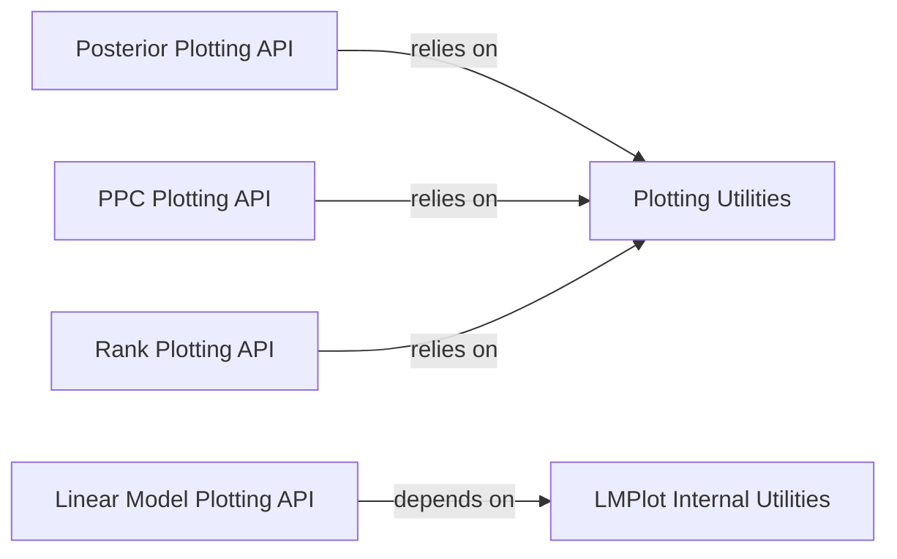

## Details

The High-Level Plotting API subsystem in ArviZ provides a unified, user-facing interface for generating various plots from InferenceData objects, abstracting away backend-specific implementations.

### Posterior Plotting API
Provides the high-level entry point for generating posterior distribution plots. It orchestrates data preparation, calls shared utilities for layout and backend function retrieval, and delegates to the specific plotting backend.

**Related Classes/Methods**:

- <a href="https://github.com/arviz-devs/arviz/blob/main/arviz/plots/posteriorplot.py#L11-L298" target="_blank" rel="noopener noreferrer">`plot_posterior`:11-298</a>

### PPC Plotting API
Offers the high-level entry point for creating posterior predictive check (PPC) plots. It handles data extraction and preparation for PPC, then utilizes shared utilities to select and invoke the backend plotting logic.

**Related Classes/Methods**:

- <a href="https://github.com/arviz-devs/arviz/blob/main/arviz/plots/ppcplot.py#L18-L369" target="_blank" rel="noopener noreferrer">`plot_ppc`:18-369</a>

### Rank Plotting API
Provides the high-level entry point for generating rank plots, primarily used for MCMC diagnostics. It prepares the necessary data and delegates the actual rendering to a backend-specific function via shared utilities.

**Related Classes/Methods**:

- <a href="https://github.com/arviz-devs/arviz/blob/main/arviz/plots/rankplot.py#L16-L232" target="_blank" rel="noopener noreferrer">`plot_rank`:16-232</a>

### Linear Model Plotting API
Implements the high-level interface for plotting linear models. It handles specific data transformations required for linear model plots before delegating to backend plotting.

**Related Classes/Methods**:

- <a href="https://github.com/arviz-devs/arviz/blob/main/arviz/plots/lmplot.py#L20-L380" target="_blank" rel="noopener noreferrer">`plot_lm`:20-380</a>

### Plotting Utilities
Acts as a core utility module providing common functionalities and helper methods used by various high-level plotting functions. This includes managing plot layouts (default_grid), filtering and retrieving backend-specific plotting functions (filter_plotters_list, get_plotting_function), and general data manipulation for plotting (plot_point_interval, round_num). This component is crucial for abstracting backend implementations and promoting code reuse.

**Related Classes/Methods**:

- <a href="https://github.com/arviz-devs/arviz/blob/main/arviz/plots/plot_utils.py#L99-L143" target="_blank" rel="noopener noreferrer">`default_grid`:99-143</a>
- <a href="https://github.com/arviz-devs/arviz/blob/main/arviz/plots/plot_utils.py#L265-L279" target="_blank" rel="noopener noreferrer">`filter_plotters_list`:265-279</a>
- <a href="https://github.com/arviz-devs/arviz/blob/main/arviz/plots/plot_utils.py#L282-L318" target="_blank" rel="noopener noreferrer">`get_plotting_function`:282-318</a>
- <a href="https://github.com/arviz-devs/arviz/blob/main/arviz/plots/plot_utils.py#L370-L501" target="_blank" rel="noopener noreferrer">`plot_point_interval`:370-501</a>
- <a href="https://github.com/arviz-devs/arviz/blob/main/arviz/plots/plot_utils.py#L165-L177" target="_blank" rel="noopener noreferrer">`round_num`:165-177</a>

### LMPlot Internal Utilities
Provides internal utility functions specific to linear model plotting, such as data restructuring or repetition, supporting the Linear Model Plotting API.

**Related Classes/Methods**:

- <a href="https://github.com/arviz-devs/arviz/blob/main/arviz/plots/lmplot.py#L16-L17" target="_blank" rel="noopener noreferrer">`_repeat_flatten_list`:16-17</a>

### [FAQ](https://github.com/CodeBoarding/GeneratedOnBoardings/tree/main?tab=readme-ov-file#faq)