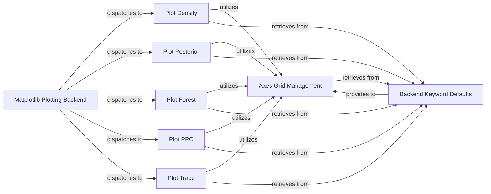

## Details

The `Matplotlib Plotting Backend` subsystem in ArviZ is responsible for generating various statistical plots using the Matplotlib library. It acts as a central dispatcher, directing plotting requests to specialized components for density, posterior, forest, PPC, and trace plots. These individual plotting components leverage shared utilities like `Axes Grid Management` for consistent subplot layouts and `Backend Keyword Defaults` for standardized styling and configuration. This modular design ensures that each plot type is handled by a dedicated component, promoting maintainability and reusability of common plotting functionalities.

### Matplotlib Plotting Backend [[Expand]](./Matplotlib_Plotting_Backend.md)
The overarching component that contains all concrete implementations for rendering ArviZ plots using the Matplotlib library, producing static visualizations. It acts as the entry point for Matplotlib-specific plotting operations.

**Related Classes/Methods**:

- <a href="https://github.com/arviz-devs/arviz/blob/main/arviz/plots/backends/matplotlib" target="_blank" rel="noopener noreferrer">`arviz.plots.backends.matplotlib`</a>

### Plot Density
Orchestrates the creation of density plots, visualizing the distribution of a single variable. It utilizes `Axes Grid Management` for subplot layout and `Backend Keyword Defaults` for consistent styling.

**Related Classes/Methods**:

- <a href="https://github.com/arviz-devs/arviz/blob/main/arviz/plots/backends/matplotlib/densityplot.py#L14-L101" target="_blank" rel="noopener noreferrer">`arviz.plots.backends.matplotlib.densityplot.plot_density`:14-101</a>

### Plot Posterior
Renders comprehensive posterior distribution plots, often including point estimates, Highest Density Intervals (HDIs), and reference values. It relies on `Axes Grid Management` for subplot arrangement and `Backend Keyword Defaults` for default plot configurations.

**Related Classes/Methods**:

- <a href="https://github.com/arviz-devs/arviz/blob/main/arviz/plots/backends/matplotlib/posteriorplot.py#L21-L108" target="_blank" rel="noopener noreferrer">`arviz.plots.backends.matplotlib.posteriorplot.plot_posterior`:21-108</a>

### Plot Forest
Generates complex forest plots, typically used for visualizing multiple parameters' posterior distributions and their credible intervals, often with diagnostic elements like R-hat and ESS. It uses `Axes Grid Management` for layout and `Backend Keyword Defaults` for styling.

**Related Classes/Methods**:

- <a href="https://github.com/arviz-devs/arviz/blob/main/arviz/plots/backends/matplotlib/forestplot.py#L26-L171" target="_blank" rel="noopener noreferrer">`arviz.plots.backends.matplotlib.forestplot.plot_forest`:26-171</a>

### Plot PPC
Manages posterior predictive check plots, comparing observed data to data simulated from the posterior predictive distribution, including animation capabilities for dynamic comparisons. It utilizes `Axes Grid Management` for subplot creation and `Backend Keyword Defaults` for plot settings.

**Related Classes/Methods**:

- <a href="https://github.com/arviz-devs/arviz/blob/main/arviz/plots/backends/matplotlib/ppcplot.py#L18-L385" target="_blank" rel="noopener noreferrer">`arviz.plots.backends.matplotlib.ppcplot.plot_ppc`:18-385</a>

### Plot Trace
Generates trace plots for MCMC chain diagnostics, showing the sampled values of parameters over iterations to assess convergence and mixing. It depends on `Axes Grid Management` for subplot layout and `Backend Keyword Defaults` for default plot parameters.

**Related Classes/Methods**:

- <a href="https://github.com/arviz-devs/arviz/blob/main/arviz/plots/backends/matplotlib/traceplot.py#L19-L451" target="_blank" rel="noopener noreferrer">`arviz.plots.backends.matplotlib.traceplot.plot_trace`:19-451</a>

### Axes Grid Management
Provides a standardized way to create and arrange Matplotlib axes for various plots, ensuring consistent layout and handling of multiple subplots.

**Related Classes/Methods**:

- <a href="https://github.com/arviz-devs/arviz/blob/main/arviz/plots/backends/matplotlib/utils.py" target="_blank" rel="noopener noreferrer">`arviz.plots.backends.matplotlib.create_axes_grid`</a>

### Backend Keyword Defaults
Centralized management and provision of default Matplotlib keyword arguments, ensuring consistent styling and configuration across different plots within the Matplotlib backend.

**Related Classes/Methods**:

- <a href="https://github.com/arviz-devs/arviz/blob/main/arviz/plots/backends/matplotlib/utils.py" target="_blank" rel="noopener noreferrer">`arviz.plots.backends.matplotlib.backend_kwarg_defaults`</a>

### [FAQ](https://github.com/CodeBoarding/GeneratedOnBoardings/tree/main?tab=readme-ov-file#faq)