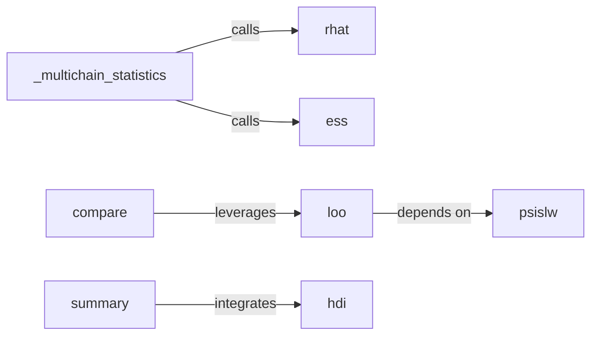

## Details

The `arviz` project's statistical analysis subsystem focuses on providing tools for Bayesian workflow, particularly for analyzing Markov Chain Monte Carlo (MCMC) samples. It encompasses core functionalities for convergence diagnostics, model comparison, and posterior distribution summarization. The central components facilitate the assessment of MCMC chain quality, comparison of different models, and comprehensive reporting of simulation results. This subsystem is crucial for users to evaluate the reliability and validity of their Bayesian models.

### _multichain_statistics
Orchestrates and aggregates results from various MCMC convergence and efficiency diagnostics. It acts as a high-level entry point for obtaining a suite of diagnostic metrics.

**Related Classes/Methods**:

- <a href="https://github.com/arviz-devs/arviz/blob/main/arviz/stats/diagnostics.py#L228-L347" target="_blank" rel="noopener noreferrer">`arviz.stats.diagnostics.rhat`:228-347</a>
- <a href="https://github.com/arviz-devs/arviz/blob/main/arviz/stats/diagnostics.py" target="_blank" rel="noopener noreferrer">`arviz.stats.diagnostics.ess`</a>

### rhat
Calculates the Gelman-Rubin R-hat convergence diagnostic, a key indicator of MCMC chain convergence. This component assesses whether multiple chains have converged to the same target distribution.

**Related Classes/Methods**:

- <a href="https://github.com/arviz-devs/arviz/blob/main/arviz/stats/diagnostics.py#L228-L347" target="_blank" rel="noopener noreferrer">`arviz.stats.diagnostics.rhat`:228-347</a>

### ess
Calculates the Effective Sample Size (ESS), a measure of the number of independent samples effectively drawn from the posterior distribution. This component quantifies the efficiency of MCMC sampling.

**Related Classes/Methods**:

- <a href="https://github.com/arviz-devs/arviz/blob/main/arviz/stats/diagnostics.py" target="_blank" rel="noopener noreferrer">`arviz.stats.diagnostics.ess`</a>

### compare
Performs Bayesian model comparison using information criteria such as LOO (Leave-One-Out) and WAIC (Widely Applicable Information Criterion). This component helps in selecting the best-fitting model among several candidates.

**Related Classes/Methods**:

- <a href="https://github.com/arviz-devs/arviz/blob/main/arviz/stats/stats_refitting.py" target="_blank" rel="noopener noreferrer">`arviz.stats.stats_refitting.loo`</a>

### loo
Implements Leave-One-Out cross-validation for model assessment, providing an estimate of out-of-sample predictive accuracy. This component is a core part of the model comparison process.

**Related Classes/Methods**:

- <a href="https://github.com/arviz-devs/arviz/blob/main/arviz/stats/stats_refitting.py" target="_blank" rel="noopener noreferrer">`arviz.stats.stats_refitting.loo`</a>

### summary
Generates comprehensive summary statistics for posterior distributions, including means, standard deviations, quantiles, and credible intervals. This component provides a concise overview of the posterior samples.

**Related Classes/Methods**:

- <a href="https://github.com/arviz-devs/arviz/blob/main/arviz/plots/hdiplot.py" target="_blank" rel="noopener noreferrer">`arviz.plots.hdiplot.hdi`</a>

### hdi
Calculates the Highest Density Interval (HDI) for posterior distributions, representing the narrowest interval containing a specified probability mass. This component is used to quantify uncertainty in parameter estimates.

**Related Classes/Methods**:

- <a href="https://github.com/arviz-devs/arviz/blob/main/arviz/plots/hdiplot.py" target="_blank" rel="noopener noreferrer">`arviz.plots.hdiplot.hdi`</a>

### psislw
Performs robust Pareto Smoothed Importance Sampling weighting. This component is crucial for stabilizing importance sampling estimates, particularly in `loo` calculations.

**Related Classes/Methods**:

- <a href="https://github.com/arviz-devs/arviz/blob/main/arviz/stats/stats.py#L872-L960" target="_blank" rel="noopener noreferrer">`arviz.stats.stats.psislw`:872-960</a>

### [FAQ](https://github.com/CodeBoarding/GeneratedOnBoardings/tree/main?tab=readme-ov-file#faq)