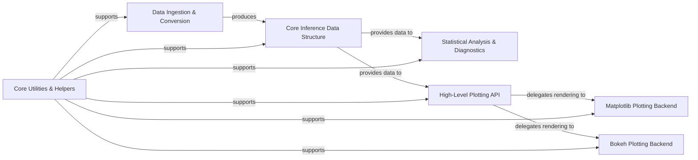

## Details

ArviZ is structured around a central `InferenceData` object, which serves as the universal container for Bayesian inference results. Data from various probabilistic programming frameworks is first ingested and converted into this standardized `InferenceData` format. Once in this core structure, the data can be subjected to comprehensive statistical analysis and diagnostics, or visualized through a high-level plotting API. This plotting API abstracts away the underlying rendering mechanisms, delegating to specific backends like Matplotlib or Bokeh for static or interactive visualizations, respectively. A collection of core utilities and helper functions provides foundational support across all these components, ensuring consistent data handling, selection, and configuration.

### Data Ingestion & Conversion [[Expand]](./Data_Ingestion_Conversion.md)
Handles the intake and standardization of raw output from various probabilistic programming frameworks into ArviZ's `InferenceData` format.

**Related Classes/Methods**:

- <a href="https://github.com/arviz-devs/arviz/blob/main/arviz/data/converters.py" target="_blank" rel="noopener noreferrer">`arviz/data/converters.py`</a>
- <a href="https://github.com/arviz-devs/arviz/blob/main/arviz/data/io_beanmachine.py" target="_blank" rel="noopener noreferrer">`arviz/data/io_beanmachine.py`</a>
- <a href="https://github.com/arviz-devs/arviz/blob/main/arviz/data/io_cmdstan.py" target="_blank" rel="noopener noreferrer">`arviz/data/io_cmdstan.py`</a>
- <a href="https://github.com/arviz-devs/arviz/blob/main/arviz/data/io_cmdstanpy.py" target="_blank" rel="noopener noreferrer">`arviz/data/io_cmdstanpy.py`</a>
- <a href="https://github.com/arviz-devs/arviz/blob/main/arviz/data/io_emcee.py" target="_blank" rel="noopener noreferrer">`arviz/data/io_emcee.py`</a>
- <a href="https://github.com/arviz-devs/arviz/blob/main/arviz/data/io_dict.py" target="_blank" rel="noopener noreferrer">`arviz/data/io_dict.py`</a>
- <a href="https://github.com/arviz-devs/arviz/blob/main/arviz/data/io_pyjags.py" target="_blank" rel="noopener noreferrer">`arviz/data/io_pyjags.py`</a>
- <a href="https://github.com/arviz-devs/arviz/blob/main/arviz/data/io_pyro.py" target="_blank" rel="noopener noreferrer">`arviz/data/io_pyro.py`</a>
- <a href="https://github.com/arviz-devs/arviz/blob/main/arviz/data/io_numpyro.py" target="_blank" rel="noopener noreferrer">`arviz/data/io_numpyro.py`</a>
- <a href="https://github.com/arviz-devs/arviz/blob/main/arviz/data/io_pystan.py" target="_blank" rel="noopener noreferrer">`arviz/data/io_pystan.py`</a>

### Core Inference Data Structure [[Expand]](./Core_Inference_Data_Structure.md)
The central, immutable data container (`InferenceData` object) that stores and manages all aspects of Bayesian inference results, built upon `xarray.Dataset`.

**Related Classes/Methods**:

- <a href="https://github.com/arviz-devs/arviz/blob/main/arviz/data/inference_data.py" target="_blank" rel="noopener noreferrer">`arviz/data/inference_data.py`</a>

### Statistical Analysis & Diagnostics [[Expand]](./Statistical_Analysis_Diagnostics.md)
Provides a comprehensive suite of functions for assessing MCMC convergence, mixing, and performing various statistical analyses like model comparison (LOO, WAIC), posterior summaries, and HDI calculations.

**Related Classes/Methods**:

- <a href="https://github.com/arviz-devs/arviz/blob/main/arviz/stats/diagnostics.py" target="_blank" rel="noopener noreferrer">`arviz/stats/diagnostics.py`</a>
- <a href="https://github.com/arviz-devs/arviz/blob/main/arviz/stats/stats.py" target="_blank" rel="noopener noreferrer">`arviz/stats/stats.py`</a>

### High-Level Plotting API [[Expand]](./High_Level_Plotting_API.md)
Offers a unified, user-facing API for generating a wide range of plots from `InferenceData` objects, abstracting away backend-specific implementations.

**Related Classes/Methods**:

- <a href="https://github.com/arviz-devs/arviz/blob/main/arviz/plots/plot_utils.py" target="_blank" rel="noopener noreferrer">`arviz/plots/plot_utils.py`</a>
- <a href="https://github.com/arviz-devs/arviz/blob/main/arviz/plots/posteriorplot.py" target="_blank" rel="noopener noreferrer">`arviz/plots/posteriorplot.py`</a>
- <a href="https://github.com/arviz-devs/arviz/blob/main/arviz/plots/ppcplot.py" target="_blank" rel="noopener noreferrer">`arviz/plots/ppcplot.py`</a>
- <a href="https://github.com/arviz-devs/arviz/blob/main/arviz/plots/rankplot.py" target="_blank" rel="noopener noreferrer">`arviz/plots/rankplot.py`</a>
- <a href="https://github.com/arviz-devs/arviz/blob/main/arviz/plots/lmplot.py" target="_blank" rel="noopener noreferrer">`arviz/plots/lmplot.py`</a>

### Matplotlib Plotting Backend [[Expand]](./Matplotlib_Plotting_Backend.md)
Contains the concrete implementations for rendering ArviZ plots using the Matplotlib library, producing static visualizations.

**Related Classes/Methods**:

- <a href="https://github.com/arviz-devs/arviz/blob/main/arviz/plots/backends/matplotlib/" target="_blank" rel="noopener noreferrer">`arviz/plots/backends/matplotlib/`</a>

### Bokeh Plotting Backend [[Expand]](./Bokeh_Plotting_Backend.md)
Contains the concrete implementations for rendering ArviZ plots using the Bokeh library, enabling interactive web-based visualizations.

**Related Classes/Methods**:

- <a href="https://github.com/arviz-devs/arviz/blob/main/arviz/plots/backends/bokeh/" target="_blank" rel="noopener noreferrer">`arviz/plots/backends/bokeh/`</a>

### Core Utilities & Helpers
A collection of general-purpose helper functions, data selection utilities, labeling mechanisms, and configuration management used across various ArviZ components.

**Related Classes/Methods**:

- <a href="https://github.com/arviz-devs/arviz/blob/main/arviz/sel_utils.py" target="_blank" rel="noopener noreferrer">`arviz/sel_utils.py`</a>
- <a href="https://github.com/arviz-devs/arviz/blob/main/arviz/labels.py" target="_blank" rel="noopener noreferrer">`arviz/labels.py`</a>
- <a href="https://github.com/arviz-devs/arviz/blob/main/arviz/rcparams.py" target="_blank" rel="noopener noreferrer">`arviz/rcparams.py`</a>
- <a href="https://github.com/arviz-devs/arviz/blob/main/arviz/stats/density_utils.py" target="_blank" rel="noopener noreferrer">`arviz/stats/density_utils.py`</a>
- <a href="https://github.com/arviz-devs/arviz/blob/main/arviz/stats/ecdf_utils.py" target="_blank" rel="noopener noreferrer">`arviz/stats/ecdf_utils.py`</a>

### [FAQ](https://github.com/CodeBoarding/GeneratedOnBoardings/tree/main?tab=readme-ov-file#faq)