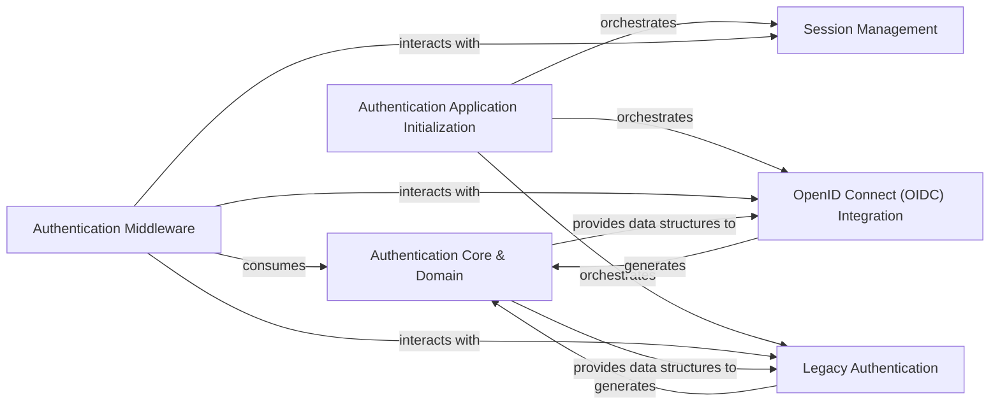

## Details

The Authentication & User Management subsystem, rooted in arxiv.auth, is responsible for user identity, authentication (legacy and OIDC), authorization, and session management, providing a consistent user context across the application.

### Authentication Core & Domain
Defines the foundational data models for user profiles (UserProfile), authorization scopes (Scope), and core authorization logic (is_authorized). It also manages and provides access to the authenticated user's specific claims, roles, and capabilities (e.g., is_admin, is_tex_pro), handling the encoding and decoding of JWT tokens. This component represents the canonical representation of user identity and permissions.

**Related Classes/Methods**:

- <a href="https://github.com/arXiv/arxiv-base/blob/develop/arxiv/auth/domain.py" target="_blank" rel="noopener noreferrer">`arxiv.auth.domain`</a>
- <a href="https://github.com/arXiv/arxiv-base/blob/develop/arxiv/auth/user_claims.py" target="_blank" rel="noopener noreferrer">`arxiv.auth.user_claims`</a>

### Session Management
Manages the lifecycle of user sessions, including secure generation, packing, unpacking, decoding, loading, validation, and deletion of session cookies. It ensures persistent user context across requests and may delegate to legacy session handling mechanisms.

**Related Classes/Methods**:

- <a href="https://github.com/arXiv/arxiv-base/blob/develop/arxiv/auth/auth/sessions/store.py" target="_blank" rel="noopener noreferrer">`arxiv.auth.auth.sessions.store`</a>

### OpenID Connect (OIDC) Integration
Facilitates communication with an OpenID Connect Identity Provider (IdP). This includes obtaining authentication and token URLs, acquiring and validating OIDC tokens, and converting IdP-specific claims into the internal arxiv.auth.user_claims format.

**Related Classes/Methods**:

- <a href="https://github.com/arXiv/arxiv-base/blob/develop/arxiv/auth/openid/oidc_idp.py" target="_blank" rel="noopener noreferrer">`arxiv.auth.openid.oidc_idp`</a>

### Legacy Authentication
Handles user authentication using legacy methods, such as tokens or username/password combinations. It retrieves user data from the legacy system and generates user_claims for legacy users, relying on internal legacy account (arxiv.auth.legacy.accounts), password (arxiv.auth.legacy.passwords), and endorsement (arxiv.auth.legacy.endorsements) data.

**Related Classes/Methods**:

- <a href="https://github.com/arXiv/arxiv-base/blob/develop/arxiv/auth/legacy/authenticate.py" target="_blank" rel="noopener noreferrer">`arxiv.auth.legacy.authenticate`</a>

### Authentication Application Initialization
Initializes the main authentication application within the Flask framework. It sets up the environment for session loading and integrates both legacy and modern authentication mechanisms, acting as the entry point for the authentication subsystem's configuration and setup.

**Related Classes/Methods**:

- <a href="https://github.com/arXiv/arxiv-base/blob/develop/arxiv/auth/auth/__init__.py" target="_blank" rel="noopener noreferrer">`arxiv.auth.auth.__init__`</a>

### Authentication Middleware
Intercepts web requests to load user sessions, authenticate users, and establish the user context before the request reaches the application's view logic. It acts as the primary integration point for the authentication subsystem within the web application's request processing pipeline.

**Related Classes/Methods**:

- <a href="https://github.com/arXiv/arxiv-base/blob/develop/arxiv/auth/auth/middleware.py" target="_blank" rel="noopener noreferrer">`arxiv.auth.auth.middleware`</a>

### [FAQ](https://github.com/CodeBoarding/GeneratedOnBoardings/tree/main?tab=readme-ov-file#faq)