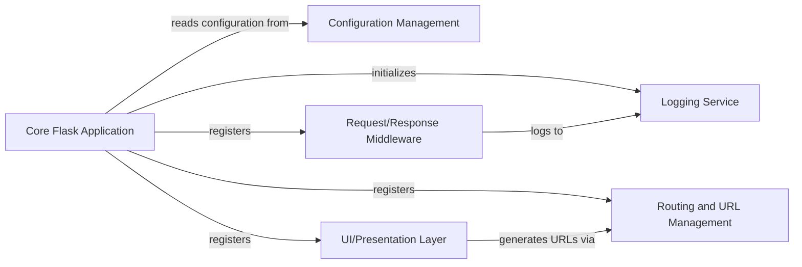

## Details

The arxiv-base subsystem is defined by the arxiv/base Python package. Its primary boundary encompasses the core Flask application setup, foundational services, UI-related utilities, and static asset management, designed to be a reusable base for other arXiv-NG web services. It functions as a Web Application Framework/Library.

### Core Flask Application [[Expand]](./Core_Flask_Application.md)
The central orchestrator responsible for creating and configuring the Flask application instance. It manages the application's lifecycle, integrates various extensions, and sets up the foundational services required by the framework.

**Related Classes/Methods**:

- <a href="https://github.com/arXiv/arxiv-base/blob/develop/arxiv/base/__init__.py" target="_blank" rel="noopener noreferrer">`arxiv.base.__init__`</a>
- <a href="https://github.com/arXiv/arxiv-base/blob/develop/arxiv/base/factory.py" target="_blank" rel="noopener noreferrer">`arxiv.base.factory`</a>

### Configuration Management
Handles the loading and management of application-wide settings, environment-specific variables, and secrets. It provides a centralized and structured way to access configuration parameters throughout the application.

**Related Classes/Methods**:

- <a href="https://github.com/arXiv/arxiv-base/blob/develop/arxiv/base/config.py" target="_blank" rel="noopener noreferrer">`arxiv.base.config`</a>

### Request/Response Middleware
Implements logic that intercepts and processes HTTP requests before they reach view functions and responses before they are sent back to the client. This includes common functionalities like session management, authentication checks, and header manipulation.

**Related Classes/Methods**:

- <a href="https://github.com/arXiv/arxiv-base/blob/develop/arxiv/base/middleware/base.py" target="_blank" rel="noopener noreferrer">`arxiv.base.middleware.base`</a>

### Routing and URL Management
Defines the URL patterns and maps them to specific view functions within the application. It also provides utilities for generating URLs dynamically, ensuring consistency and maintainability of links across the application.

**Related Classes/Methods**:

- <a href="https://github.com/arXiv/arxiv-base/blob/develop/arxiv/base/routes.py" target="_blank" rel="noopener noreferrer">`arxiv.base.routes`</a>
- <a href="https://github.com/arXiv/arxiv-base/blob/develop/arxiv/base/urls/links.py" target="_blank" rel="noopener noreferrer">`arxiv.base.urls.links`</a>

### UI/Presentation Layer [[Expand]](./UI_Presentation_Layer.md)
Responsible for preparing and injecting data into templates (via context processors) to ensure consistent UI elements and global variables. It also manages user-facing messages and alerts, providing feedback to the end-user.

**Related Classes/Methods**:

- <a href="https://github.com/arXiv/arxiv-base/blob/develop/arxiv/base/context_processors.py" target="_blank" rel="noopener noreferrer">`arxiv.base.context_processors`</a>
- <a href="https://github.com/arXiv/arxiv-base/blob/develop/arxiv/base/alerts.py" target="_blank" rel="noopener noreferrer">`arxiv.base.alerts`</a>

### Logging Service
Provides a centralized mechanism for recording application events, errors, and debugging information. It's crucial for monitoring application health, diagnosing issues, and auditing activities.

**Related Classes/Methods**:

- <a href="https://github.com/arXiv/arxiv-base/blob/develop/arxiv/base/logging.py" target="_blank" rel="noopener noreferrer">`arxiv.base.logging`</a>

### [FAQ](https://github.com/CodeBoarding/GeneratedOnBoardings/tree/main?tab=readme-ov-file#faq)