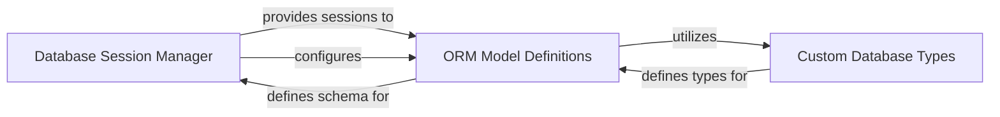

## Details

The `arxiv.db` subsystem forms the core of database interaction, with the Database Session Manager acting as its central orchestrator. This manager is responsible for initializing and configuring the SQLAlchemy database engines, making them available for application-wide use. It provides essential session management capabilities through objects like Session and transaction, which are consumed by the ORM Model Definitions to perform data operations. The ORM Model Definitions component, in turn, defines the application's database schema as Python objects, abstracting away direct SQL. While the Database Session Manager primarily facilitates database access, it also plays a role in configuring the ORM models by importing a specific engine configuration function from the ORM Model Definitions. Furthermore, Custom Database Types are integrated within the ORM Model Definitions to ensure accurate and consistent data mapping between Python and the underlying database.

### Database Session Manager
responsible for initializing and configuring SQLAlchemy database engines and providing session objects (Session and transaction) that enable database operations.

**Related Classes/Methods**: _None_

### ORM Model Definitions
defines the SQLAlchemy models, which are Pythonic representations of the database schema.

**Related Classes/Methods**: _None_

### Custom Database Types
utilized by ORM Model Definitions to handle specific data types and ensure proper mapping between Python objects and database columns.

**Related Classes/Methods**: _None_

### [FAQ](https://github.com/CodeBoarding/GeneratedOnBoardings/tree/main?tab=readme-ov-file#faq)