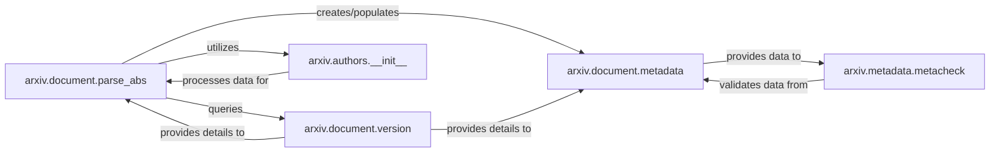

## Details

The `arxiv.document` subsystem is central to ingesting, structuring, and validating scholarly article metadata within the arXiv system. It primarily focuses on transforming raw `.abs` files into a canonical `DocMetadata` representation, ensuring data quality, and managing version-specific information. The `parse_abs` component initiates the data pipeline, leveraging specialized utilities like `arxiv.authors` for author data normalization and `arxiv.document.version` for handling document versioning. The `arxiv.document.metadata` component acts as the core data model, which is then subject to validation by `arxiv.metadata.metacheck` to maintain data integrity.

### arxiv.document.parse_abs
Acts as the primary entry point for ingesting and transforming raw .abs files (arXiv's legacy metadata format) into structured document metadata objects. It orchestrates the initial data extraction and population, serving as a crucial parser and data pipeline initiator within the framework.

**Related Classes/Methods**:

- <a href="https://github.com/arXiv/arxiv-base/blob/develop/arxiv/document/parse_abs.py" target="_blank" rel="noopener noreferrer">`arxiv.document.parse_abs`</a>

### arxiv.document.metadata
Serves as the central data model and access layer for structured document metadata. It defines the canonical representation of document information (e.g., title, authors, abstract, subjects), providing a consistent and authoritative interface for other components to retrieve and manage document details within the web application framework.

**Related Classes/Methods**:

- <a href="https://github.com/arXiv/arxiv-base/blob/develop/arxiv/document/metadata.py#L43-L307" target="_blank" rel="noopener noreferrer">`DocMetadata`:43-307</a>

### arxiv.metadata.metacheck
Provides a comprehensive validation service for various metadata fields against predefined business rules and formats. This component is essential for ensuring data quality and consistency, preventing malformed or invalid data from entering the system, which is critical for the integrity of scholarly article data.

**Related Classes/Methods**:

- <a href="https://github.com/arXiv/arxiv-base/blob/develop/arxiv/metadata/metacheck.py" target="_blank" rel="noopener noreferrer">`arxiv.metadata.metacheck`</a>

### arxiv.document.version
Manages and provides specific attributes and checks related to document versions, such as file formats, source flags, and withdrawal status. It acts as a utility for understanding version characteristics, supporting the core metadata model and parsing processes by offering version-specific context.

**Related Classes/Methods**:

- <a href="https://github.com/arXiv/arxiv-base/blob/develop/arxiv/document/version.py#L96-L153" target="_blank" rel="noopener noreferrer">`VersionEntry`:96-153</a>
- <a href="https://github.com/arXiv/arxiv-base/blob/develop/arxiv/document/version.py#L13-L93" target="_blank" rel="noopener noreferrer">`SourceFlag`:13-93</a>

### arxiv.authors.__init__
A specialized utility component dedicated to parsing and normalizing complex author and affiliation strings. It handles various formats and collaborations, ensuring consistent and structured author data for the metadata model, which is crucial for accurate attribution and search.

**Related Classes/Methods**:

- <a href="https://github.com/arXiv/arxiv-base/blob/develop/arxiv/authors/__init__.py#L35-L62" target="_blank" rel="noopener noreferrer">`parse_author_affil`:35-62</a>
- <a href="https://github.com/arXiv/arxiv-base/blob/develop/arxiv/authors/__init__.py#L65-L145" target="_blank" rel="noopener noreferrer">`_parse_author_affil_split`:65-145</a>

### [FAQ](https://github.com/CodeBoarding/GeneratedOnBoardings/tree/main?tab=readme-ov-file#faq)