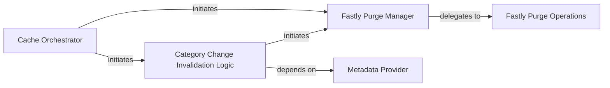

## Details

This subsystem is responsible for abstracting and managing interactions with external Content Delivery Networks (CDNs), specifically Fastly, for cache invalidation tasks within the arXiv-NG ecosystem. It provides a structured interface for other arXiv services to request cache purges without needing to understand the underlying Fastly API complexities.

### Cache Orchestrator
Serves as the high-level public API for initiating cache invalidation requests. It orchestrates the overall purge process, determining the necessary purge operations based on the application's context (e.g., a specific paper). It abstracts the complexities of Fastly interactions from the calling application.

**Related Classes/Methods**:

- <a href="https://github.com/arXiv/arxiv-base/blob/develop/arxiv/integration/fastly/purge.py#L24-L34" target="_blank" rel="noopener noreferrer">`purge_cache_for_paper`:24-34</a>

### Fastly Purge Manager
Manages the direct communication and interaction with the Fastly API. It is responsible for executing both single and multiple key purges, potentially optimizing for batch operations. This component acts as the direct interface to the external Fastly service.

**Related Classes/Methods**:

- <a href="https://github.com/arXiv/arxiv-base/blob/develop/arxiv/integration/fastly/purge.py#L111-L132" target="_blank" rel="noopener noreferrer">`purge_fastly_keys`:111-132</a>

### Fastly Purge Operations
This conceptual component groups the low-level, atomic operations for purging Fastly cache keys. It includes functionalities for purging individual keys and efficiently handling multiple keys, potentially with batching or chunking.

**Related Classes/Methods**:

- <a href="https://github.com/arXiv/arxiv-base/blob/develop/arxiv/integration/fastly/purge.py#L134-L142" target="_blank" rel="noopener noreferrer">`_purge_single_key`:134-142</a>
- <a href="https://github.com/arXiv/arxiv-base/blob/develop/arxiv/integration/fastly/purge.py#L144-L160" target="_blank" rel="noopener noreferrer">`_purge_multiple_keys`:144-160</a>

### Category Change Invalidation Logic
Encapsulates specific business logic for cache invalidation scenarios related to changes in paper categories. This component determines the specific set of keys or rules required for purging when a category update occurs, ensuring targeted and efficient invalidation.

**Related Classes/Methods**:

- <a href="https://github.com/arXiv/arxiv-base/blob/develop/arxiv/integration/fastly/purge.py#L62-L109" target="_blank" rel="noopener noreferrer">`_purge_category_change`:62-109</a>

### Metadata Provider
A utility component responsible for extracting and providing necessary metadata (such as category and date information) required by specific cache invalidation scenarios, particularly for the `Category Change Invalidation Logic`. It ensures that the correct data is available for complex purge operations.

**Related Classes/Methods**:

- <a href="https://github.com/arXiv/arxiv-base/blob/develop/arxiv/integration/fastly/purge.py#L36-L60" target="_blank" rel="noopener noreferrer">`_get_category_and_date`:36-60</a>

### [FAQ](https://github.com/CodeBoarding/GeneratedOnBoardings/tree/main?tab=readme-ov-file#faq)