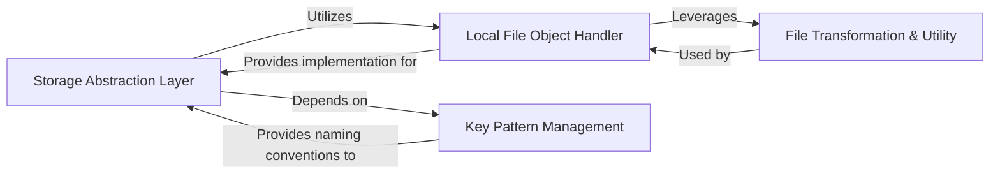

## Details

The `File & Object Storage` subsystem in `arxiv-base` provides a robust and flexible mechanism for handling content storage, abstracting away the complexities of different storage backends. It is crucial for a web application framework like `arxiv-base` to manage static assets and potentially user-uploaded content consistently.

### Storage Abstraction Layer
Provides a unified interface for interacting with various storage backends (e.g., local file system, S3). It abstracts the underlying storage mechanism, offering a consistent API for storing, retrieving, and listing objects. This component is fundamental for ensuring the framework's flexibility in deployment environments (local development vs. cloud production).

**Related Classes/Methods**:

- <a href="https://github.com/arXiv/arxiv-base/blob/develop/arxiv/files/object_store.py" target="_blank" rel="noopener noreferrer">`arxiv.files.object_store:to_obj`</a>
- <a href="https://github.com/arXiv/arxiv-base/blob/develop/arxiv/files/object_store.py" target="_blank" rel="noopener noreferrer">`arxiv.files.object_store:list`</a>

### Local File Object Handler
Encapsulates fundamental file system operations for local file objects, providing a concrete representation and methods for interacting with file content. This component is essential for handling files in a local development environment or when local storage is the primary backend.

**Related Classes/Methods**:

- <a href="https://github.com/arXiv/arxiv-base/blob/develop/arxiv/files/__init__.py" target="_blank" rel="noopener noreferrer">`arxiv.files.LocalFileObj`</a>
- <a href="https://github.com/arXiv/arxiv-base/blob/develop/arxiv/files/__init__.py" target="_blank" rel="noopener noreferrer">`arxiv.files.LocalFileObj:open`</a>
- <a href="https://github.com/arXiv/arxiv-base/blob/develop/arxiv/files/__init__.py" target="_blank" rel="noopener noreferrer">`arxiv.files.LocalFileObj:read`</a>
- <a href="https://github.com/arXiv/arxiv-base/blob/develop/arxiv/files/__init__.py" target="_blank" rel="noopener noreferrer">`arxiv.files.LocalFileObj:size`</a>
- <a href="https://github.com/arXiv/arxiv-base/blob/develop/arxiv/files/__init__.py" target="_blank" rel="noopener noreferrer">`arxiv.files.LocalFileObj:exists`</a>
- <a href="https://github.com/arXiv/arxiv-base/blob/develop/arxiv/files/__init__.py" target="_blank" rel="noopener noreferrer">`arxiv.files.LocalFileObj:close`</a>
- <a href="https://github.com/arXiv/arxiv-base/blob/develop/arxiv/files/__init__.py" target="_blank" rel="noopener noreferrer">`arxiv.files.LocalFileObj:seek`</a>
- <a href="https://github.com/arXiv/arxiv-base/blob/develop/arxiv/files/__init__.py" target="_blank" rel="noopener noreferrer">`arxiv.files.LocalFileObj:readline`</a>
- <a href="https://github.com/arXiv/arxiv-base/blob/develop/arxiv/files/__init__.py" target="_blank" rel="noopener noreferrer">`arxiv.files.LocalFileObj:__exit__`</a>

### Key Pattern Management
Defines and generates standardized naming conventions (keys/paths) for various types of stored objects. This ensures consistent organization and retrieval across the system, regardless of the underlying storage backend, which is critical for maintainability and scalability in a web application.

**Related Classes/Methods**:

- <a href="https://github.com/arXiv/arxiv-base/blob/develop/arxiv/files/key_patterns.py" target="_blank" rel="noopener noreferrer">`arxiv.files.key_patterns`</a>

### File Transformation & Utility
Provides utilities for transforming file streams or content, offering capabilities to modify or adapt file content streams. This component supports operations like data sanitization or format conversion before storage or after retrieval.

**Related Classes/Methods**:

- <a href="https://github.com/arXiv/arxiv-base/blob/develop/arxiv/files/__init__.py" target="_blank" rel="noopener noreferrer">`arxiv.files.BinaryMinimalFileTransformed`</a>

### [FAQ](https://github.com/CodeBoarding/GeneratedOnBoardings/tree/main?tab=readme-ov-file#faq)