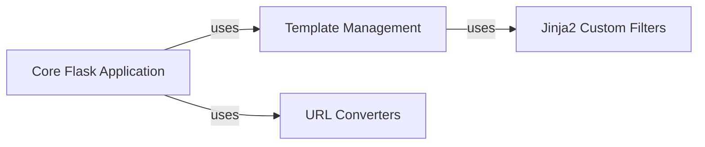

## Details

The `arxiv.base` subsystem forms the foundational layer for arXiv-NG web applications, centered around the `Core Flask Application`. This core component is responsible for the application's initialization and overall configuration, acting as the central hub that integrates other specialized components. It leverages `Template Management` to render dynamic web content using Jinja2, ensuring a consistent user interface. The `Template Management` component, in turn, utilizes `Jinja2 Custom Filters` for specific data formatting and transformation needs within the templates. Furthermore, the `Core Flask Application` integrates `URL Converters` to establish clean and semantically meaningful URLs, crucial for navigation and resource identification. This architecture ensures a modular and maintainable structure, with clear responsibilities for each component in handling web requests and rendering responses.

### Core Flask Application [[Expand]](./Core_Flask_Application.md)
This component is the central orchestrator of the arXiv-NG web application. It is responsible for initializing the Flask application, configuring its settings, registering blueprints, and integrating various sub-components such as template management and URL converters. It defines the core application context and request handling.

**Related Classes/Methods**:

- <a href="https://github.com/arXiv/arxiv-base/blob/develop/arxiv/base/factory.py" target="_blank" rel="noopener noreferrer">`arxiv.base.factory:create_app`</a>
- <a href="https://github.com/arXiv/arxiv-base/blob/develop/arxiv/base/routes.py" target="_blank" rel="noopener noreferrer">`arxiv.base.routes`</a>

### Template Management
This component is responsible for defining the visual structure and layout of web pages using Jinja2 templates. It provides a consistent look and feel across various arXiv-NG web applications, serving as the primary interface for rendering HTML content.

**Related Classes/Methods**:

- <a href="https://github.com/arXiv/arxiv-base/blob/develop/arxiv/base/templates" target="_blank" rel="noopener noreferrer">`arxiv.base.templates`</a>

### Jinja2 Custom Filters
This component provides a collection of custom Jinja2 filters designed for data transformation and formatting specific to arXiv's content. These filters ensure that data is presented consistently and correctly within the templates (e.g., converting line feeds, handling TeX to UTF-8, formatting file sizes).

**Related Classes/Methods**:

- <a href="https://github.com/arXiv/arxiv-base/blob/develop/arxiv/base/filters.py" target="_blank" rel="noopener noreferrer">`arxiv.base.filters:abstract_lf_to_br`</a>
- <a href="https://github.com/arXiv/arxiv-base/blob/develop/arxiv/base/filters.py" target="_blank" rel="noopener noreferrer">`arxiv.base.filters:f_tex2utf`</a>
- <a href="https://github.com/arXiv/arxiv-base/blob/develop/arxiv/base/filters.py" target="_blank" rel="noopener noreferrer">`arxiv.base.filters:tidy_filesize`</a>
- <a href="https://github.com/arXiv/arxiv-base/blob/develop/arxiv/base/filters.py" target="_blank" rel="noopener noreferrer">`arxiv.base.filters:as_eastern`</a>

### URL Converters
This component defines custom URL converters for Flask, such as ArXivConverter. These converters enable the creation of clean, human-readable, and semantically meaningful URLs, which are crucial for navigation and resource identification within the web application.

**Related Classes/Methods**:

- <a href="https://github.com/arXiv/arxiv-base/blob/develop/arxiv/base/converter.py" target="_blank" rel="noopener noreferrer">`arxiv.base.converter:ArXivConverter`</a>

### [FAQ](https://github.com/CodeBoarding/GeneratedOnBoardings/tree/main?tab=readme-ov-file#faq)