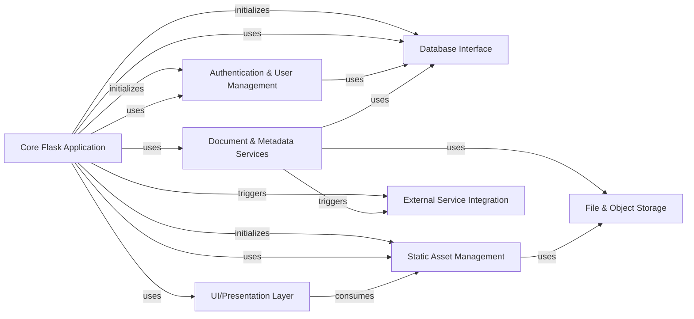

## Details

The arXiv-NG application is structured around a Core Flask Application that orchestrates various specialized components to deliver its functionalities. Authentication & User Management handles user identity and access, integrating with the Database Interface for user data persistence. The Database Interface itself provides a robust abstraction for all data interactions, including ORM models. Static Asset Management and UI/Presentation Layer work in tandem to render the user interface, with static assets potentially leveraging File & Object Storage. Core to arXiv's mission, Document & Metadata Services manages the parsing and validation of scholarly content, relying on both the Database Interface and File & Object Storage for content and metadata persistence. Finally, External Service Integration facilitates communication with external systems like CDNs, triggered by both the Core Flask Application and Document & Metadata Services for cache invalidation and content delivery optimization. This modular design promotes clear separation of concerns and facilitates maintainability and scalability.

Critical Interaction Pathways
1. User Request Flow: A user request first hits the Core Flask Application, which then interacts with Authentication & User Management to verify identity and permissions. Depending on the request, the Core Flask Application might then interact with Document & Metadata Services to retrieve or process document information, or with the UI/Presentation Layer to render a page, which in turn consumes assets from Static Asset Management.
2. Data Persistence Flow: Components like Authentication & User Management and Document & Metadata Services interact directly with the Database Interface for storing and retrieving structured data. Document & Metadata Services also utilizes File & Object Storage for handling the actual document files.
3. Content Delivery Flow: The UI/Presentation Layer consumes static assets managed by Static Asset Management. Document & Metadata Services can trigger External Service Integration (e.g., Fastly purges) to ensure content delivery network caches are updated, optimizing content distribution.

### Core Flask Application [[Expand]](./Core_Flask_Application.md)
The central Flask application instance, responsible for initializing the application, managing the request/response lifecycle, middleware integration, and providing foundational services. It acts as the primary orchestrator for other components.

**Related Classes/Methods**:

- <a href="https://github.com/arXiv/arxiv-base/blob/develop/arxiv/base/__init__.py" target="_blank" rel="noopener noreferrer">`arxiv/base/__init__.py`</a>
- <a href="https://github.com/arXiv/arxiv-base/blob/develop/arxiv/base/factory.py" target="_blank" rel="noopener noreferrer">`arxiv/base/factory.py`</a>
- <a href="https://github.com/arXiv/arxiv-base/blob/develop/arxiv/base/middleware/base.py" target="_blank" rel="noopener noreferrer">`arxiv/base/middleware/base.py`</a>
- <a href="https://github.com/arXiv/arxiv-base/blob/develop/arxiv/base/routes.py" target="_blank" rel="noopener noreferrer">`arxiv/base/routes.py`</a>
- <a href="https://github.com/arXiv/arxiv-base/blob/develop/arxiv/base/urls/links.py" target="_blank" rel="noopener noreferrer">`arxiv/base/urls/links.py`</a>
- <a href="https://github.com/arXiv/arxiv-base/blob/develop/arxiv/base/alerts.py" target="_blank" rel="noopener noreferrer">`arxiv/base/alerts.py`</a>
- <a href="https://github.com/arXiv/arxiv-base/blob/develop/arxiv/base/config.py" target="_blank" rel="noopener noreferrer">`arxiv/base/config.py`</a>
- <a href="https://github.com/arXiv/arxiv-base/blob/develop/arxiv/base/logging.py" target="_blank" rel="noopener noreferrer">`arxiv/base/logging.py`</a>
- <a href="https://github.com/arXiv/arxiv-base/blob/develop/arxiv/base/context_processors.py" target="_blank" rel="noopener noreferrer">`arxiv/base/context_processors.py`</a>

### Authentication & User Management [[Expand]](./Authentication_User_Management.md)
Handles all aspects of user identity, authentication (supporting both legacy and OIDC mechanisms), authorization, and session management. It provides a consistent user context across the application.

**Related Classes/Methods**:

- <a href="https://github.com/arXiv/arxiv-base/blob/develop/arxiv/auth/__init__.py" target="_blank" rel="noopener noreferrer">`arxiv/auth/__init__.py`</a>
- <a href="https://github.com/arXiv/arxiv-base/blob/develop/arxiv/auth/auth/sessions/store.py" target="_blank" rel="noopener noreferrer">`arxiv/auth/auth/sessions/store.py`</a>
- <a href="https://github.com/arXiv/arxiv-base/blob/develop/arxiv/auth/openid/oidc_idp.py" target="_blank" rel="noopener noreferrer">`arxiv/auth/openid/oidc_idp.py`</a>
- <a href="https://github.com/arXiv/arxiv-base/blob/develop/arxiv/auth/legacy/authenticate.py" target="_blank" rel="noopener noreferrer">`arxiv/auth/legacy/authenticate.py`</a>
- <a href="https://github.com/arXiv/arxiv-base/blob/develop/arxiv/auth/user_claims.py" target="_blank" rel="noopener noreferrer">`arxiv/auth/user_claims.py`</a>
- <a href="https://github.com/arXiv/arxiv-base/blob/develop/arxiv/auth/domain.py" target="_blank" rel="noopener noreferrer">`arxiv/auth/domain.py`</a>
- <a href="https://github.com/arXiv/arxiv-base/blob/develop/arxiv/auth/auth/middleware.py" target="_blank" rel="noopener noreferrer">`arxiv/auth/auth/middleware.py`</a>

### Database Interface [[Expand]](./Database_Interface.md)
Provides the abstraction layer for interacting with the underlying database. It manages database connections, sessions, and ORM model definitions, ensuring consistent data access patterns.

**Related Classes/Methods**:

- <a href="https://github.com/arXiv/arxiv-base/blob/develop/arxiv/db/__init__.py" target="_blank" rel="noopener noreferrer">`arxiv/db/__init__.py`</a>
- <a href="https://github.com/arXiv/arxiv-base/blob/develop/arxiv/db/models.py" target="_blank" rel="noopener noreferrer">`arxiv/db/models.py`</a>
- <a href="https://github.com/arXiv/arxiv-base/blob/develop/arxiv/db/orig_models.py" target="_blank" rel="noopener noreferrer">`arxiv/db/orig_models.py`</a>
- <a href="https://github.com/arXiv/arxiv-base/blob/develop/arxiv/db/types.py" target="_blank" rel="noopener noreferrer">`arxiv/db/types.py`</a>

### Static Asset Management
Manages the lifecycle and serving of static assets (CSS, JavaScript, images, fonts) for the UI. This component is crucial for maintaining UI consistency and performance, including Sass compilation and potential S3 deployment.

**Related Classes/Methods**:

- <a href="https://github.com/arXiv/arxiv-base/blob/develop/arxiv/base/static/" target="_blank" rel="noopener noreferrer">`arxiv/base/static/`</a>
- <a href="https://github.com/arXiv/arxiv-base/blob/develop/arxiv/base/urls/links.py" target="_blank" rel="noopener noreferrer">`arxiv/base/urls/links.py`</a>

### Document & Metadata Services [[Expand]](./Document_Metadata_Services.md)
Responsible for the parsing, validation, and management of arXiv document metadata and content. It provides the core logic for handling the structure and integrity of scholarly articles.

**Related Classes/Methods**:

- <a href="https://github.com/arXiv/arxiv-base/blob/develop/arxiv/document/parse_abs.py" target="_blank" rel="noopener noreferrer">`arxiv/document/parse_abs.py`</a>
- <a href="https://github.com/arXiv/arxiv-base/blob/develop/arxiv/metadata/metacheck.py" target="_blank" rel="noopener noreferrer">`arxiv/metadata/metacheck.py`</a>

### UI/Presentation Layer [[Expand]](./UI_Presentation_Layer.md)
Defines the visual structure and presentation logic of the web application using Jinja2 templates and custom filters. This component ensures a consistent look and feel (leveraging Bulma and Sass) across various arXiv-NG web applications.

**Related Classes/Methods**:

- <a href="https://github.com/arXiv/arxiv-base/blob/develop/arxiv/base/templates/" target="_blank" rel="noopener noreferrer">`arxiv/base/templates/`</a>
- <a href="https://github.com/arXiv/arxiv-base/blob/develop/arxiv/base/filters.py" target="_blank" rel="noopener noreferrer">`arxiv/base/filters.py`</a>
- <a href="https://github.com/arXiv/arxiv-base/blob/develop/arxiv/base/converter.py" target="_blank" rel="noopener noreferrer">`arxiv/base/converter.py`</a>

### File & Object Storage [[Expand]](./File_Object_Storage.md)
Provides a unified abstraction layer for interacting with various storage backends, including local file systems and cloud object storage services (e.g., S3). It ensures flexible and scalable content storage.

**Related Classes/Methods**:

- <a href="https://github.com/arXiv/arxiv-base/blob/develop/arxiv/files/object_store.py" target="_blank" rel="noopener noreferrer">`arxiv/files/object_store.py`</a>

### External Service Integration [[Expand]](./External_Service_Integration.md)
Handles communication and integration with external third-party services, such as Content Delivery Networks (CDNs) like Fastly, for tasks like cache invalidation.

**Related Classes/Methods**:

- <a href="https://github.com/arXiv/arxiv-base/blob/develop/arxiv/integration/fastly/purge.py" target="_blank" rel="noopener noreferrer">`arxiv/integration/fastly/purge.py`</a>

### [FAQ](https://github.com/CodeBoarding/GeneratedOnBoardings/tree/main?tab=readme-ov-file#faq)