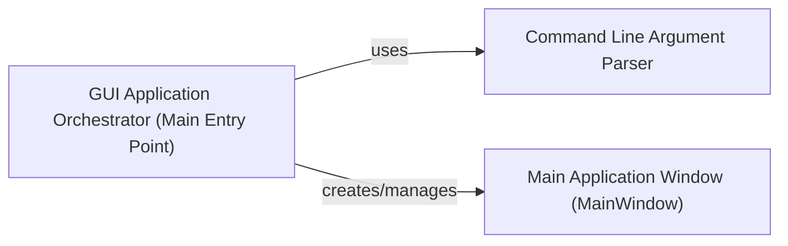

## Details

The `asammdf` GUI application's core architecture is orchestrated by the `GUI Application Orchestrator`, which serves as the main entry point. This orchestrator is responsible for initializing the application environment, parsing command-line arguments to configure initial settings, and subsequently creating and managing the `Main Application Window`. The `Main Application Window` then provides the primary user interface for interacting with the application's functionalities. This clear separation ensures a robust startup sequence and a well-defined interaction flow between the application's core control and its user-facing interface.

### GUI Application Orchestrator (Main Entry Point)
This is the overarching component representing the main application entry point. It initializes the Qt application environment, sets up critical environment variables, handles global exception logging, and orchestrates the instantiation and display of the primary GUI window. It manages the application's event loop, ensuring the GUI remains responsive.

**Related Classes/Methods**:

- <a href="https://github.com/danielhrisca/asammdf/blob/master/src/asammdf/app/asammdfgui.py#L14-L48" target="_blank" rel="noopener noreferrer">`src.asammdf.app.asammdfgui.main`:14-48</a>

### Command Line Argument Parser
Responsible for parsing command-line arguments provided at application launch. It configures initial application settings or behaviors, such as opening a specific MDF file directly or setting debug modes, based on user input.

**Related Classes/Methods**:

- <a href="https://github.com/danielhrisca/asammdf/blob/master/src/asammdf/app/asammdfgui.py#L6-L11" target="_blank" rel="noopener noreferrer">`src.asammdf.app.asammdfgui._cmd_line_parser`:6-11</a>

### Main Application Window (MainWindow)
The primary graphical user interface window that serves as the central container for all other GUI elements and user interactions. It is instantiated by the `GUI Application Orchestrator` and provides the main interface for users to interact with the `asammdf` core functionalities.

**Related Classes/Methods**:

- <a href="https://github.com/danielhrisca/asammdf/blob/master/src/asammdf/gui/widgets/main.py#L30-L1716" target="_blank" rel="noopener noreferrer">`asammdf.gui.widgets.main.MainWindow`:30-1716</a>

### [FAQ](https://github.com/CodeBoarding/GeneratedOnBoardings/tree/main?tab=readme-ov-file#faq)