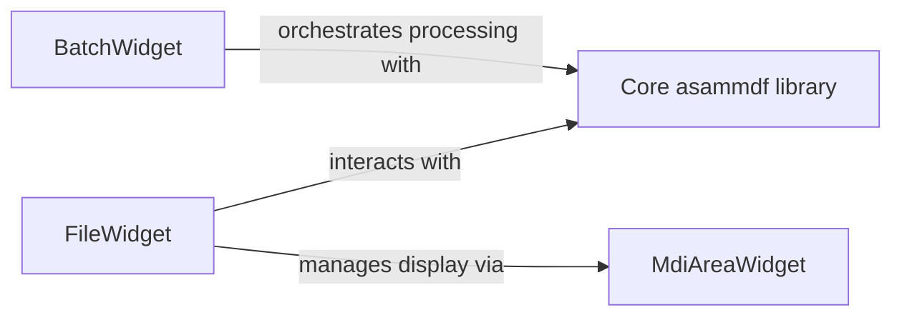

## Details

The `asammdf` GUI subsystem is structured around two primary user interaction components: `FileWidget` for single-file operations and `BatchWidget` for multi-file processing. Both of these components leverage auto-generated UI definitions from `asammdf.gui.ui` and provide concrete implementations within `asammdf.gui.widgets`. They serve as the primary interface for users to interact with MDF data. The core data handling and manipulation capabilities are encapsulated within the `Core asammdf library`, which `FileWidget` and `BatchWidget` interact with to perform operations like loading, saving, filtering, and transforming MDF files. The `MdiAreaWidget` acts as a central display manager, allowing `FileWidget` to present various data views in a flexible multi-document interface. This architecture separates concerns between UI presentation, application logic, and core data processing, promoting modularity and maintainability.

### FileWidget
This component provides the user interface and associated logic for managing and interacting with individual MDF files. It is composed of two parts: `asammdf.gui.ui.file_widget.FileWidget` which is the auto-generated UI definition, and `asammdf.gui.widgets.file.FileWidget` which is the concrete implementation inheriting from the UI definition and providing the interactive logic. Its responsibilities include enabling users to open, save, filter, and search within a single MDF file. It also facilitates the initiation of various data processing operations on the loaded file and orchestrates the display of processed data within the MDI (Multi-Document Interface) area. This component acts as a view and its associated controller for single-file operations.

**Related Classes/Methods**:

- <a href="https://github.com/danielhrisca/asammdf/blob/master/" target="_blank" rel="noopener noreferrer">`asammdf.gui.ui.file_widget.FileWidget`</a>
- <a href="https://github.com/danielhrisca/asammdf/blob/master/src/asammdf/gui/widgets/file.py#L118-L3438" target="_blank" rel="noopener noreferrer">`asammdf.gui.widgets.file.FileWidget`:118-3438</a>

### BatchWidget
This component is dedicated to the user interface and logic for configuring and executing batch processing tasks across multiple MDF files. Similar to `FileWidget`, it consists of `asammdf.gui.ui.batch_widget.BatchWidget` as the UI definition and `asammdf.gui.widgets.batch.BatchWidget` as the implementation. It allows users to define and apply operations such as scrambling, concatenation, stacking, and bus logging extraction to a collection of files, streamlining repetitive data manipulation workflows. This component embodies the "User Interface (UI) Layer" and "Controller/ViewModel Logic" patterns, specifically for batch-oriented operations.

**Related Classes/Methods**:

- <a href="https://github.com/danielhrisca/asammdf/blob/master/" target="_blank" rel="noopener noreferrer">`asammdf.gui.ui.batch_widget.BatchWidget`</a>
- <a href="https://github.com/danielhrisca/asammdf/blob/master/src/asammdf/gui/widgets/batch.py#L31-L2094" target="_blank" rel="noopener noreferrer">`asammdf.gui.widgets.batch.BatchWidget`:31-2094</a>

### Core asammdf library
This component represents the core functionality of the `asammdf` library, responsible for reading, writing, and manipulating MDF files. It provides the underlying data structures and algorithms for handling MDF data, including operations like filtering, cutting, resampling, and bus logging extraction.

**Related Classes/Methods**:

- <a href="https://github.com/danielhrisca/asammdf/blob/master/src/asammdf/mdf.py" target="_blank" rel="noopener noreferrer">`asammdf.mdf.MDF`</a>

### MdiAreaWidget
This component manages the display of multiple document interfaces within the application. It provides the framework for opening, arranging, and interacting with various sub-windows (e.g., plot, numeric, tabular views) that display data from MDF files.

**Related Classes/Methods**:

- <a href="https://github.com/danielhrisca/asammdf/blob/master/" target="_blank" rel="noopener noreferrer">`asammdf.gui.widgets.MdiAreaWidget`</a>

### [FAQ](https://github.com/CodeBoarding/GeneratedOnBoardings/tree/main?tab=readme-ov-file#faq)