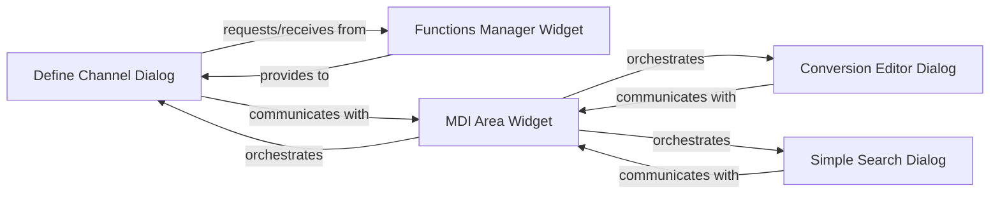

## Details

The core of this subsystem revolves around the `MDI Area Widget`, which acts as the central orchestrator for various user interaction dialogs. It manages the lifecycle, display, and basic interactions with dialogs such as `Define Channel Dialog`, `Conversion Editor Dialog`, and `Simple Search Dialog`. These dialogs, in turn, facilitate specific user tasks: `Define Channel Dialog` allows users to create custom data channels, often interacting with the `Functions Manager Widget` to retrieve and manage user-defined functions. `Conversion Editor Dialog` enables the definition of data conversion rules, while `Simple Search Dialog` provides quick search capabilities. All these dialogs communicate back with the `MDI Area Widget` to signal events or provide results, ensuring a cohesive user experience within the application's Multiple Document Interface.

### Define Channel Dialog
This component provides the user interface and underlying logic for users to define new channels, including custom computations using mathematical expressions or Python functions, and transformations. It serves as a key entry point for users to extend the "Data Transformation Pipeline" by specifying custom processing steps. It manages user input for channel definitions, argument searching, and the application or cancellation of these definitions.

**Related Classes/Methods**:

- <a href="https://github.com/danielhrisca/asammdf/blob/master/src/asammdf/gui/dialogs/define_channel.py#L1-L1000" target="_blank" rel="noopener noreferrer">`define_channel`:1-1000</a>

### Conversion Editor Dialog
This component manages the creation, editing, and application of various conversion rules for channel data. It supports different conversion types (e.g., value-to-text, value-range-to-text, linear conversions) and their default settings. This dialog is integral to the "Data Transformation Pipeline" by allowing users to define how raw MDF data values are transformed into more meaningful or human-readable representations.

**Related Classes/Methods**:

- <a href="https://github.com/danielhrisca/asammdf/blob/master/src/asammdf/gui/dialogs/conversion_editor.py#L1-L1000" target="_blank" rel="noopener noreferrer">`conversion_editor`:1-1000</a>

### Simple Search Dialog
This component implements the user interface and logic for performing basic search and filter operations on MDF data, primarily for channel names or properties. It facilitates data exploration within the "Data Processing Library" by allowing users to quickly locate relevant data points. It manages the display of search results and handles user interactions like adding selected items to a view or responding to double-clicks on matches.

**Related Classes/Methods**:

- <a href="https://github.com/danielhrisca/asammdf/blob/master/src/asammdf/gui/dialogs/simple_search.py#L1-L1000" target="_blank" rel="noopener noreferrer">`simple_search`:1-1000</a>

### Functions Manager Widget
Manages the storage, retrieval, validation, and persistence of user-defined Python functions and global variables. This component is crucial for enabling the "Define Channel Dialog" to execute custom computations.

**Related Classes/Methods**:

- <a href="https://github.com/danielhrisca/asammdf/blob/master/src/asammdf/gui/widgets/main.py#L1655-L1684" target="_blank" rel="noopener noreferrer">`functions_manager`:1655-1684</a>

### MDI Area Widget
Central Multiple Document Interface container for the application's sub-windows (including the dialogs listed above). It is responsible for their instantiation, display, and basic lifecycle management within the GUI.

**Related Classes/Methods**:

- <a href="https://github.com/danielhrisca/asammdf/blob/master/src/asammdf/gui/widgets/file.py" target="_blank" rel="noopener noreferrer">`mdi_area`</a>

### [FAQ](https://github.com/CodeBoarding/GeneratedOnBoardings/tree/main?tab=readme-ov-file#faq)