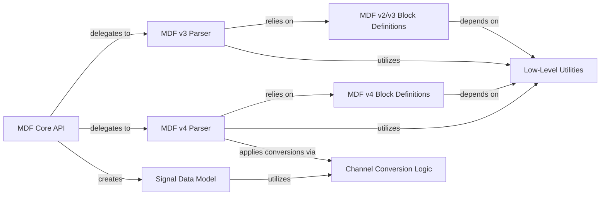

## Details

The MDF Core Library subsystem is the central data processing engine for asammdf, handling all MDF file I/O, parsing, signal extraction, and data manipulation. It provides the primary programmatic interface for interacting with MDF data.

### MDF Core API
Acts as the primary high-level API (Facade) for users to interact with MDF files. It abstracts away the complexities of different MDF versions, providing a unified interface for opening, closing, converting, cutting, and exporting MDF data, as well as extracting signals.

**Related Classes/Methods**:

- <a href="https://github.com/danielhrisca/asammdf/blob/master/src/asammdf/mdf.py" target="_blank" rel="noopener noreferrer">`asammdf.mdf.MDF`</a>

### MDF v3 Parser
Implements the specific logic for parsing, reading, writing, and manipulating MDF version 3 files. It understands the internal structure and block types of MDF v3.

**Related Classes/Methods**:

- <a href="https://github.com/danielhrisca/asammdf/blob/master/src/asammdf/blocks/mdf_v3.py#L122-L3914" target="_blank" rel="noopener noreferrer">`asammdf.blocks.mdf_v3.MDF3`:122-3914</a>

### MDF v4 Parser
Implements the specific logic for parsing, reading, writing, and manipulating MDF version 4 files. It handles the internal structure and block types unique to MDF v4.

**Related Classes/Methods**:

- <a href="https://github.com/danielhrisca/asammdf/blob/master/src/asammdf/blocks/mdf_v4.py#L211-L12515" target="_blank" rel="noopener noreferrer">`asammdf.blocks.mdf_v4.MDF4`:211-12515</a>

### Signal Data Model
Encapsulates a single measurement signal's data (values, timestamps), along with its associated metadata (name, unit, channel type, etc.). It provides methods for accessing, manipulating, and converting signal data.

**Related Classes/Methods**:

- <a href="https://github.com/danielhrisca/asammdf/blob/master/src/asammdf/signal.py" target="_blank" rel="noopener noreferrer">`asammdf.signal.Signal`</a>

### MDF v4 Block Definitions
Defines Python classes that represent the various block types found in MDF v4 files, encapsulating their structure and basic parsing/serialization logic. These are the fundamental data structures for MDF v4.

**Related Classes/Methods**:

- <a href="https://github.com/danielhrisca/asammdf/blob/master/src/asammdf/blocks/v4_blocks.py" target="_blank" rel="noopener noreferrer">`asammdf.blocks.v4_blocks`</a>

### MDF v2/v3 Block Definitions
Defines Python classes that represent the various block types found in MDF v2 and v3 files, encapsulating their structure and basic parsing/serialization logic. These are the fundamental data structures for MDF v2/v3.

**Related Classes/Methods**:

- <a href="https://github.com/danielhrisca/asammdf/blob/master/src/asammdf/blocks/v2_v3_blocks.py" target="_blank" rel="noopener noreferrer">`asammdf.blocks.v2_v3_blocks`</a>

### Low-Level Utilities
Provides general-purpose, low-level utility functions for file stream manipulation (e.g., reading/writing specific data types), data type conversions, and text encoding/decoding, used across different MDF versions.

**Related Classes/Methods**:

- <a href="https://github.com/danielhrisca/asammdf/blob/master/src/asammdf/blocks/utils.py" target="_blank" rel="noopener noreferrer">`asammdf.blocks.utils`</a>

### Channel Conversion Logic
Provides functions for creating, applying, and inverting various types of channel conversions (e.g., linear, polynomial, rational, tabular) to signal values, ensuring correct data interpretation.

**Related Classes/Methods**:

- <a href="https://github.com/danielhrisca/asammdf/blob/master/src/asammdf/blocks/conversion_utils.py" target="_blank" rel="noopener noreferrer">`asammdf.blocks.conversion_utils`</a>

### [FAQ](https://github.com/CodeBoarding/GeneratedOnBoardings/tree/main?tab=readme-ov-file#faq)