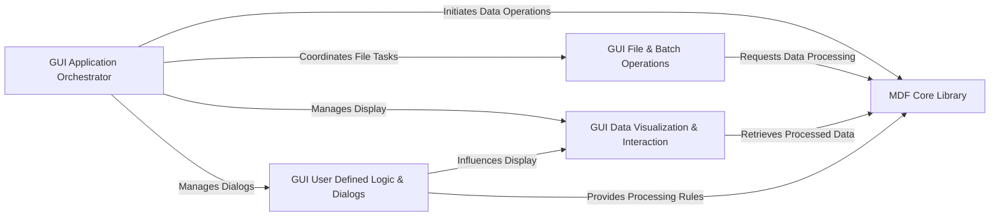

## Details

The `asammdf` project is structured around a powerful MDF Core Library that serves as the backbone for all data parsing, manipulation, and storage of automotive measurement data. This core library, optimized for performance, directly interacts with low-level block processors and manages signal data, including specialized handling for bus logging. A distinct GUI Application Orchestrator provides the entry point for the user interface, coordinating interactions between specialized GUI components. User-driven actions, managed by GUI File & Batch Operations and GUI User Defined Logic & Dialogs, are translated into requests for the MDF Core Library to load, process, or transform data. The results are then consumed by the GUI Data Visualization & Interaction component, which renders time-series plots and tabular views, offering interactive exploration. This modular design ensures a clear separation of concerns, allowing the core data processing capabilities to be used independently while providing a rich, extensible graphical environment for data analysis.

### MDF Core Library [[Expand]](./MDF_Core_Library.md)
The central data processing engine responsible for all MDF file I/O, parsing, signal extraction, and data manipulation. It acts as the primary interface for programmatic interaction with MDF data.

**Related Classes/Methods**:

- <a href="https://github.com/danielhrisca/asammdf/blob/master/src/asammdf/mdf.py" target="_blank" rel="noopener noreferrer">`src/asammdf/mdf.py`</a>
- <a href="https://github.com/danielhrisca/asammdf/blob/master/src/asammdf/blocks/mdf_v3.py" target="_blank" rel="noopener noreferrer">`src/asammdf/blocks/mdf_v3.py`</a>
- <a href="https://github.com/danielhrisca/asammdf/blob/master/src/asammdf/blocks/mdf_v4.py" target="_blank" rel="noopener noreferrer">`src/asammdf/blocks/mdf_v4.py`</a>
- <a href="https://github.com/danielhrisca/asammdf/blob/master/src/asammdf/signal.py" target="_blank" rel="noopener noreferrer">`src/asammdf/signal.py`</a>
- <a href="https://github.com/danielhrisca/asammdf/blob/master/src/asammdf/blocks/bus_logging_utils.py" target="_blank" rel="noopener noreferrer">`src/asammdf/blocks/bus_logging_utils.py`</a>

### GUI Application Orchestrator [[Expand]](./GUI_Application_Orchestrator.md)
The main application component that initializes the graphical user interface, manages the overall application lifecycle, and coordinates interactions between various GUI sub-components.

**Related Classes/Methods**:

- <a href="https://github.com/danielhrisca/asammdf/blob/master/src/asammdf/app/asammdfgui.py" target="_blank" rel="noopener noreferrer">`src/asammdf/app/asammdfgui.py`</a>

### GUI Data Visualization & Interaction
Handles the visual representation of MDF data, including plotting time-series signals, displaying tabular data, and managing the multi-document interface for multiple views.

**Related Classes/Methods**:

- <a href="https://github.com/danielhrisca/asammdf/blob/master/src/asammdf/gui/plot.py" target="_blank" rel="noopener noreferrer">`src/asammdf/gui/plot.py`</a>
- <a href="https://github.com/danielhrisca/asammdf/blob/master/src/asammdf/gui/widgets/mdi_area.py" target="_blank" rel="noopener noreferrer">`src/asammdf/gui/widgets/mdi_area.py`</a>
- <a href="https://github.com/danielhrisca/asammdf/blob/master/src/asammdf/gui/widgets/tabular.py" target="_blank" rel="noopener noreferrer">`src/asammdf/gui/widgets/tabular.py`</a>

### GUI File & Batch Operations [[Expand]](./GUI_File_Batch_Operations.md)
Provides user interface elements and logic specifically for managing MDF files (e.g., opening, saving, channel selection) and configuring/executing batch processing tasks on multiple files.

**Related Classes/Methods**:

- <a href="https://github.com/danielhrisca/asammdf/blob/master/src/asammdf/gui/ui/file_widget.py" target="_blank" rel="noopener noreferrer">`src/asammdf/gui/ui/file_widget.py`</a>
- <a href="https://github.com/danielhrisca/asammdf/blob/master/src/asammdf/gui/ui/batch_widget.py" target="_blank" rel="noopener noreferrer">`src/asammdf/gui/ui/batch_widget.py`</a>

### GUI User Defined Logic & Dialogs [[Expand]](./GUI_User_Defined_Logic_Dialogs.md)
Encompasses all user interface components and underlying logic that allow users to define custom computations, conversion rules, and perform various search and filter operations on MDF data.

**Related Classes/Methods**:

- <a href="https://github.com/danielhrisca/asammdf/blob/master/src/asammdf/gui/dialogs/define_channel.py" target="_blank" rel="noopener noreferrer">`src/asammdf/gui/dialogs/define_channel.py`</a>
- <a href="https://github.com/danielhrisca/asammdf/blob/master/src/asammdf/gui/dialogs/conversion_editor.py" target="_blank" rel="noopener noreferrer">`src/asammdf/gui/dialogs/conversion_editor.py`</a>
- <a href="https://github.com/danielhrisca/asammdf/blob/master/src/asammdf/gui/dialogs/simple_search.py" target="_blank" rel="noopener noreferrer">`src/asammdf/gui/dialogs/simple_search.py`</a>

### [FAQ](https://github.com/CodeBoarding/GeneratedOnBoardings/tree/main?tab=readme-ov-file#faq)