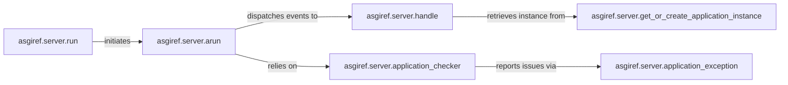

## Details

The `asgiref.server` subsystem provides the core infrastructure for running ASGI applications. It orchestrates the lifecycle of ASGI applications, from synchronous entry points to asynchronous event handling and instance management. The `run` component serves as the synchronous adapter, initiating the asynchronous `arun` component. `arun` is central to managing the application's event loop and coordinating with `handle` for event processing and `application_checker` for validation. The `handle` component is responsible for dispatching events to the ASGI application instance, which is efficiently managed by `get_or_create_application_instance`. Error handling within the application is standardized by `application_exception`.

### asgiref.server.run
This component acts as the primary synchronous entry point and adapter for ASGI applications. It bridges traditional synchronous environments with the asynchronous ASGI core, making ASGI applications accessible from synchronous contexts.

**Related Classes/Methods**:

- <a href="https://github.com/django/asgiref/blob/main/asgiref/server.py#L65-L80" target="_blank" rel="noopener noreferrer">`asgiref.server.arun`:65-80</a>

### asgiref.server.arun
The central asynchronous runner and orchestrator of the ASGI application's lifecycle. It manages the main event loop, coordinates the processing of ASGI events, and ensures the application's health.

**Related Classes/Methods**:

- <a href="https://github.com/django/asgiref/blob/main/asgiref/server.py#L82-L83" target="_blank" rel="noopener noreferrer">`asgiref.server.handle`:82-83</a>
- <a href="https://github.com/django/asgiref/blob/main/asgiref/server.py#L146-L162" target="_blank" rel="noopener noreferrer">`asgiref.server.application_checker`:146-162</a>

### asgiref.server.handle
A core component in the event-driven architecture responsible for processing individual ASGI events (e.g., http.request, websocket.connect). It dispatches events to the appropriate application handlers.

**Related Classes/Methods**:

- <a href="https://github.com/django/asgiref/blob/main/asgiref/server.py#L82-L83" target="_blank" rel="noopener noreferrer">`asgiref.server.handle`:82-83</a>

### asgiref.server.get_or_create_application_instance
This component is focused on resource management, handling the lifecycle, instantiation, and caching of ASGI application instances. It ensures efficient reuse of application instances.

**Related Classes/Methods**:

- <a href="https://github.com/django/asgiref/blob/main/asgiref/server.py#L122-L134" target="_blank" rel="noopener noreferrer">`delete_oldest_application_instance`:122-134</a>

### asgiref.server.application_checker
A utility component for validating and monitoring ASGI application instances to ensure they conform to the ASGI specification. It plays a crucial role in maintaining the stability and correctness of the server.

**Related Classes/Methods**:

- <a href="https://github.com/django/asgiref/blob/main/asgiref/server.py#L164-L173" target="_blank" rel="noopener noreferrer">`asgiref.server.application_exception`:164-173</a>

### asgiref.server.application_exception
A utility component that standardizes exception handling and reporting for errors originating from the ASGI application. It ensures consistent error responses and logging.

**Related Classes/Methods**:

- <a href="https://github.com/django/asgiref/blob/main/asgiref/server.py#L164-L173" target="_blank" rel="noopener noreferrer">`asgiref.server.ApplicationException`:164-173</a>

### [FAQ](https://github.com/CodeBoarding/GeneratedOnBoardings/tree/main?tab=readme-ov-file#faq)