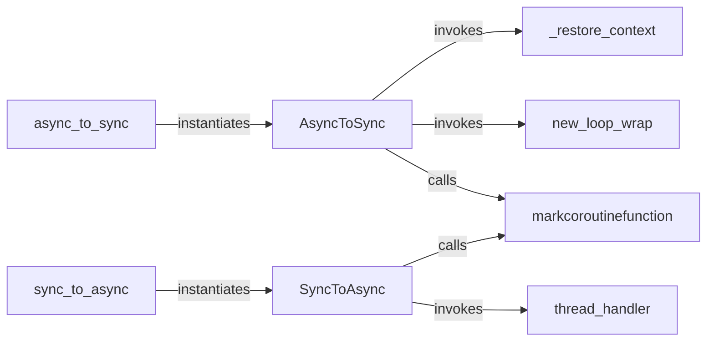

## Details

The `Async/Sync Bridging Layer` subsystem is a core component of `asgiref`, providing essential utilities for seamless interoperability between asynchronous (`asyncio`) and synchronous Python code. Its primary boundary is defined by the `asgiref/sync.py` module, which encapsulates the mechanisms for converting call contexts.

### async_to_sync
The primary public function for converting an asynchronous callable into a synchronous one. It acts as an adapter, making async code consumable by sync contexts.

**Related Classes/Methods**:

- <a href="https://github.com/django/asgiref/blob/main/asgiref/sync.py#L519-L543" target="_blank" rel="noopener noreferrer">`async_to_sync`:519-543</a>

### sync_to_async
The primary public function for converting a synchronous callable into an asynchronous one. It ensures synchronous code can be run without blocking the asyncio event loop.

**Related Classes/Methods**:

- <a href="https://github.com/django/asgiref/blob/main/asgiref/sync.py#L565-L584" target="_blank" rel="noopener noreferrer">`sync_to_async`:565-584</a>

### AsyncToSync
An internal class that encapsulates the detailed logic for executing an asynchronous function within a synchronous context, managing the event loop and context.

**Related Classes/Methods**:

- <a href="https://github.com/django/asgiref/blob/main/asgiref/sync.py#L113-L310" target="_blank" rel="noopener noreferrer">`AsyncToSync`:113-310</a>

### SyncToAsync
An internal class that encapsulates the detailed logic for executing a synchronous function within an asynchronous context, typically by offloading it to a thread pool.

**Related Classes/Methods**:

- <a href="https://github.com/django/asgiref/blob/main/asgiref/sync.py#L313-L493" target="_blank" rel="noopener noreferrer">`SyncToAsync`:313-493</a>

### new_loop_wrap
A utility responsible for ensuring an `asyncio` event loop is active and properly managed when an asynchronous function is called from a synchronous context.

**Related Classes/Methods**:

- <a href="https://github.com/django/asgiref/blob/main/asgiref/sync.py#L226-L232" target="_blank" rel="noopener noreferrer">`new_loop_wrap`:226-232</a>

### thread_handler
A utility responsible for executing synchronous code in a separate thread, preventing it from blocking the main `asyncio` event loop during `sync_to_async` operations.

**Related Classes/Methods**:

- <a href="https://github.com/django/asgiref/blob/main/asgiref/sync.py#L472-L493" target="_blank" rel="noopener noreferrer">`thread_handler`:472-493</a>

### _restore_context
A crucial utility that ensures the correct execution context (e.g., `asyncio` task context, `threading` local storage) is preserved and restored across the async/sync boundary, maintaining state integrity.

**Related Classes/Methods**:

- <a href="https://github.com/django/asgiref/blob/main/asgiref/sync.py#L44-L53" target="_blank" rel="noopener noreferrer">`_restore_context`:44-53</a>

### markcoroutinefunction
A utility function called by `AsyncToSync` and `SyncToAsync` during their instantiation to correctly mark the wrapped functions as coroutines.

**Related Classes/Methods**:

- <a href="https://github.com/django/asgiref/blob/main/asgiref/sync.py#L67-L69" target="_blank" rel="noopener noreferrer">`markcoroutinefunction`:67-69</a>

### [FAQ](https://github.com/CodeBoarding/GeneratedOnBoardings/tree/main?tab=readme-ov-file#faq)