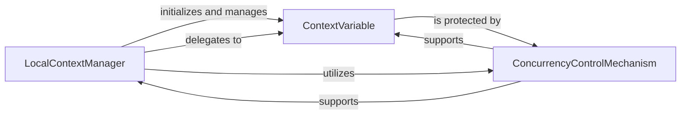

## Details

The Context Local Storage Manager subsystem is a foundational component within asgiref, designed to provide isolated, context-specific data storage for asynchronous and multi-threaded environments. It aligns with the "Utility Library/Framework Component" pattern by offering a low-level, reusable mechanism for managing state across different execution contexts.

### LocalContextManager
This component serves as the public-facing interface for the context-local storage. It provides an intuitive, attribute-style access mechanism, allowing applications to easily set, retrieve, and delete context-specific variables. It acts as the primary entry point for interacting with the subsystem.

**Related Classes/Methods**:

- <a href="https://github.com/django/asgiref/blob/main/asgiref/local.py#L40-L131" target="_blank" rel="noopener noreferrer">`asgiref.local.Local`:40-131</a>

### ContextVariable
This component represents the fundamental data structure for storing context-specific values. Each instance of ContextVariable (internally _CVar) holds the actual value of a context variable, ensuring that its value is strictly isolated per asynchronous task or thread. It is the core mechanism that enables context separation.

**Related Classes/Methods**:

- <a href="https://github.com/django/asgiref/blob/main/asgiref/local.py#L8-L37" target="_blank" rel="noopener noreferrer">`asgiref.local._CVar`:8-37</a>

### ConcurrencyControlMechanism
This internal, functional component is responsible for ensuring synchronized and thread-safe access to the underlying context variables. It prevents race conditions and data corruption that could arise when multiple concurrent tasks or threads attempt to access or modify context data. While not a distinct class, its functionality is implemented through synchronization primitives (e.g., locks) associated with _lock_storage.

**Related Classes/Methods**:

- <a href="https://github.com/django/asgiref/blob/main/asgiref/local.py#L81-L117" target="_blank" rel="noopener noreferrer">`asgiref.local._lock_storage`:81-117</a>

### [FAQ](https://github.com/CodeBoarding/GeneratedOnBoardings/tree/main?tab=readme-ov-file#faq)